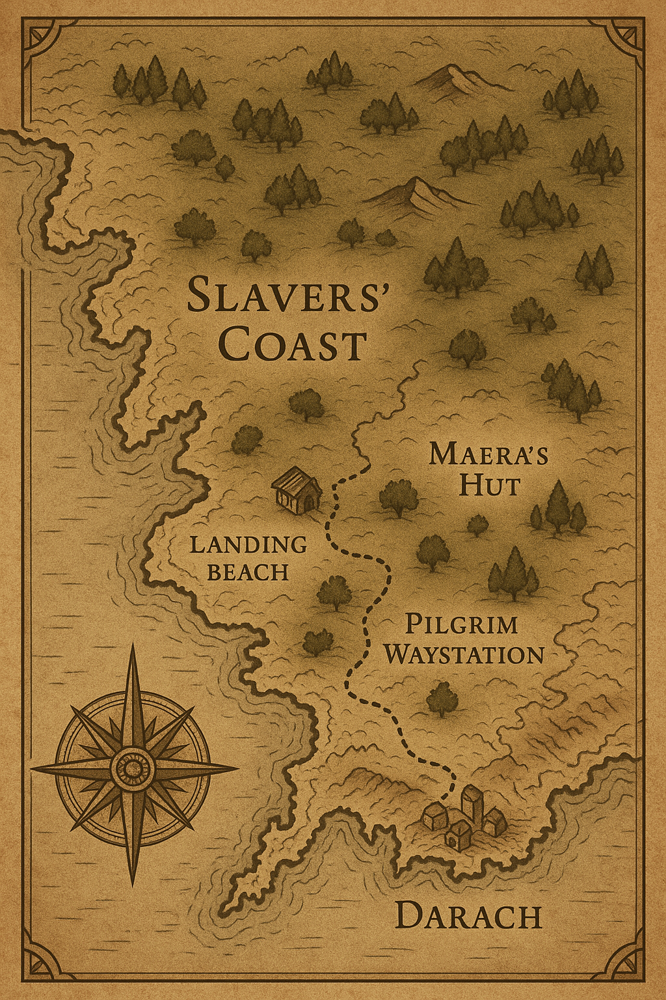
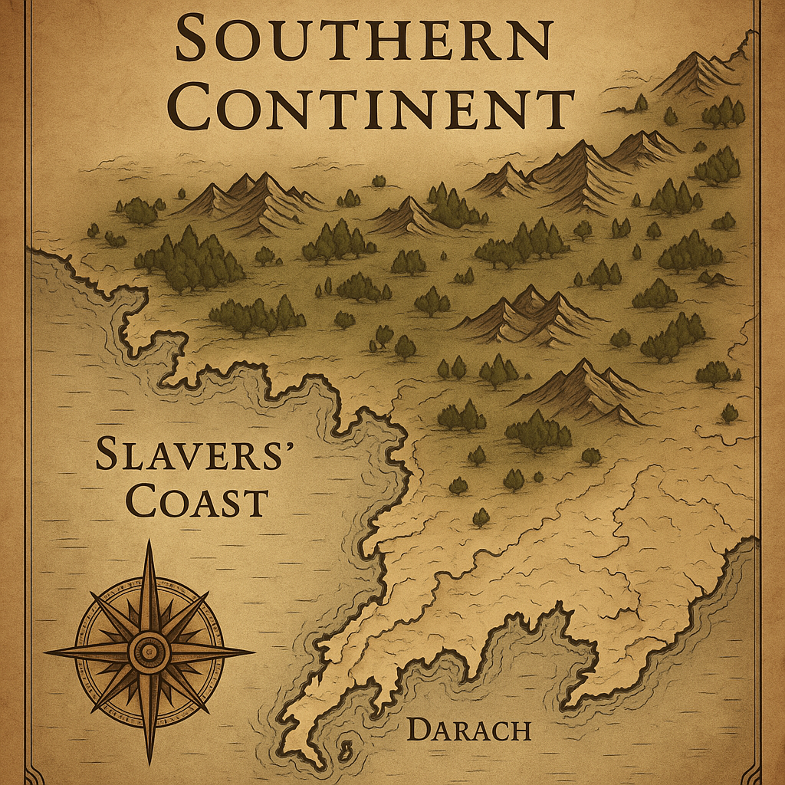

# Paladin's Rise

*An Epic Fantasy Novel*

By Ryan Ginstrom

---

## Synopsis

Gond, a cynical mercenary, never figured he'd be more than a sword for hire. His life was a predictable loop: fight, drink, gamble, and repeat—a cycle that kept his purse heavy and his conscience conveniently quiet. That predictable life shattered when his supposed comrades, Borin and Kael, betrayed him, leaving him drugged and sold to slave catchers. Gond awoke to a brutal hangover and a searing brand on his forehead—the mark of a slave, just another piece of chattel.

But his captors and betrayers underestimated him. When an opportunity arose on the slave ship, Gond, alongside a wiry rogue named Pell and a gentle priest of Alanyi named Sim, carved a path to freedom with broken chains and brute force. They plunged into the sea, eventually washing ashore, battered but alive.

Their journey led them to Maera, a reclusive hermit-healer who offered them aid and pointed them towards the city of Darach. However, their path was fraught with peril. They ambushed a slave cart, liberating two young siblings, Aerin and Dax, and acquiring much-needed supplies. Gond, initially driven by a desire for vengeance against Borin and Kael, decided to scout Darach alone, leaving his companions and the rescued children at a hidden way-station.

In Darach, Gond discovered a hefty bounty on his head, his branded face plastered on wanted posters. He even glimpsed his betrayers, Borin and Kael, operating within the city. Realizing a direct confrontation would be suicidal and endanger his new companions, Gond made a tactical retreat—his first unconscious choice of protection over revenge. On his return, he encountered and rescued another escaped slave, a young woman named Lira.

With the dangers of Darach clear and their small band of fugitives growing, Gond made a crucial decision: they would abandon the coast and seek refuge in the remote, rugged hills. What began as a quest for personal revenge had already begun to shift, replaced by an unexpected and growing responsibility for the lives now depending on him.

In the wilderness, Gond's transformation accelerated beyond the merely personal. At a ruined temple of Alanyi, he experienced his first mystical encounter—subtle, ambiguous, but undeniably real. As their refugee community grew in a hidden valley, Gond's latent divine abilities began manifesting: unnaturally sharp instincts, an inexplicable calming presence, and healing that occurred too quickly to be natural. When slave catchers finally attacked their sanctuary, Gond performed his first undeniable miracle—healing a mortally wounded refugee before the entire community. There was no longer any room for rationalization: he had become a paladin of Alanyi.

The arrival of Silviana Starweaver, an elven lore-keeper drawn by news of the healing miracle, marked the beginning of Gond's formal spiritual education. Under her guidance and that of Sim, Gond learned to consciously channel his divine powers while grappling with the weight of his calling. His reputation as the "healer in the hills" spread across the continent, drawing both desperate refugees and unwanted attention from the slave cities.

As Gond's legend grew, so did the scope of his mission. Maera revealed her role in a vast underground network dedicated to challenging the slave system. Thorek Ironheart, a dwarven war-priest, arrived to assess Gond's worthiness and ultimately offered the Iron Covenant's military support—siege engines, weapons, and tactical expertise. The movement gained further legitimacy when Grimjaw Ironforge, an elite dwarven siege engineer, led his company's defection from established military orders to join the cause.

The religious establishment split over Gond's emergence. Some saw him as a threat to their authority; others recognized him as a divine instrument. The Circle of Whispers, the elven council, debated his legitimacy before ultimately endorsing his paladin status. Meanwhile, the Noble Knights of Turin—aristocratic knights who opposed slavery but maintained classist attitudes—began secret coordination with Gond's egalitarian movement, creating complex three-faction dynamics.

What had begun as a small refugee community evolved into a continental liberation movement. Gond led coordinated raids on slave operations, combining stealth, divine power, and dwarven siege engines to devastating effect. During one such raid, fate brought him face-to-face with his original betrayers, Borin and Kael, now working as slave catchers. In a moment that crystallized his complete spiritual transformation, Gond chose mercy over vengeance, releasing them with a warning message for other mercenaries rather than claiming the revenge he had once craved.

The movement's success triggered religious civil war as some members of holy orders joined Gond's cause while others violently opposed him. The schism created new opportunities and dangers as traditional religious figures grappled with divine mandate versus established authority. Through it all, Gond navigated the complex politics of building a new society while maintaining his mission of liberation.

The climactic campaign brought together the largest multi-racial alliance in continental history. Humans, dwarves, and elves united under Gond's leadership for a coordinated assault on the heart of the slave system. While Gond led the liberation army against the coastal slave cities, the Noble Knights simultaneously assaulted the Holy City of Turin, stronghold of the corrupt Marshal Order.

The final battle showcased the full scope of the conflict: dwarven siege engines breaking fortified defenses, elven ancient knowledge providing strategic intelligence, and divine intervention from both Alanyi and Turin himself. The god of justice manifested his wrath against the corrupt human leaders who had perverted his teachings, while Gond's divine powers reached their full potential in service of liberation.

Victory came at great cost, but it was complete. The slave system that had dominated the continent for generations lay in ruins. In the aftermath, Gond discovered Borin dead and Kael mortally wounded. Despite their past betrayal, Gond performed one final act of divine mercy, healing Kael and setting him on a path toward redemption as a future priest of Alanyi. This moment completed Gond's journey from vengeance-seeker to divine mercy-giver.

The new world that emerged from the ashes of the old was built on the foundation of unity in diversity. Humans, dwarves, and elves worked together to establish governmental and social structures based on freedom rather than bondage. Gond's evolution from reluctant hero to foundational leader was complete, his legacy secured not through conquest but through the radical act of choosing mercy over revenge, protection over personal gain, and hope over cynicism.

***

*Paladin's Rise* is an epic fantasy told in a sardonic third-person narrative voice that follows one man's transformation from self-serving mercenary to legendary liberator. The story explores themes of redemption, the fight for freedom, divine calling, and the power of unity across racial and cultural boundaries. Through Gond's journey, the novel examines how the most unlikely heroes can emerge from the darkest circumstances, and how the choice between vengeance and mercy can reshape not just individual lives, but entire civilizations.

At its heart, this is a story about the surprising, often inconvenient touch of divine grace, and how one cynical mercenary's reluctant acceptance of his calling sparked a continental revolution that transformed a world built on slavery into one founded on freedom, cooperation, and the radical notion that all people—regardless of race or origin—deserve dignity and liberty.

---

\newpage

# Part I

## The Rude Awakening

\newpage

### Chapter 1: The Mark of Betrayal

Gond's tongue stuck to the roof of his mouth like old leather. The taste coating his teeth told him this wasn't a typical morning after. Blood, stale ale, and something bitter that made his throat constrict. His forehead throbbed with each heartbeat. The pain was sharp enough to make his eyes water before he'd even opened them.

When he finally cracked one eyelid, pale moonlight leaked through gaps in warped planking above. The surface beneath him rose and fell in a gentle rhythm that sent his stomach lurching sideways. 

*Ship.* The realization hit him like cold water. *Wonderful.*

Iron clinked against his wrist as he tried to sit up. Manacles. Of course. His second attempt to rise succeeded. He had to lean heavily against splintered timber that felt damp under his palm.

The hold stretched before him in the dim light. A collection of hunched shapes chained in pairs. The air hung thick with the smell of unwashed bodies, fear-sweat, and something else. Something that made him breathe through his mouth.

The man beside him had shoulders like a dock worker and fists to match. Purple bruises mottled his face. Rope burns circled his thick wrists where he'd fought his bonds. Calluses on his palms spoke of years hauling nets or loading cargo. His breathing came in harsh rasps. When his eyes flicked open, they held the kind of spark that meant trouble. The muscles in his jaw kept working, like he was chewing on words too dangerous to speak.

Across from Gond, two figures slumped forward. One sat perfectly still—too still. His head lolled at an angle that spoke of either a broken neck or final surrender. Flies had begun their grisly work around his vacant stare. Tattered silk clung to his frame—once fine clothing now stained with blood and worse. A merchant, perhaps, or minor noble who'd trusted the wrong people.

His companion coughed wetly, each breath a visible struggle. Waxy skin stretched over sharp cheekbones. His chest barely moved with each shallow intake. Ink stains marked his fingertips. Spectacles hung broken from a chain around his neck. A scribe or clerk, reduced to this.

*Not much time left for that one.*

Two more bodies lay motionless further into the hold. A woman with farmer's hands and sun-weathered skin. What might have been a young man, though the shadows made it hard to tell. Behind him, someone breathed like an angry bull, all snorts and barely contained fury. The occasional clink of metal suggested a soldier or guard, still wearing pieces of armor they hadn't bothered to strip.

Gond flexed his fingers, testing the chain's give. Solid. Professional work. His captors knew their business.

Memory crept back in fragments. Borin's flushed face raised in a toast at the Prancing Dragon, his voice booming over the tavern's din: "To Gond, luckiest sword on the coast!" Kael's answering smirk, those cold eyes catching torchlight as he leaned close. "Business, mate. Nothing personal."

The alley behind the inn. The prick of something sharp in his neck. Darkness.

An itch flared across his forehead. His fingers rose instinctively. They found raised, tender flesh—still raw, still seeping. Heat radiated from the wound. The skin felt thick and ridged under his touch. Two interlocking circles, each no larger than a copper coin, burned into his flesh with deliberate precision.

His breath caught. His hand trembled against the brand for a heartbeat before jerking away as if the flesh had turned to flame. The fingers that had traced the marks curled slowly into a fist, knuckles white in the dim light.

A muscle jumped in his jaw. His chest rose and fell in careful, measured breaths—too careful, too controlled. The kind of breathing a man used when the alternative was screaming.

A bucket of murky water sat within reach, its surface barely catching the moonlight. Gond stared at it for a long moment, his throat working silently. When he finally leaned forward, his movements were deliberate, almost mechanical. The reflection that stared back showed a ghost-pale face, hollow-eyed and marked forever by the crude iron circles that branded him property.

His free hand clenched against his thigh. The chain between his wrists clinked softly as a tremor ran through his shoulders—brief, quickly suppressed, but there nonetheless.

The ship creaked around him in steady rhythm. Above, boots scuffed across deck planks, punctuated by coarse laughter and the occasional crack of a whip. When food came—moldy bread and brackish water in filthy buckets—guards tossed it down like they were feeding animals. The dock worker beside Gond lunged for his portion with desperate efficiency. He tore into the moldy crust like a man who'd known hunger before. The dying scribe could only manage a few sips of water before his head lolled back, exhausted by the effort.

In the far corner, a woman's voice whispered what sounded like a lullaby—broken, barely audible, but persistent. Someone else muttered prayers in a dialect Gond didn't recognize. The words were punctuated by the soft clink of what might have been prayer beads. The soldier behind him said nothing, but his breathing had the rhythm of a man counting—perhaps tracking time, perhaps just staying sane.

Those too weak to crawl for their share simply went without.

One guard leaned over the hatch opening, grinning down at them. "Comfortable down there, are we? Don't worry—journey's nearly over. Then the real fun begins."

More laughter echoed from above.

Gond's gaze drifted to the hatch. He studied the lazy way the guards moved, how they clustered together instead of watching properly. Sloppy. Overconfident.

He settled back against the hull, closing his eyes. Let them think him broken. Let them grow careless.

His lips curved in the barest suggestion of a smile.

*Entertainment's just about to begin.*

\newpage

### Chapter 2: Breaking Chains

The ship's hull groaned like an old man's bones, each creak marking time in their floating prison. Gond's skull still felt like someone had used it for hammer practice, but the initial fog had lifted enough for him to think clearly. Around him, the symphony of misery played on—retching, whimpering, the constant rattle of chains.

His tongue moved across cracked lips, tasting the metallic tang that lingered from whatever they'd used to drug him. *Badger's bladder would taste better,* he thought, forcing himself to swallow the foul water when it came.

Days crawled by. Gond ate the slop they tossed down, drank the brackish water, and watched. Always watching. The guards grew lazier with each passing day, their routines as predictable as sunrise.

Jord shifted beside him for the hundredth time, chains clanking. The man's shoulders bunched like a bull ready to charge, and his breathing came fast and shallow. Sweat beaded on his forehead despite the cold.

"You bolt too early, we're all feeding the fish," Gond murmured, not looking at him.

Jord's jaw worked silently, but he managed a jerky nod.

Behind them, Pell watched everything with eyes like a hawk tracking prey. His head turned at every footstep above, every change in the guards' voices. When he caught Gond's attention, he tilted his chin toward the hatch.

"One of them keeps leaning too far over," Pell whispered. "The greasy one with the gap teeth. Likes to wave his food around, make us watch him eat."

Gond had noticed. The guard thought himself clever, dangling strips of dried meat just out of reach while prisoners strained against their chains.

"We wait for his shift," Gond said.

The man chained with Pell—Sim—kept his voice soft as morning mist. "Patience will serve us better than haste." Even here, in this floating tomb, something in his tone made the nearby prisoners lean closer, tension easing from their shoulders.

"Keep your god handy," Jord muttered. "We'll need more than pretty words."

Sim's mouth curved in the faintest smile. "She's always listening."

***

The planning began in earnest the next night, when the guards settled into their dice games and the hold fell into restless quiet. Gond shifted closer to his companions, chains scraping against wood.

"Listen carefully," he breathed, his voice barely audible above the ship's creaking. "We get one chance at this."

Jord's muscles coiled like springs. His fingers drummed against his thigh in rapid, nervous beats. "Just give the word. I'm ready to—"

"You're ready to get us all killed," Gond cut him off. "Greasy leans over the hatch every third watch. Always the same spot, always showing off his food."

Pell's eyes glittered in the dim light filtering down from above. "Twelve steps from hatch to rail on the port side. I counted. But there's a coil of rope near the mainmast—could trip a man in the dark."

"Good." Gond's mind worked through the sequence like a chess master planning moves. "Sim, how fast can you free yourself once you have keys?"

"Thirty heartbeats, perhaps forty." The priest's voice carried quiet certainty. "These locks are crude. But the others..." He gestured toward the rows of chained prisoners.

"We can't save them all," Gond said, the words tasting like ash. "Not this time."

Jord's breathing quickened. His shoulders hunched forward, every line of his body screaming impatience. "So we just leave them? Let them rot while we—"

"We survive," Gond said firmly. "Dead heroes save no one."

Pell leaned closer, his voice like silk over steel. "The crossbow guard—he's left-handed, favors his weak side when he draws. If we can get him to turn..."

"I'll handle the crossbow," Gond said. "Pell, you get the keys and free Sim. Jord—"

"I know what I'm doing," Jord growled, his fists clenching and unclenching in steady rhythm.

"Do you?" Gond's stare could have cut glass. "Because the moment you charge up those stairs screaming like a berserker, every guard on this ship knows exactly where we are."

Sim placed a gentle hand on Jord's arm. The big man's breathing slowed slightly, though his muscles remained taut as bowstrings. "The river finds its way to the sea not through force, but through persistence," the priest murmured.

"Pretty words won't stop a crossbow bolt," Jord muttered, but some of the tension left his shoulders.

Gond studied each face in turn. "Pell—you're sure about the rope?"

"Port side, three feet from the mast. Thick as a man's wrist." Pell's fingers moved in small, precise gestures, mapping the deck from memory. "But if we go starboard instead..."

"Longer run to the rail. More time for them to organize." Gond shook his head. "We stick with port side. Jord, you follow my lead. No charging, no roaring. We move fast but quiet until we're committed."

"And if it goes wrong?" Jord asked.

Sim's smile was serene as dawn light. "Then we trust that Alanyi guides our path, whatever it may be."

"Trust the goddess, but swim like your life depends on it," Pell added with dark humor.

Gond felt the weight of their lives settling on his shoulders. Three men, bound by nothing but shared desperation and the chains that held them. In a few hours, they would either be free or dead.

"Remember," he whispered, "Greasy leans over at the start of third watch. We take him quiet, get the keys, and move. No hesitation, no second thoughts."

Jord's jaw worked silently, but he nodded. Pell's eyes never stopped moving, cataloging every shadow and sound. Sim's lips moved in what might have been prayer or simply preparation.

The die was cast. Now they could only wait for the moment to strike.

***

The moment came three nights later. Greasy leaned far into the hold, waving a strip of salted pork just beyond Gond's reach. "Hungry, are we? Maybe if you bark like a proper dog—"

Gond's hand shot up, fingers closing on the guard's rough tunic. One sharp yank, and Greasy pitched forward with a satisfying crack as his skull met oak planking.

"Now!"

Pell moved like water, flowing over Greasy's prone form to snatch keys and shortsword. Steel flashed as he freed himself, then tossed the keys to Sim, who caught them without looking up from his quiet prayers.

"Wait—" Gond started, but Jord's patience shattered like dropped glass.

The big man roared and charged upward, chains trailing behind him like anchor rope. Shouts erupted from above.

"Bloody fool!" Gond snarled, racing after him.

The deck exploded into chaos. Guards stumbled from their dice games, fumbling for weapons. Gond's blade found the gap between one man's ribs before the guard could clear his scabbard. The man folded over, hands clutching his throat as he toppled into the rail.

"Over the side!" Gond shouted over the rising din.

Pell appeared at his shoulder, his knife work quick and merciless. Prisoners poured from below like water through a broken dam, some still trailing chains, all desperate.

A crossbow string sang. Jord jerked, the bolt sprouting from his chest like a deadly flower. His eyes went wide, not with pain but with understanding. He lurched toward Gond, fingers grasping.

Gond brought his blade down on Jord's wrist. The steel bit deep, and the drowning man's grip loosened. Gond's dagger tumbled away into darkness as he vaulted the rail.

Cold water hit him like a physical blow, driving the air from his lungs. Around him, other bodies splashed into the waves. Some went under immediately, dragged down by iron weights. Others surfaced, gasping and flailing.

Gond's head broke the surface. Twenty yards away, Pell and Sim swam with steady strokes, still chained together but moving as if they'd practiced the maneuver. Their coordination spoke of quick thinking and natural teamwork.

The shore seemed impossibly distant, but Gond forced his aching arms to move. Stroke after stroke, breath after ragged breath, until his knees scraped sand and he could crawl onto the beach.

He collapsed face-first into wet sand, lungs burning, every muscle screaming. Nearby, Pell rolled onto his back and actually laughed—a breathless, disbelieving sound.

"Well," the rogue gasped, "that went exactly as planned."

Sim knelt further up the beach, his lips moving in what looked like prayers of gratitude. His shoulders shook, though whether from cold or relief, Gond couldn't tell.

***

Hours later, Pell produced a rusty file from somewhere in his rags. The metal scraped against iron with agonizing slowness, each stroke sending vibrations through already raw wrists. Gond's hands shook uncontrollably—not from effort, but from the bone-deep cold that had settled into his marrow. His lips had turned blue, and his breath came in short, visible puffs despite the mild coastal air.

"Hold still," Pell muttered through chattering teeth, his own fingers fumbling with the file. Dark humor crept into his voice even as his hands trembled. "At this rate, we'll die of old age before these bloody things come off. Though I suppose that's better than drowning."

Sim worked at his own manacles with methodical patience, but Gond could see the priest's shoulders hunched against more than just the cold. The weight of Jord's death pressed down on all of them—the big man's final, desperate reach, the sound of steel biting through bone and sinew.

Gond's stomach cramped violently, and he doubled over, retching seawater and bile onto the sand. The taste of salt and copper filled his mouth, remnants of the ship's foul water mixed with his own blood from where he'd bitten his tongue during the swim. Each heave sent spasms through his already aching ribs.

"Easy," Sim said quietly, moving closer despite his own chains. The priest's voice carried that same steady calm, but his movements were careful, deliberate—the actions of a man fighting his own demons. "The body needs time to expel what doesn't belong."

When the retching finally stopped, Gond found Sim kneeling beside him with strips of torn cloth. The priest's gentle hands cleaned the raw, bleeding wounds where the manacles had chafed, then bound them with surprising skill. His touch was warm against Gond's ice-cold skin.

"There," Sim murmured, tying off the makeshift bandages. "The healing will come in time."

Pell finally worked his own chains free and immediately set to helping the others, his usual quick wit subdued. "Well," he said, forcing lightness into his voice, "at least we're not fish food. Though I'm starting to think the fish might have had the easier time of it."

The joke fell flat in the grey morning air, but it served its purpose—a reminder that they were alive, that survival meant moving forward despite the weight of what they'd lost.

***

When the last manacle finally fell away, Gond stood and brushed sand from his clothes. His legs still shook, and the world tilted slightly with each movement, but he forced himself upright. Inland, smoke rose from a small chimney, promising warmth and perhaps answers.

He looked at his unlikely companions—the sharp-eyed thief and the gentle priest—and felt something shift in his chest. Not quite trust, but maybe its distant cousin. They had bled together, suffered together, lost a friend together. That had to count for something.

"Come on," he said, shouldering his makeshift pack. "Our path lies ahead."

\newpage

### Chapter 3 – Shore of Second Chances

Grey dawn crept across the horizon, its pale fingers barely penetrating the heavy clouds that pressed down on the beach. Gond's eyes opened to cold, wet sand grinding against his cheek. His fingers still clutched a splintered driftwood plank, knuckles white and numb. Waves lapped at his legs with gentle mockery.

His body screamed as he pushed himself upright—muscles cramped from the swim, salt crusting his skin, lungs still raw from swallowing seawater. Nearby, Pell rolled onto his back with a weak laugh that turned into a coughing fit.

"That went exactly as planned," the rogue managed between spasms, spitting brine.

Further down the shore, Sim knelt with his palms pressed into the sand, lips moving in whispered prayer. His slender frame trembled—whether from cold or exhaustion, Gond couldn't tell.

Gond hauled himself to his feet, legs shaking. "Up." He extended a hand to Pell, then moved toward the priest. "Cold kills slower than slavers, but it still kills."

Sim looked up, offering a nod. "Inland. Freshwater." He pointed toward a gap in the dunes. "Fleabane and thrift cluster near streams—we can follow them to water."

Gond filed the information away. The priest's knowledge kept surprising him—not the mystical nonsense he'd expected, but practical survival skills. He scanned the debris littering the shore. Barrels bobbed in the shallows, tangled nets draped across rocks, planks scattered like broken bones.

He selected a warped boathook, testing its weight. Pell snatched up a coil of rope, fingers already working to untangle the knots. Sim gathered barnacle-crusted gourds, shaking each one near his ear before nodding approval.

They followed the thin trickle of freshwater inland, through a narrow gully where the stream broadened into clear, cold water. Pell dropped to his belly and drank like a man dying of thirst. Gond sipped carefully, eyes scanning the ridgelines above.

Sim crouched beside patches of sea-kale, showing Pell how to scrape salt crystals from the rocks. "For preserving meat," he explained, "when we find some."

The path climbed toward rugged cliffs, winding between wind-carved stones. At the crest stood a small hut, weathered grey as the morning sky. Smoke rose from its crooked chimney, carrying the scent of woodsmoke and herbs.

Before Gond could knock, the door swung open. An elderly woman stood in the threshold, spear held steady in capable hands. Her eyes swept over them—taking in their sodden clothes, makeshift weapons, the desperate edge that clung to escaped slaves.

"Names. Weapons down."

Gond lowered his staff. "Gond."

"Pell." The rope hit the ground.

"Sim." The priest spread his hands, empty palms facing outward. "We seek warmth and safety. No harm intended."

The woman's spear didn't waver. Her gaze lingered on each face, reading something in their expressions. Finally, she stepped aside. "One hour. No longer."

Warmth enveloped them as they entered. Herbs hung from the rafters, filling the air with the scent of thyme and sage. A small goat dozed in a woven basket near the fire, its breathing soft and even. The woman—Maera, she said—ladled steaming broth into wooden bowls.

Gond's hands shook as he lifted the bowl to his lips. The broth tasted of fish and wild onions, richer than any feast he could remember. Around him, Pell and Sim ate with the same desperate hunger, color returning to their faces.

Maera moved between them with efficient grace, binding Pell's bruised ribs with strips of clean cloth, examining Sim's blistered feet, cleaning the ugly brand on Gond's forehead with a pungent salve that made his eyes water.

"You're a healer?" Sim asked, watching her work.

"Served a temple in Darach once." Her voice carried the weight of old disappointments. "Corruption outweighed compassion. Priests of Kemiss conducting slave auctions on the very temple steps, blessing chains with holy water." Her mouth twisted with disgust. "Commerce became more sacred than mercy." She glanced at the dagger Pell offered him. "Pacifist?"

Sim's hands remained folded in his lap. "My path is mercy. I heal and guide."

Pell snorted. "How's a pacifist supposed to defend himself from slave catchers? Pray them to death?"

Sim's eyes held steady calm. "Even the tiny field mouse will defend itself when attacked, and Alanyi blesses it."

Maera's weathered face showed the first hint of interest. "Then keep these two alive." The corner of her mouth twitched—not quite a smile, but close.

Gond set down his empty bowl. "We're heading for Darach. Need information. Need..." His jaw tightened. "Justice."

Pell's eyes brightened at the mention of the city. "Streets full of opportunity. Coin changing hands."

"The old archives there," Sim added quietly. "They might hold answers about those who betrayed us."

Maera listened, her weathered face thoughtful. "There's a pilgrim way-station south of here." She sketched directions in the dirt floor with a charred stick. "Find supplies, rest. Perhaps clarity."

She pressed a satchel into Sim's hands—dried provisions and bundled herbs. "Compassion first," she said, meeting Gond's eyes. "Justice follows in its own time."

Outside, the wind had picked up, driving clouds across the grey sky. Gond adjusted his grip on the boathook, testing its balance. Behind them, the ocean whispered its endless secrets. Ahead lay Darach, uncertain and dangerous.

"We make an odd company," Pell observed, shouldering his rope.

"Odd, but perhaps balanced." Sim watched Gond carefully. "Sometimes the strangest alliances hold the strongest purpose."

The words settled into Gond's chest like stones dropped into still water. He looked at his companions—the warrior, the rogue, the priest. Three men with nothing in common but shared survival and the chains they'd broken.

He turned toward the inland path, feeling the weight of their trust like a physical burden. Behind them, the relentless ocean. Ahead, whatever waited in Darach.

Together, they stepped forward into the uncertain morning.

\newpage

# Part II

## Seeds of Rebellion

\newpage

### Chapter 4 – Crack in the Chain

Gulls wheeled overhead, their harsh cries cutting through the salt-heavy air. Gond, Pell, and Sim moved along the cliff-top path, cloaks snapping in the stiff breeze. Darach still lay leagues ahead, but the prickle between Gond's shoulder blades warned that danger stalked closer.

Mid-morning, Pell dropped to a crouch beside flattened thicket. Gond joined him, studying the crushed grass and broken branches. Nearby, Sim examined trampled lavender stalks, his fingers tracing the damage.

"Five, maybe six." Gond's voice came out flat. "Slave-catchers."

Sim straightened, brushing dirt from his hands. "Fresh tracks. Less than an hour."

"Fantastic." Pell adjusted the rope across his shoulder. "I was beginning to miss trouble."

Gond's knuckles whitened around the boathook. They had little chance against seasoned slavers, but the alternative was watching more innocents dragged away in chains. "Stay sharp."

The trail descended into rolling dunes where voices drifted upward on the wind. Gond raised his fist, and the others froze. Below, a narrow wagon creaked toward the coast road, drawn by two sturdy horses. Two slavers lounged on the driver's bench, relaxed as men counting easy coin. A third walked alongside, whip coiled at his belt like a sleeping snake.

Behind the wagon stumbled two young captives—a boy and girl, heavy chains dragging at their ankles. The girl's shoulders shook with silent sobs.

Gond's jaw clenched so hard his teeth ached. His free hand curled into a fist, nails biting into his palm. Beside him, Pell's eyes had gone cold and sharp. Sim's lips moved in what might have been prayer or curse.

"We can't let this pass," Gond whispered, his voice rough as grinding stone.

Sim nodded, that surprising steadiness settling over his features. "Carefully."

Gond sketched his plan in quick, harsh whispers. "Pell, wide flank. Free the horses. Sim, stay low, retrieve the animals after. I'll take the guards."

Pell melted into the tall grass without a sound. Gond counted to thirty, then stepped onto the trail with an easy grin plastered across his face.

"Ho there!" He raised his hand in greeting. "Lost a wheel up the road—could use some help."

The lead slaver squinted, recognition dawning too slowly. By the time his hand moved toward his sword, Gond was already inside his guard. The boathook caught him across the temple with a wet crack.

Chaos erupted. Pell burst from cover, his knife flashing as he severed the horses' traces. The startled animals bolted a dozen paces before stopping to crop grass, indifferent to the violence behind them.

The rear guard's crossbow bolt hissed past Gond's ear, close enough to part his hair. He lunged forward, hooking the man's leg and sending him sprawling. Pell's blade found the third slaver before he could draw steel.

In moments, three bodies lay still in the dust. Sim moved calmly to the terrified children, producing a set of lock picks from somewhere in his robes. The shackles fell away with metallic clinks.

"Easy," Sim murmured to the horses, approaching with carrots salvaged from the scattered supplies. Despite the scent of blood thick in the air, his gentle manner soon had them calm and willing.

Pell grinned as he counted coins and tested a sword's balance. "Good haul." His eyes gleamed with satisfaction. "This one's decent steel—much better than that old boathook."

Gond knelt beside the fallen slavers, examining their weapons. Two carried standard mercenary blades, well-maintained but unremarkable. The third bore a sword that made him pause. The weapon was crude, its blade nearly black with a dull, matte finish that seemed to drink in the light. More iron than steel, by the look of it—the kind of cheap weapon slave catchers carried when they couldn't afford better.

His fingers closed around the leather-wrapped hilt. The balance felt wrong, the weight distributed poorly, yet something about it called to him. He lifted it, testing the edge against his thumb. Sharp enough, despite its rough appearance.

"That one's garbage," Pell observed, hefting his own prize. "Take this instead—proper steel, decent balance."

Gond shook his head, sliding the dark blade through his belt. "This one will do."

Pell shrugged, pocketing the better weapon. "Your funeral. Though I suppose you've always had strange tastes."

Gond only nodded, his gaze already scanning the horizon for more threats, the crude sword's weight somehow comforting at his side.

By evening, they'd made camp beneath a spreading pine. Gond tended his wounded arm—the crossbow bolt had left a shallow furrow—while Sim cared for the children's injuries with soft hymns and gentle hands. Pell secured their perimeter, moving like a shadow between the trees.

The silence stretched until Gond finally spoke. "We can't continue openly toward Darach. Too dangerous now."

"Then what?" Pell asked, settling beside the fire.

Gond traced Maera's map in the dirt with a stick. "The way-station. Defensible, hidden. You'll be safe there while I go to Darach alone."

Pell opened his mouth to protest, but something in Gond's expression killed the words. Sim placed a hand on the boy's shoulder—Dax, he'd said his name was. "You're making the right choice. Protecting these lives comes first."

"I'll return with answers." Gond stood, his shadow long in the firelight.

Dawn found them at the ancient way-station, its moss-covered stones half-hidden by climbing ivy. They stored supplies quickly, secured the horses, and helped injured Dax onto the gentler of the two mounts.

Before departing, Gond clasped Pell's shoulder and pressed the better steel blade into the rogue's hands. "Keep them safe. One week. If I'm not back, go to Maera."

Sim grasped Gond's forearm, warmth and trust clear in his steady gaze. "Safe travels."

Gond nodded once, then turned toward the forest trail. Behind him, a young voice called softly, "Thank you."

The simple words hit him like a physical blow. He straightened his shoulders and lengthened his stride toward Darach, carrying the weight of their trust like armor against whatever waited ahead.

\newpage

### Chapter 5 – A Change of Course

Pre-dawn mist coiled around Darach's northern gate like ghostly fingers as Gond nudged Ash forward. His breath fogged in the chill air. He tugged his hood lower, hiding the brand that marked him as escaped property. The city's walls loomed ahead, black silhouettes against the pale sky. His pulse hammered against his throat.

Two guards lounged by the portcullis, halberds propped against their shoulders. Their eyes sharpened as Gond approached. Lantern light danced across battle-scarred faces.

"Hold there." The older guard stepped forward, flame casting flickering shadows. "Name and business?"

"Rosan Vale." Gond adopted the weary slouch of a man beaten down by travel. "Horse trader from Cliffmere. Storm scattered my stock—only Ash here survived." He patted the cart-horse's neck.

The second guard circled slowly. His eyes took in Ash's rough harness and Gond's concealed sword. "One horse doesn't make much of a trade."

Gond forced his lips into a tired smile. He slid two silver coins into the guard's palm. "It's what the storm left me. Gate fees?"

The coins vanished. Suspicion eased from the guards' faces. But as they stepped aside, the lantern swung too close. Light caught the edge of Gond's brand. The older guard's eyes narrowed. Recognition flickered across his weathered features.

Then, inexplicably, he said nothing.

Gond's spine went rigid as he passed beneath the iron gate. Every step expected the shout of alarm that never came.

Inside Darach's walls, the city stirred to life. Hawkers called their wares. Cart wheels rumbled over cobblestones. The air filled with the scents of bread and horse dung. But Gond felt eyes everywhere—whispers trailing him like smoke, curious glances that lingered too long.

At the market square, his worst fears materialized. A wanted poster fluttered against a wooden post. The sketch was crude but unmistakable—his face, his brand, clear as daylight. **WANTED ALIVE – 500 ROYALS**. The bounty had doubled.

Near the weapon stalls, a smith's apprentice called out, "Fine blades! Steel from the northern forges!" The display glittered with polished swords, their edges bright and true. One in particular caught the light—a well-balanced blade with a leather-wrapped grip, far superior to the crude weapon at his side.

Gond's hand moved unconsciously to his sword hilt. He felt the rough iron beneath his palm. The dark blade had served him well enough. Something about abandoning it felt wrong. Like discarding a loyal companion for a prettier face.

He turned away from the weapons without a second glance.

A merchant glanced from the poster to Gond's face, eyes widening. Gond turned and walked away, forcing himself not to run. More heads turned. Whispers followed.

He made it to the gate before the shouts began.

"You there! Stop!"

Gond didn't look back. The younger guard glanced up in surprise as he passed. But Gond's purposeful stride and curt nod carried him through without question. Only when Darach had shrunk to a smudge on the horizon did he allow himself to breathe freely.

The northern road twisted along cliffsides bordered by wild heather and gorse. Gond's eyes caught movement ahead—a small figure struggling through roadside mud, chains dragging at her feet. He dismounted, hands raised and empty.

The young woman froze, terror stark in her wide eyes.

"I won't hurt you." Gond kept his voice soft, showing his palms. "I've worn those chains."

She trembled, exhaustion warring with hope in her gaunt features. "Lira," she whispered. "Escaped this morning. They'll come for me."

"No, they won't." Gond pulled a metal file from his pack and knelt beside her. The shackles fell away with heavy thuds. Lira choked back a sob, rubbing her raw ankles.

"Can you ride?"

She nodded. He lifted her onto Ash's broad back. Her weight settled against the bedroll, arms wrapping around it for support. Together, they turned north toward safety.

Nightfall found the way-station warm with firelight and the rich aroma of stew. Sim rose in surprise. Compassion flooded his features as he welcomed Lira. Pell watched from the shadows, tension easing only when Gond explained.

"Darach is death," Gond concluded. "We need to disappear."

"Into thin air?" Pell's eyebrow arched.

"Into the hills." Gond pointed to Maera's map. "Too rugged for slavers. Too remote for bounty hunters. We hide, rest, plan our next move."

Sim nodded, that calm certainty settling over him. "Wisdom. Safety first."

Aerin and Dax exchanged glances, then nodded agreement. Gond felt something shift in his chest—a weight settling there, heavy but not unwelcome.

"Dawn, then." His voice carried new authority. "A fresh start."

Pell's grin held anticipation and wariness in equal measure. "Let's hope hidden stays hidden."

Morning broke clear and bright, painting their small band in golden light. Gond led the way with Lira secure behind him, her arms around the bedroll. Dax dozed atop their second horse, his injured feet wrapped and healing.

They climbed steadily away from the coast, leaving the dangerous lowlands behind. The rugged hills opened before them—wild, untamed, promising sanctuary. Gond's shoulders straightened as they rode. The weight in his chest transformed into something that might have been hope.

He caught Sim's eye and nodded. The priest smiled back. Understanding passed between them without words.

Revenge could wait. Today, they needed a home.

\newpage

### Chapter 6: Whispers in Stone

Dawn broke grey and muted over their makeshift camp. Gond stood at the edge of the way-station's crumbling walls, watching the mist roll through the valleys below. Behind him, the growing number of refugees stirred—nearly two dozen souls now, drawn by whispers and desperate hope.

"We can't stay here." His voice cut through the morning quiet. The others gathered around him, faces turned upward with the expectation he'd grown to recognize and dread.

Sim approached, brushing dirt from his knees after morning prayers. "There are older sanctuaries in these hills. Places forgotten by most."

Pell snorted, shouldering his pack. "Forgotten ruins sound perfect for forgotten people."

"Lead the way." Gond hefted his own gear, ignoring the weight of two dozen gazes following his every movement.

The priest guided them deeper into mist-shrouded hills, following paths that seemed more memory than trail. Soft drizzle whispered through the landscape, turning everything grey and ghostly. Behind Gond trudged their small army—Pell scanning for threats, Aerin and Dax supporting each other, Lira walking with newfound strength, and the handful of other refugees who had somehow found them in this wilderness.

"Sim," Gond called as they climbed a particularly steep slope. "You've been muttering prayers since dawn. Do your gods offer directions, or is that extra?"

The priest's lips curved in a faint smile. "Alanyi guides the heart more clearly than the feet. But perhaps she smiles upon us." He pointed ahead through the swirling mist. "Look there."

Pale stone emerged from the grey—ancient walls partially hidden by climbing ivy and thick moss. Gond stopped, something tugging at his chest like a fishhook. The sensation was neither pleasant nor painful, just... insistent.

"Your goddess has strange tastes," he muttered.

Sim's gaze lingered on the weathered stones. "This was a sanctuary. Once, such temples stood throughout the land. Now they crumble, forgotten."

"Perfect." Pell's eyes swept the surroundings, cataloging defensive positions. "We'll blend right in with the ruins."

Gond approached the ancient walls, studying the faded carvings—symbols of peace, intertwined hands worn smooth by centuries of weather. He touched one carving, the damp stone cold beneath his fingertips. The tugging in his chest intensified, but beneath the pull of something sacred, he sensed something else—a lingering taint, like the memory of corruption that had once defiled this holy place.

"We shelter here." He forced authority into his voice, though the words felt strange on his tongue. "Sim, will the old gods mind squatters?"

"These stones have sheltered travelers for centuries." The priest's eyes held quiet humor. "Even the irreverent."

They moved quickly, establishing camp within the temple's crumbling embrace. Soon a fire crackled in what had once been the main sanctuary, casting dancing shadows across broken columns. Dax's feet received Sim's gentle attention while Aerin and Lira prepared their meager meal.

As night deepened, Gond found himself walking deeper into the ruins. His feet carried him through half-collapsed archways without conscious direction, until he reached a chamber that remained surprisingly intact. Stone benches surrounded a simple altar, its surface worn smooth by countless reverent hands.

He paused at the threshold. The air here felt different—thicker, charged with something he couldn't name. A sound reached his ears, barely audible. Humming? No—more like the memory of singing, echoes of voices long silenced.

Almost without thinking, he stepped forward and placed his palm against the altar.

Warmth flooded through him, sudden and disorienting. The chamber blurred, then sharpened into impossible clarity. Images flashed behind his eyes—battles and peaceful gatherings, lives saved and lost, and through it all, a figure wreathed in gentle light. A woman's voice, impossibly tender yet firm, whispered words that seemed to bypass his ears entirely: "You carry burdens willingly, Gond. Now carry hope."

The vision shattered. Gond staggered backward, his palm burning where it had touched the stone. The altar was cold granite again, nothing more. But the warmth remained, spreading through his chest like wine.

He dropped onto the nearest bench, hands shaking. Exhaustion. Had to be exhaustion. The stress of leadership, the constant vigilance, the weight of so many lives depending on his choices. Hallucinations were common enough among soldiers pushed too far.

But the warmth lingered, and with it, a certainty he couldn't explain or dismiss.

Footsteps echoed in the outer chamber. Gond composed himself, forcing his breathing to steady. When he emerged, Sim stood waiting, those perceptive eyes taking in every detail of Gond's appearance.

"The ruins are... peaceful," Gond said carefully.

Sim nodded, understanding flickering in his gaze. "Old places often are. They remember what they once were."

That night, sleep eluded Gond. He lay staring up at the fractured ceiling where stars shone through ancient cracks. Around him, the refugees breathed softly in slumber—people who had somehow become his responsibility, his burden, his purpose.

The warmth in his chest pulsed gently, like a second heartbeat.

"Hope," he whispered to the darkness, tasting the word like something foreign. "Well, Alanyi, if you've chosen a fool, at least you've chosen one who knows he's a fool."

Somewhere in the ruins, wind sighed through broken stone, carrying what might have been laughter—or perhaps just the echo of his own bitter amusement.

But the warmth remained, and with it, the growing certainty that his path had changed in ways he was only beginning to understand.

\newpage

### Chapter 7: The Gradual Awakening

Three weeks after finding the valley, when Pell started down what appeared to be a clear trail, Gond's hand shot out, stopping him. Bird calls had shifted to warning silence, and something prickled along his spine.

"Wait."

Pell frowned, scanning the area. "Looks clear to me."

He studied the path more carefully, noting how the grass lay too flat, how no birds sang in the nearby trees. "There." He pointed to a barely visible depression in the earth. "Pit trap. And fresh horse dung beyond those rocks."

Within minutes, dust clouds appeared on the horizon. Slave catchers, moving fast along the very route Pell had suggested.

"How did you—" Lira began.

"Lucky guess." Gond was already moving, leading them through dense thickets that tore at their clothes but kept them hidden. "Years of staying alive in hostile territory."

Sim's gaze lingered on him, thoughtful and knowing, but the priest said nothing.

They found an alternate route through brambles and broken stone. As evening approached, tensions within their group began to fray. Aerin and Korven—a surly man who'd joined them two days prior—squared off over their dwindling food supplies.

"Children eat first," Aerin insisted, her voice rising with each word. "That's how decent people behave."

"Decent people don't survive long." Korven's hand drifted toward his knife. "Strong eat, weak starve. That's nature."

Other refugees began choosing sides, voices rising, hands moving toward weapons. The fragile unity of their group cracked like thin ice.

Gond stepped between them. When he spoke, his voice carried a weight that seemed to settle over the entire group like a heavy blanket.

"Enough."

The single word hung in the air. Korven's hand froze halfway to his blade. Aerin's mouth closed with an audible snap. Even the children stopped their restless fidgeting.

"We share what we have, or we all starve together." Gond's eyes moved from face to face, holding each gaze until they looked away. "Korven, you take first watch. Aerin, help Sim with the injured. Everyone else, make camp."

The argument died as if it had never been. Korven nodded curtly and moved to his assigned position. Aerin gathered the children without complaint. The others dispersed to their tasks, the tension evaporating like morning mist.

Pell appeared at Gond's elbow as they settled for the night. "That was... interesting. Since when do you command that kind of authority?"

"Since I started making sense instead of noise." But even as Gond spoke, he wondered at how easily the conflict had resolved. The words had felt right in his mouth, weighted with certainty he didn't understand.

Later that evening, one of the newer refugees—a man named Jorik—took a turn for the worse. Fever burned through him, and angry red lines spread from a festering wound on his arm. Sim worked tirelessly, applying herbs and murmuring prayers, but the infection was winning.

"Let me help." Gond knelt beside the dying man without conscious thought.

"I don't think—" Sim began, then stopped as Gond placed his hands on Jorik's burning forehead.

The warmth from the temple stirred in Gond's chest, flowing down his arms and into his palms. Jorik's fever broke within moments, the red lines fading like chalk washed from stone. Within an hour, the man was sitting up and asking for food.

"Remarkable recovery." Sim's voice was carefully neutral. "The herbs work swiftly when properly applied."

Gond nodded, accepting the explanation like a lifeline. "Your goddess has good timing."

But privately, he flexed his fingers, half-expecting to see some visible sign of change. They looked the same as always—scarred, callused, ordinary. Yet the warmth lingered, and with it, questions he wasn't ready to ask.

That night, during his watch, Gond found himself studying the sleeping faces around their fire. When had he become the one they looked to for answers? When had their survival become his responsibility?

Soft footsteps announced Sim's approach. The priest settled beside him on the rocky ledge, gazing out at the star-filled sky.

"Troubled thoughts?"

"Just wondering how we got here." Gond kept his voice low. "Few weeks ago, I was a sellsword with no responsibilities beyond my next meal. Now..."

"Now you carry the hopes of two dozen souls." Sim's voice held no judgment. "Heavy burden."

"One I never asked for."

"The best leaders rarely do." The priest was quiet for a moment. "Alanyi often chooses those who are reluctant to serve. Perhaps because they understand the weight."

Gond glanced at him. "You really believe your goddess is involved in this?"

"The smallest seed can grow into the mightiest oak, given proper soil." Sim's smile was gentle in the starlight. "Sometimes strength comes from unexpected places."

A low growl echoed from the darkness beyond their camp. Gond tensed, hand moving to his sword, but instead of fear, a strange calm settled over him. He stood slowly, walking to the edge of their firelight.

A large wolf emerged from the shadows, eyes reflecting the dying flames. The refugees who were awake froze in terror, but Gond felt no threat from the creature. Instead, he sensed curiosity, even recognition.

"Easy," he murmured—whether to the wolf or his companions, he wasn't sure. "No harm here."

The wolf studied him for a long moment, head tilted as if listening to something only it could hear. Then it turned and melted back into the darkness, leaving only the memory of amber eyes and the scent of wild places.

"How did you know it wouldn't attack?" Aerin whispered.

Gond returned to his post, settling beside Sim once more. "Sometimes you just know."

Aerin's gaze shifted to Sim. "How do you always know which herbs to use? Jorik should have died from that infection."

Sim's fingers traced patterns in the dirt. "The forest teaches those who listen. Every plant has its purpose."

The priest's knowing look followed him, but Sim said nothing more. They sat in comfortable silence, watching the stars wheel overhead, while around them the refugees slept peacefully under Gond's protection.

The warmth in his chest pulsed gently, like a second heartbeat, and Gond found himself wondering what other changes were stirring within him—changes he could feel but not yet name.

\newpage

### Chapter 8: Sanctuary Found

Dawn painted the rugged horizon in shades of gold and rose as Gond's weary band stirred from their rocky shelter. The refugees moved with quiet efficiency now—nearly three dozen souls drawn by whispers and desperate hope. Gond stood at the edge of their camp, studying the terrain ahead.

"Today, we find our sanctuary." His voice carried across the morning air, steady despite the doubts gnawing at his gut.

Sim placed a hand on his shoulder, that familiar calm radiating from the priest. "Trust what you feel—it's brought us this far."

Pell emerged from checking their perimeter, expression guarded but ready. "All clear. We move when you say."

Gond turned to the gathered refugees, meeting their expectant gazes. "Keep quiet, stay close, help each other. This last push will test us all."

The terrain grew harsher as they climbed deeper into the hills. Jagged rocks thrust from the earth like broken teeth, and thorny brambles caught at clothes and skin. Gond led with tireless purpose, his sword clearing a path through the worst tangles. Each choice of route proved sound—every decision led them closer to something he could feel but not yet see.

At midday, the land opened suddenly into a wide valley sheltered by towering cliffs. A narrow waterfall tumbled down one sheer wall, pooling into a lake so clear Gond could see the bottom twenty feet down. Green grass carpeted the valley floor, dotted with wildflowers and fruit trees gone wild.

Sim stopped, his eyes wide. "A gift," he breathed. "This valley is perfect."

Gond's shoulders sagged with relief he hadn't realized he'd been carrying. But as he stepped into the valley proper, something crunched beneath his boot. He looked down and froze.

Bones. Human bones, bleached white by sun and weather, half-buried in the grass near what had once been a fire pit. A skull grinned up at him from beneath a tangle of vines, and scattered around it lay the remnants of what might have been a small camp.

"Not the first to find this place," Pell observed grimly, kneeling beside the remains. "Looks like they've been here a while."

Sim approached, his face troubled. "Refugees, most likely. Seeking the same sanctuary we are."

"What happened to them?" Lira asked, her voice barely above a whisper.

Gond studied the bones, his tactical mind reading the story they told. No signs of violence—no cut marks, no broken skulls. "Starvation, maybe. Disease. Or they just couldn't make it work." He straightened, meeting the worried gazes of his people. "We're not them."

"Here. We rebuild here," he said, his voice carrying more conviction than he felt.

As the refugees trickled into the valley, exhaustion transformed into something approaching hope. Gond moved among them, organizing work parties with quiet efficiency. Pell took charge of the horses, fashioning crude sledges from rope and timber to haul supplies.

"These beasts are worth ten men," Pell noted, patting Ash's sturdy flank as the horse dragged a load of firewood.

Sim moved tirelessly among the injured and weary, his gentle touch and soft prayers bringing order to chaos. Aerin and Dax, energized by safety, took charge of foraging, their youthful enthusiasm infectious. Lira revealed an unexpected talent for organization, creating order from their scattered belongings.

Throughout the valley, Gond's name echoed quietly. When disputes arose over work assignments, people sought his judgment. When questions needed answers, they turned to him. He found himself at the center of every decision, the focal point around which their small community revolved.

Word continued to spread through Maera's network, and refugees arrived in ones and twos. Each new face brought both hope and concern—more mouths to feed, more lives to protect, but also more hands to build their sanctuary.

Gond began to notice patterns in their arrivals. The refugees found them too easily, following trails that should have been impossible to track. Someone was guiding them here, but he couldn't identify the source. Still, he couldn't bring himself to turn away desperate souls seeking shelter.

As his abilities continued manifesting—calming frightened animals with a touch, sensing weather changes hours in advance—Gond took on more responsibilities. His tactical insights proved unnaturally sharp, his instincts for danger increasingly reliable. The community grew but remained manageable, a sense of security developing among the refugees.

Nightfall saw rough shelters circling a communal fire. The refugees gathered close, exhaustion evident but overshadowed by cautious hope. Gond stood before them, firelight dancing across his weathered features.

"We've found our sanctuary." His voice carried quiet authority. "But safety isn't guaranteed. We must stay vigilant, ready to defend this home."

Pell stepped forward, arms crossed. "Tomorrow, we fortify the entrance. Make it defensible, discreet. Traps if needed."

Sim nodded. "We build a community of hope, but prepare wisely for those who would destroy our peace."

Murmurs of agreement rose from the gathered refugees, voices strengthening with resolve. Gond watched their faces, something swelling in his chest that he refused to name.

"We each have a role." His gaze moved from face to face, holding each one. "Together, we survive. Together, we thrive."

In the quiet hours before dawn, Gond stood watch atop the valley's highest ridge. Below, the fledgling community slept peacefully, their safety bound to his strength and choices. The weight was immense, but for the first time, he felt ready to carry it.

"It's a good start," Pell murmured, joining him in the darkness. "But slavers won't ignore us forever."

Gond nodded, his jaw set. "Let them come. They'll find more than frightened fugitives here."

Pell's lips curved in a fierce grin. "Then we'll show them what desperate people can do when they have something worth protecting."

Below them, the first rays of dawn touched their hidden valley with gold. Gond felt something settle deep in his chest—not the burden he'd expected, but a quiet, unshakeable resolve.

"Let them come," he repeated softly, his eyes blazing with defiant purpose. "We'll be ready."

***

A week into their settlement, the first real crisis struck.

Gond crouched beside the dwindling pile of grain sacks, his jaw tight as he counted what remained. Around him, the morning bustle of the camp continued—children playing by the lake, adults tending fires and mending clothes—but the numbers didn't lie. At their current rate of consumption, they had perhaps ten days of food left.

"How bad?" Pell asked, appearing at his shoulder.

"Bad enough." Gond straightened, brushing dust from his hands. "We need to send foraging parties farther out. The valley's resources won't sustain fifty people."

Sim approached, his face grave. "I've been thinking the same. The fruit trees are nearly stripped, and the fish in the lake are growing scarce."

The three men stood in uncomfortable silence, each understanding the implications. Larger foraging parties meant greater risk of discovery. But without food, their sanctuary would become a tomb—just like it had for the previous refugees whose bones they'd buried.

"There's something else," Sim said quietly. "The new arrivals yesterday—they brought troubling news."

Gond turned his full attention to the priest. "What kind of news?"

"Smoke on the horizon. Three days' travel south of here. Thick, black columns that lasted for hours." Sim's voice dropped lower. "The kind that comes from burning villages."

A chill ran down Gond's spine despite the morning warmth. "Systematic raids?"

"That's what it sounds like. The refugees spoke of a pattern—slavers hitting settlements in sequence, moving north along the trade routes." Sim met his gaze. "If they're following that pattern..."

"They'll reach this area within the week," Gond finished grimly.

Pell cursed under his breath. "So we're caught between starvation and discovery. Perfect."

Gond's mind raced through their options, none of them good. They could ration more strictly, but hungry people made poor fighters. They could send small, stealthy foraging parties, but that would take too long to gather enough supplies. Or they could risk a major expedition to the abandoned farmsteads they'd passed two days south—closer to the smoke, closer to danger, but with the potential for significant food stores.

"Gather the council," he decided. "Lira, Korven, Aerin, and the other group leaders. We need to make a choice, and everyone needs to understand the stakes."

An hour later, the leadership circle sat around the central fire pit, their faces reflecting the gravity of the situation. Gond laid out their predicament with brutal honesty—the food shortage, the approaching threat, the impossible choice between risk and starvation.

"I say we take the risk," Korven declared, his scarred hands clenched into fists. "Better to die fighting than waste away like those poor souls we buried."

"Easy words from someone without children to protect," Aerin shot back. "You're talking about sending people into slaver territory."

"We're already in slaver territory," Lira pointed out quietly. "The question is whether we face that reality now or wait for it to find us."

The debate continued for nearly an hour, voices rising and falling as fear and desperation warred with caution and hope. Gond listened to each argument, weighing options that all seemed to lead toward disaster.

Finally, he raised his hand for silence. "We go. Tomorrow at dawn, I'll lead a party to the Thornfield farmstead. It's been abandoned for weeks—the refugees who told us about it said the family fled when the raids started. Their root cellars might still be intact."

"How many?" Pell asked.

"Twelve. Enough to carry significant supplies, few enough to move quietly." Gond's gaze swept the circle. "Volunteers only. No one with children under ten. No one who can't run if we need to."

Sim leaned forward. "The smoke they saw—how far from Thornfield?"

"Close enough to be dangerous. Far enough that we might have a chance." Gond stood, his decision made. "We leave before dawn, travel fast, load what we can find, and get back before nightfall. One day, in and out."

As the council dispersed to spread word of the expedition, Gond found himself staring south toward the horizon. Somewhere out there, smoke still rose from burning homes. Somewhere out there, slavers moved with methodical precision, destroying everything in their path.

And tomorrow, he would lead his people directly toward that danger.

The irony wasn't lost on him. A week ago, he'd promised them sanctuary. Now he was asking them to risk everything on a desperate gamble for survival. The bones in the grass served as a stark reminder of what happened to refugees who couldn't make the hard choices.

"Second thoughts?" Pell asked, settling beside him on the rocky outcrop.

"Third and fourth thoughts," Gond admitted. "But the alternative is watching them starve."

"Could be walking into a trap. Could be the farmstead's already been hit."

"Could be." Gond's hand moved unconsciously to his sword hilt. "But we won't know until we look."

Pell nodded slowly. "Then we'd better make sure we're ready for whatever we find."

As evening fell over the valley, Gond stood before the assembled refugees once more. But this time, instead of promises of safety, he offered them truth—harsh, uncompromising, and necessary.

"Tomorrow, some of us risk everything so all of us can survive," he said, his voice carrying to every corner of the gathering. "That's what family does. That's what we've become."

The faces looking back at him showed fear, yes, but also determination. These were no longer the broken fugitives who had stumbled into his care. They were his people, bound together by shared danger and common purpose.

And tomorrow, that bond would be tested by fire.

\newpage

### Chapter 9: Hunters and Hunted

Three weeks had passed since they'd found the valley. Gond crouched at the ridge's edge, studying fresh horse tracks in the mud below. The prints were deep, purposeful—not the wandering marks of wild animals or lost travelers. His fingers traced the hoofprints, reading the story they told.

"Shod horses. Five riders, maybe six." He straightened, brushing dirt from his hands. "Moving in formation."

Pell joined him, eyes following the trail that wound toward their hidden sanctuary. "Slavers?"

"Or worse." Gond's gaze swept the horizon where thin smoke drifted on the morning breeze. Not the thin wisps of cooking fires, but thick, dark columns that spoke of burning buildings. "The stream of new refugees stopped three days ago. That's never a good sign."

Pell followed his gaze to the distant smoke. "How many villages does that make?"

"Four that we know of. Maybe more." Gond's jaw tightened. "And they're getting closer. The pattern's clear—they're working their way north along the trade routes, hitting every settlement in sequence."

"Systematic," Pell muttered. "Professional."

"Which means they'll reach this area soon." Gond stood, brushing dirt from his hands. "The question is whether they know about us specifically, or if we're just in their path."

Below in the valley, nearly fifty souls went about their morning routines—tending fires, mending clothes, teaching children to read. They moved with the easy confidence of people who believed themselves safe. Gond envied them that illusion.

He descended to the communal fire where the refugees gathered for their morning meal. Conversations died as he approached, faces turning toward him with the expectation he'd grown to recognize.

"We've had our respite," he announced without preamble. "Now we prepare for war."

The words hit like stones dropped into still water, ripples of unease spreading through the crowd. But these were no longer the broken, desperate fugitives who had first stumbled into their sanctuary. Weeks of good food, safety, and purpose had transformed them into something resembling a community.

Korven, the surly man who had once challenged Aerin over food, stepped forward. His tone held none of its former hostility. "What do you need us to do?"

Gond's mind was already mapping their defensive strategy, seeing the flow of battle before it began. "Pell, take a team and set snares along the main approaches. Nothing lethal—we want to slow them down, not announce our presence with screams."

He turned to Sim. "Organize the non-combatants. Evacuation routes, supply caches, places to hide the children."

The priest nodded, already moving toward the families with young ones.

"The rest of you," Gond continued, his voice carrying to every corner of the gathering, "we're going to turn this valley into a fortress. Every advantage we can create, every trap we can set, every defensive position we can fortify—we use them all."

The refugees dispersed with purpose, but Gond caught the overconfident glances some of the newcomers exchanged. They believed their remote valley made them untouchable. His instincts, sharper than ever, screamed otherwise.

As he drilled the community in defensive tactics, patterns emerged that others missed. He could visualize how attackers would move through the terrain, identify weaknesses in their defenses that escaped even Pell's experienced eye, anticipate strategies before the enemy had formed them.

"You there." He called to a group practicing with makeshift spears. "Spread out more. If one crossbow bolt can take down three of you, you're standing too close."

"How do you know so much about this?" Lira asked during a break in training. She'd become one of his most trusted lieutenants, her organizational skills invaluable.

Gond paused, considering the question. His knowledge of tactics had always been solid—a sellsword survived by understanding warfare. But lately, his insights felt deeper, more intuitive. He could sense optimal ambush positions, predict enemy movements, anticipate their strategies with uncanny accuracy.

"Experience," he said finally, though the word felt inadequate.

During one particularly intense training session, a refugee named Marcus took what should have been a serious wound when a practice blade slipped past his guard. The cut was deep, blood flowing freely from his forearm. Gond moved to help before Sim could reach them.

"Let me see." He grasped Marcus's arm, and the familiar warmth flowed through his hands. The bleeding stopped almost immediately. When he released his grip, only a thin pink line remained where the gash had been.

The watching refugees stared. Marcus flexed his arm experimentally, wonder clear in his eyes.

"Remarkable," Sim said quietly, appearing at Gond's shoulder. "Your field medicine skills are quite... advanced."

Gond met the priest's knowing gaze. They both understood what had really happened, but neither was ready to speak it aloud. "Pressure points. Stops the bleeding long enough for proper treatment."

The observers accepted this explanation, but Gond caught several meaningful glances exchanged. Word would spread, as it always did. The refugees were beginning to see him as something more than just a skilled leader.

As the days passed, tension built like storm clouds gathering on the horizon. Gond's preparations became increasingly urgent, driven by instincts that prickled with approaching danger. He positioned archers in concealed nests among the rocks, established fallback positions throughout the valley, drilled his fighters until they moved like a coordinated unit.

"You're pushing them hard," Pell observed one evening as they reviewed their defensive plans.

"Not hard enough." Gond studied the map he'd sketched of the valley, marking every defensive position, every escape route, every potential weakness. "They're coming soon."

Pell frowned. "How can you be so certain?"

Gond couldn't explain the certainty that gripped him, the way his skin seemed to prickle with awareness of distant threats. The sensation was like standing in an open field before a lightning strike—every nerve screaming of imminent danger.

"Call it intuition."

"Your intuition's been remarkably accurate lately," Sim noted, joining their conversation. "Almost as if you're receiving guidance from a higher source."

"Don't start," Gond warned, but there was no real heat in his voice. He was beginning to accept that something had changed in him, even if he couldn't—or wouldn't—name what that something was.

***

The discovery came two days later, and it shattered any remaining illusions of safety.

Pell returned from his morning scout with a grim expression and a leather satchel clutched in his white-knuckled grip. He found Gond drilling a group of refugees in sword work, their makeshift weapons clashing in the morning air.

"We need to talk," Pell said quietly. "Now."

Something in his tone made Gond call an immediate halt to the training. He followed Pell to a secluded spot near the waterfall, where the sound of cascading water would mask their conversation.

"What did you find?" Gond asked.

Pell opened the satchel and withdrew a rolled parchment, its edges stained with what looked suspiciously like blood. "Abandoned campsite, half a day's ride south. Recent—maybe two days old. Whoever was there left in a hurry."

Gond unrolled the parchment and felt his blood turn to ice. It was a map—professionally drawn, detailed, accurate. And there, marked with a red X and labeled in neat script, was their valley.

"'Hidden refugee camp,'" Gond read aloud, his voice barely above a whisper. "'Estimated 40-50 souls. Defensible position but limited escape routes. Approach from northeast ridge for optimal surprise.'"

Pell nodded grimly. "There's more. Look at the other markings."

Gond studied the map more carefully. Red X's dotted the parchment like drops of blood—dozens of them, each marking a settlement, a farm, a hidden camp. Most had been crossed out with black ink. Destroyed. Captured. Eliminated.

Only three red X's remained unmarked, including theirs.

"They know exactly where we are," Gond said, his tactical mind already racing through the implications. "This isn't random raiding—it's systematic extermination. They're clearing the entire region."

"Gets worse," Pell said, producing a second item from the satchel—a brass medallion bearing the seal of the Coastal Slavers Guild. "Professional operation. Big money behind it."

Gond stared at the medallion, understanding flooding through him like cold water. This wasn't just about capturing refugees for the slave markets. Someone was paying premium rates to clear the entire region of free settlements. Someone with deep pockets and long-term plans.

"How long do we have?" he asked.

"Based on their pattern? Two days, maybe three." Pell's voice was steady, but Gond could see the fear in his eyes. "And Gond—there's something else. The force size estimates on this map? They're planning for a much larger attack than we prepared for."

Gond looked at the notation again. Where he'd expected to see estimates of ten or fifteen attackers, the map showed calculations for a force of thirty to forty professional soldiers.

"We can't fight those numbers," Pell continued. "Not with our people, not with our weapons. We'd be slaughtered."

For a moment, Gond felt the weight of impossible choices crushing down on him. Forty professional soldiers against his ragtag band of refugees. No escape routes that wouldn't lead them directly into other marked camps. No allies close enough to reach in time.

Then his jaw set with grim determination.

"Then we don't fight them," he said. "We disappear."

Pell frowned. "What do you mean?"

"Emergency evacuation. Tonight, under cover of darkness. We take only what we can carry and abandon the valley." Gond was already planning, his mind racing through logistics. "Split into small groups, different routes, different destinations. Make it look like we fled in panic days ago."

"And go where? Every safe haven in the region is marked on this map."

Gond studied the parchment again, looking for gaps in the red X's, areas the slavers hadn't yet mapped or targeted. There—to the northwest, in the deep wilderness where the old trade roads had been abandoned decades ago.

"Here," he said, pointing to an unmarked area. "The Thornwood. It's rough country, but if we can reach it..."

"That's three days' hard travel through open country," Pell protested. "With children, elderly, wounded—we'll never make it unseen."

"We will if we move smart. Small groups, staggered departures, different routes that converge at the Thornwood." Gond rolled up the map, his decision made. "It's our only chance."

As they returned to the valley, Gond felt the familiar weight of leadership settling on his shoulders. In a few hours, he would have to tell his people that their sanctuary was compromised, that they would have to abandon everything they'd built and flee into the wilderness with nothing but hope and determination.

But as he looked at the faces of the refugees—his people—he saw something that gave him strength. They trusted him. They would follow him into the unknown because they believed in him, believed in the vision of freedom he represented.

The slavers might have superior numbers, professional training, and detailed intelligence. But they didn't have what Gond's people had: the desperate courage of those who had nothing left to lose and everything to fight for.

The attack came at dawn the next day, just as his instincts had predicted. But when the slavers crested the ridge and looked down into the valley, they found only empty shelters and cold fire pits.

The refugees were already gone, melting into the wilderness like morning mist, carrying their hope and their leader toward a new sanctuary in the deep woods.

Gond woke moments before the first war cry echoed across the empty valley, his body already moving toward weapons he no longer needed. From his hiding place in the rocks above, he watched the slavers discover their abandoned camp and felt a fierce satisfaction.

"They're here!" His voice carried clearly through the morning air, but now it was a signal to his hidden watchers, not a call to battle. "Positions!"

The refugees responded with the discipline he'd drilled into them, but instead of flowing to defensive posts, they melted deeper into the wilderness, following the escape routes they'd practiced in secret.

From his vantage point on the valley's rim, Gond could see the slave catchers approaching—roughly forty men, just as the map had predicted. They moved with the casual arrogance of hunters who expected easy prey.

They were about to learn that their prey had already escaped.

Gond checked his weapons one final time, then raised his hand. Around the valley, hidden watchers acknowledged his signal and began their own withdrawal, leaving the slavers to search an empty sanctuary.

"Now," he whispered, and melted into the forest like a ghost.

\newpage

### Chapter 10: First Blood, First Miracle

The slave catchers' confidence shattered like glass against stone. Gond's ambush unfolded with devastating precision—arrows whistled from concealed positions, pit traps swallowed horses and riders, coordinated attacks turned the hunters into the hunted.

Gond moved through the battle like a man possessed, every decision flowing from instincts that seemed to see around corners. When the enemy tried to flank left, he was already there with a counter-ambush. When they attempted to retreat to higher ground, his archers were waiting. The flow of combat spread before him like a map, each move predictable, each counter-move inevitable.

"Behind you!" Pell shouted, engaging two slavers near the valley's entrance.

Gond drew his sword as he spun to face the threat. The blade that emerged from its sheath was no longer the crude, dark iron he had carried for weeks. Instead, it gleamed like polished silver, its edge sharp as winter starlight. The transformation was so complete, so impossible, that for a moment he could only stare.

"By the gods," breathed a nearby refugee, lowering his bow. "Finally picked a weapon worthy of a leader."

Gond spun, his blade meeting the descending sword of a massive slaver captain. The man's strength was enormous, each blow driving Gond back step by step. Steel rang against steel as they fought, the captain's experience evident in every calculated strike.

The slaver's blade slipped past Gond's guard, the point driving deep into his thigh. Fire shot up his leg, and he stumbled, blood flowing freely down to pool in his boot. The watching refugees gasped—such a wound would cripple a man, leave him limping for life if he survived at all.

But Gond fought on, his movements barely hindered. The transformed blade sang through the air with supernatural sharpness. When the captain raised his sword to block Gond's next strike, the silver blade sheared through the steel like parchment, continuing its arc to find the gap between breastplate and helm. The man toppled backward, his severed weapon clattering in two pieces on the stone.

The battle turned decisively. The remaining slavers, seeing their leader fall and their ambush turned against them, broke and fled. Gond's people pursued them to the valley's edge, ensuring they wouldn't return.

As the last echoes of combat faded, Pell approached Gond, his face pale. "That wound—" He pointed at Gond's leg, where blood had soaked through the fabric. "I saw that blade go deep. Should have crippled you, maybe worse."

Gond looked down, pulling aside the torn cloth. Where he expected to find a gaping wound, only a shallow graze marked his thigh. The bleeding had already stopped. He stared at the minor cut, his brow furrowing.

"I could have sworn..." Pell shook his head, backing away. "I saw it happen. We all did."

The return to camp revealed a different horror. Overturned pots, scattered belongings, and drag marks in the dirt told the story. Two slavers had crept in during the battle, targeting those who couldn't fight—the elderly, the women, the children. They had fled when word reached them that their main force was broken.

But they had left their mark.

Korven lay sprawled near the children's shelter, his body riddled with crossbow bolts. He had died defending those he'd sworn to protect. Nearby, old Marta sat propped against a tree, her sightless eyes staring at nothing, a slaver's blade still protruding from her chest.

Sim knelt beside the children's shelter, cradling his right hand against his chest. His knuckles were split and bloody, and a slaver's sword lay abandoned nearby, its wielder nowhere to be seen. When Gond approached, the priest looked up with pain-filled eyes.

"I had to," Sim said quietly, his voice heavy with anguish. "He was going for the children. I couldn't—" He swallowed hard. "I struck his wrist. Just enough to make him drop the blade. The minimum necessary." His shoulders sagged. "Every living being has the right to defend themselves and those who cannot defend themselves. But that doesn't make it easier."

And in the center of the camp, young Dax lay gasping in a spreading pool of his own blood.

The boy's chest rose and fell in ragged, desperate rhythm. Pink froth bubbled from his lips with each labored breath. A slaver's mace had crushed his ribs, driving bone fragments deep into his lungs. Each breath was a struggle, each heartbeat weaker than the last.

Sim moved from the children's shelter to kneel beside Dax, ignoring the pain in his injured hand as he channeled what healing power he possessed. Sweat beaded on the priest's forehead, his face growing ashen with effort. His hands trembled, the light flickering like a dying candle.

"He's beyond my help," Sim whispered, his voice breaking. Tears streamed down his weathered cheeks. "The damage is too great. I cannot—" His hands fell to his sides, the faint glow extinguished.

Around them, the survivors gathered in a silent circle. Shoulders slumped in defeat. Hands covered mouths to stifle sobs. Eyes turned away from the dying boy, unable to bear witness to their helplessness. Aerin knelt beside her brother, her tears falling onto his blood-stained face, but she spoke no words of plea. Hope had died with Korven and Marta.

Something stirred deep in Gond's chest—a pull he could neither name nor resist. His feet carried him forward without conscious thought, drawn by an invisible thread that seemed to connect his heart to the dying boy. The circle of mourners parted before him, their faces etched with resignation.

He knelt beside Dax, his hands hovering over the terrible wounds. The boy's breathing grew shallower, more labored. Time was running out.

Aerin looked up, her face streaked with tears. She reached out as if to stop him, to spare him the futility of trying where Sim had failed.

"Let him work," Sim said quietly, catching her wrist. His eyes never left Gond's face. "Let him do what he was born to do."

Gond placed his palms on Dax's chest and closed his eyes. At first, nothing. No warmth, no power, no divine presence. Just the sticky wetness of blood and the broken rhythm of a failing heart beneath his hands.

*Alanyi,* he prayed silently, the words forming without conscious thought. *If you're there, if this is real, help me save him.*

Gradually, like dawn breaking over distant mountains, he became aware of something else. A flicker of life, faint as a dying ember in the depths of winter. Dax's essence, barely clinging to the broken shell of his body, ready to slip away into darkness.

Gond cupped that fragile spark in his mind, breathing on it as one might coax life from the last coal in a cold hearth. He imagined the boy whole—ribs unbroken, lungs clear, blood flowing as it should. He poured his will into that vision, feeding the ember with everything he had.

The spark flared. Grew. Blazed into brilliant flame.

Suddenly, Dax's life force erupted like a wildfire, burning so bright it drove Gond's awareness back, overwhelming his senses with its intensity. Golden light poured from his hands, illuminating the entire camp with radiance that put the afternoon sun to shame.

The boy's wounds began to close. Bones knitted together with audible clicks. Torn flesh mended itself. The blood that had pooled beneath him seemed to flow backward, returning to his body as if time itself were reversing.

Gond's vision went white. The blazing essence pushed him out, severing his connection to the healing. He swayed, his hands falling away from Dax's chest as consciousness returned in fragments.

When his sight cleared, Dax was sitting up, his hand moving to where the fatal wounds had been. Nothing remained but unmarked skin. His eyes were clear and bright, no trace of pain or injury marring his young face.

The silence that followed was profound. Fifty refugees stared at Gond with expressions that ranged from awe to fear to something approaching worship. The golden light faded, leaving only the ordinary afternoon sun, but its memory blazed in every watching eye.

"Alanyi's mercy," someone whispered.

"A miracle," breathed another.

Gond staggered backward, his legs giving out beneath him. He sat heavily on the ground, staring at his hands as they trembled with residual power. There was no denying it now, no rationalizing it away. The force that had flowed through him was divine, unmistakable in its nature and scope.

Sim approached slowly, his face radiant with vindication. "Now do you believe?" he asked gently.

Gond looked at his hands, still tingling with the memory of that blazing light. He thought of the temple, the vision, the voice that had spoken of carrying hope. All the signs had been there, building gradually, but he had refused to see them for what they were.

"I believe," he said quietly, the words feeling strange on his tongue. "Alanyi help me, I believe."

The priest smiled, placing a hand on Gond's shoulder. "She already has, my friend. She already has."

As word of the miracle spread through the camp, Gond found himself surrounded by refugees seeking his blessing, his touch, his guidance. They knelt before him, reached out to brush his robes, whispered prayers in his name. The reluctant mercenary was gone, replaced by something he had never wanted to become but could no longer deny.

Dax stood and walked to him, his young face solemn with understanding beyond his years. "Thank you," he said simply, then knelt and kissed Gond's hand.

The gesture broke something inside Gond's chest. He pulled the boy to his feet, then looked out over the faces of his people—for they were his people now, bound to him by faith and miracle and the golden light that had flowed from his hands.

He was a paladin of Alanyi, chosen and blessed, whether he liked it or not.

The transformation was complete, and there would be no going back.

Around him, the refugees began to sing—a hymn of praise that rose to the heavens, carrying with it the hope of the oppressed and the promise of justice to come. Gond stood among them, no longer fighting his destiny but embracing it, ready to carry the burden and the blessing of divine purpose.

Paladin's Rise was reluctant no more.

\newpage

# Part III

## An Unlikely Saint

\newpage

### Chapter 11: Paladin's Rise

A month had passed since the golden light, and Gond still couldn't walk through the settlement without feeling the weight of watching eyes.

The valley had changed in those weeks. What had begun as a desperate refuge for escaped slaves had grown into something resembling a proper community. New shelters dotted the hillsides, built with salvaged timber and stone. Gardens sprouted in cleared patches, tended by those with farming knowledge. A smithy had been erected near the stream, where a former metalworker named Jorik hammered out tools and weapons from scavenged iron.

But the most significant change was in how people looked at Gond.

They no longer simply waited for his orders—they sought his blessing. Mothers brought sick children to him. Hunters asked him to consecrate their weapons. Even mundane disputes were brought before him, as if his touch with the divine granted him wisdom in all matters.

Gond hated it.

"You can't keep avoiding them," Pell said, settling beside him on the rocky outcrop where Gond had taken to eating his morning meal. Below them, the settlement bustled with activity, but Gond could see several people glancing up toward his retreat.

"I'm not avoiding them. I'm eating breakfast."

"Up here. Alone. For the third day running." Pell bit into a piece of dried meat. "They think you're angry with them."

"I'm not angry." Gond stabbed at his porridge with unnecessary force. "I'm just... tired of being treated like some kind of saint."

"You did bring a boy back from the dead."

"I healed him. There's a difference."

Pell raised an eyebrow. "Is there? Because from where I was standing, Dax was gone. No breath, no heartbeat, blood everywhere. Then you touched him and he sat up like he'd been taking a nap."

Gond set down his bowl, appetite gone. The memory of that moment still haunted him—the absolute certainty that the boy was beyond help, followed by the impossible surge of power that had proven him wrong. He'd performed smaller healings since then, mending cuts and curing fevers, but nothing approaching that first miracle.

"The power isn't always there," he said quietly. "Sometimes I reach for it and find nothing. What happens when someone really needs help and I can't—"

"Then you do what you can with your hands and your sword, same as always." Pell's voice was matter-of-fact. "But that doesn't mean you should hide from the gift when it is there."

Before Gond could respond, Sim appeared at the top of the path, slightly out of breath from the climb. "Gond, you need to come down. There's someone here to see you."

"Another sick child?"

"No." Sim's expression was strange—part wonder, part uncertainty. "An elf. She says she's been traveling for weeks, drawn here by... by Alanyi's call."

Gond and Pell exchanged glances. Elves were legends in these parts, creatures of story and song who kept to their hidden forests. What would bring one here?

They made their way down the winding path to the settlement's heart, where a crowd had gathered in a respectful circle around the newcomer. Gond could see her through the gaps between bodies—tall and graceful, with silver hair that caught the morning light and clothes that seemed to shimmer with their own inner radiance.

The crowd parted as Gond approached, and he got his first clear look at her. She was beautiful in the way of growing things—ageless and serene, with eyes the color of deep forest pools. But there was something else in those eyes, a weight of years and knowledge that made Gond feel suddenly young and foolish.

She studied him with the same intensity, her gaze lingering on his forehead where the slave brand had once burned so clearly. The twin circles were still visible, but faded now—more shadow than scar, as if the divine power growing within him was slowly erasing the mark of his bondage. When she spoke, her voice carried the music of wind through leaves.

"You are the one they call the Healer of the Hills."

It wasn't a question. Gond nodded anyway, acutely aware of the watching crowd. "I'm Gond. And you are?"

"Silviana Starweaver, Lore-keeper of the Moonwood Circle." She inclined her head slightly. "I have traveled far to find you, drawn by a calling I have not felt in many decades."

"What kind of calling?"

Silviana stepped closer, and Gond caught the scent of pine and starlight that seemed to cling to her. "The touch of Alanyi. Her power flows through this place like a river, and you..." She reached out as if to touch his face, then stopped, her hand hovering inches from his skin. "You are the source. I sense great gifts growing in you—some already awakened, others still sleeping, waiting for their time."

Murmurs rippled through the crowd. Gond felt heat rise in his cheeks, uncomfortable with the scrutiny. "I don't know about gifts. I just do what I can to help."

"Modesty." Silviana's lips curved in a slight smile. "That is good. The goddess has little use for the proud." She lowered her hand. "But false modesty serves no one. You have been chosen, Gond of the Branded Brow. The question is whether you will accept what you have become."

"And what's that?"

"A paladin of Alanyi. Her champion in a world that has forgotten her light."

The words hit the crowd like a physical blow. Some gasped, others fell to their knees. Gond heard someone whisper a prayer, another person sob with what sounded like relief.

"Forgotten her light?" Gond asked. "What do you mean?"

Silviana's expression grew grave. "The goddess of mercy has been pushed aside by those who profit from suffering. Where once her temples offered sanctuary, now the priests of Kemiss—god of commerce—hold sway, blessing chains and counting coin from slave auctions. And darker still..." She paused, glancing around at the listening crowd. "There are whispers of banned worship returning, evil cloaked in false righteousness."

"I'm not a paladin," Gond said, his voice rougher than he intended. "I'm a mercenary who got lucky."

Silviana's expression grew gentle but firm. "Luck does not raise the dead, Gond. Luck does not call an elf from her forest home after a century of silence. Luck does not gather the lost and broken and forge them into something stronger." She gestured toward the settlement around them. "Look at what you have built here. Look at what you have become."

Gond followed her gaze, seeing the community through her eyes. The former slaves who now stood tall and proud. The children who played without fear. The gardens and workshops and homes that had grown from nothing but hope and determination.

"They did this," he said. "Not me."

"They followed where you led. They trusted where you guided. They believed because you gave them reason to believe." Silviana's voice carried absolute certainty. "That is what paladins do, Gond. They kindle hope in the hopeless. They stand as light against the darkness."

Sim stepped forward, his face bright with vindication. "I told you," he said quietly. "From the beginning, I told you what you were becoming."

Gond looked at his friend, then at the elf, then at the faces surrounding them. All waiting for his response. All hoping he would accept what they already believed.

The weight of their expectation pressed down on him like a physical thing. Part of him wanted to deny it, to insist he was just a man with a useful talent. But another part—a part that had been growing stronger since that first night in the ruined temple—recognized the truth in Silviana's words.

"All right," he said finally. "Say I accept it. Say I am what you think I am. What then?"

"Then you learn," Silviana said. "You grow into your power, and your power grows with you. You discover what it truly means to serve the goddess of mercy and justice."

She gestured toward his fading brand. "Already the goddess works to free you from the marks of bondage. As your connection to Alanyi deepens, her light will erase all traces of your enslavement. And in time..." Her voice grew soft with wonder. "In time, you will carry that same gift to others. The touch that heals wounds can also heal the scars of slavery itself."

"You mean I could remove their brands?" Gond asked, thinking of the marked faces throughout the settlement.

"More than remove—erase completely, as if they had never been. It is one of the greatest gifts a paladin of mercy can offer: the chance to be truly free, unmarked by past suffering."

"And after that?"

The elf's expression grew somber. "After that, you face the trials that await all who carry Alanyi's light. The darkness has grown strong in her absence, Gond. It will not suffer a new paladin to rise unopposed."

Gond nodded slowly, feeling something settle into place inside his chest—not resignation, but acceptance. The reluctant mercenary was gone, burned away in golden fire and weeks of gradual understanding. In his place stood something new, something he was still learning to be.

"Then teach me," he said. "Both of you. Help me understand what I've become."

Silviana smiled, and for the first time it reached her ancient eyes. "The first lesson begins now. Come—there is much to discuss, and the day grows short."

As they walked toward Gond's shelter, Silviana's gaze fell upon the sword at Gond's side. Her steps slowed, and she tilted her head as if listening to something only she could hear.

"Your blade," she said quietly. "May I see it?"

Gond hesitated, then drew the silver sword. Even in the afternoon light, it seemed to gleam with its own inner radiance, the steel unmarked despite weeks of use.

Silviana's eyes widened with recognition. "By the ancient trees," she whispered. "I had heard rumors, but to see it with my own eyes..." She looked up at Gond with something approaching reverence. "Do you know what you carry?"

"A sword that used to be crude iron," Gond said. "It changed during the battle when I first healed Dax."

"Not just any sword. A blade touched by divine will." Silviana's voice carried the weight of ancient knowledge. "The old songs speak of such weapons—steel transformed by righteous purpose, forged not in earthly fires but in the crucible of a paladin's awakening. There have been perhaps a dozen such blades in all the long years since Alanyi first walked among mortals."

Sim moved closer, his eyes bright with wonder. "The legends are true, then? About paladin weapons?"

"More than true. They are living things, in their way—extensions of the divine will that flows through their bearers." Silviana gestured toward the blade. "That steel will never dull, never break, never fail you in righteous battle. It will grow in power as you grow, becoming more than mere metal as your connection to Alanyi deepens."

Gond stared at the sword, remembering the moment it had sheared through the slaver captain's weapon like parchment. "It cut through steel during the battle."

"And it will do far more than that, in time." Silviana's expression grew distant, remembering. "The last such blade I saw was carried by Ser Aldric the Pure, three centuries past. His sword could cleave through enchanted armor as if it were silk, and its light could banish shadows that had never known the sun."

"What happened to him?" Gond asked.

"He fell defending a village from a demon incursion, his blade blazing like a star until the very end." Silviana's voice was soft with old grief. "But the sword endured. It always does, waiting for the next worthy hand to claim it."

Gond sheathed the weapon carefully, feeling its weight differently now. Not just steel and leather, but legacy and responsibility.

As they walked toward Gond's shelter, the crowd began to disperse, but Gond could feel their eyes following him. The weight of their hope, their faith, their need. It no longer felt quite so crushing. Instead, it felt like purpose.

The transformation was complete. The real work was just beginning.

Behind them, Sim fell into step with a spring in his stride that hadn't been there in weeks. "A paladin," he murmured, just loud enough for Gond to hear. "Alanyi be praised, I knew it from the start."

"Don't get smug about it," Gond said, but there was no real irritation in his voice.

"Wouldn't dream of it," Sim replied, grinning.

Silviana glanced between them, her expression amused. "I see you have already learned one of the most important lessons of being a paladin."

"Which is?"

"That even the chosen need friends to keep them humble."

Despite everything—the weight of destiny, the burden of power, the uncertainty of what lay ahead—Gond found himself smiling.

Perhaps being a paladin wouldn't be so terrible after all.

\newpage

### Chapter 12: Healing Hands, Troubled Heart

The morning sun filtered through the valley's canopy, casting dappled shadows across the clearing where Gond sat cross-legged on a flat stone. His hands rested palm-up on his knees, fingers slightly curled as Silviana had shown him. The position felt ridiculous—like a street performer waiting for coins.

"Breathe," Silviana said from her place on the moss-covered log beside him. "Feel the light within you, not as a foreign thing, but as part of your very essence."

Gond's jaw tightened. "I feel like an idiot."

"That is progress." Her voice carried the hint of a smile. "Yesterday you felt like a fraud."

Three weeks had passed since the elven lore-keeper's arrival. Three weeks of what she called "divine education" and what he called "sitting around pretending to be mystical." The settlement had grown accustomed to seeing them together each dawn—the gruff former mercenary and the ageless elf, an unlikely pair of teacher and student.

"Close your eyes," Silviana instructed. "Reach for the warmth you felt when you healed Dax."

Gond obeyed, though his shoulders remained rigid. The memory came easily enough—the desperate pull in his chest, the sensation of something flowing out of him and into the dying man. But trying to summon that feeling deliberately was like grasping smoke.

"I can't—" he began.

"You are trying to command it," Silviana interrupted. "Divine power is not a sword to be wielded. It is a river to be channeled."

"Rivers can be dammed."

"And what happens to a river when it is dammed?"

Gond opened his eyes to find her watching him with those ancient, knowing eyes. "It finds another way through. Or it builds pressure until it breaks free."

"Precisely." She gestured toward the settlement below, where smoke rose from cooking fires and the sounds of daily life drifted upward. "Your power has been finding its own way through—in moments of crisis, when your conscious mind steps aside. But such uncontrolled manifestations exact a price."

The price. Gond's hand moved unconsciously to his chest, where a persistent ache had settled after each healing. Not pain exactly, but a hollowness, as if something essential had been carved away. After healing Dax, he'd slept for nearly two days. The smaller healings since—a child's fever, an infected wound, a broken bone—left him drained for hours.

"The exhaustion will lessen," Silviana said, reading his thoughts with unsettling accuracy. "As you learn to work with the divine flow rather than against it."

A commotion from below interrupted their session. Voices raised in argument, the sound of running feet. Gond was on his feet before he'd consciously decided to move. His hand reached for the sword that wasn't there—he'd left his weapons in his hut, as Silviana insisted during their morning sessions.

"Gond!" Pell's voice carried up the slope, sharp with urgency. "We need you!"

The thief appeared through the trees, his usually composed face tight with worry. Behind him came Sim, supporting a woman Gond didn't recognize—middle-aged, her clothes torn and bloodied, her left arm hanging at an unnatural angle.

"Found her at the valley's edge," Pell said without preamble. "Says she's been walking for days, following rumors of a healer."

The woman raised her head. Gond saw the desperation in her eyes—the same look he'd seen in every refugee who'd found their way here. But this was different. Worse. Her skin had a grayish pallor. When she tried to speak, blood flecked her lips.

"Internal injuries," Sim said quietly. "Beyond my skills."

Gond felt the familiar pull in his chest, the divine power stirring in response to suffering. But this time, instead of letting it flow unchecked, he tried to apply Silviana's teachings. He closed his eyes briefly, reaching for that sense of channeling rather than commanding.

"Bring her to the healing circle," he said, his voice steadier than he felt.

They'd established the healing circle at Silviana's suggestion—a ring of smooth stones in a grove where the light fell just so, where the very air seemed to hum with potential. As they laid the woman on the soft grass within the circle, Gond knelt beside her and placed his hands gently on her shoulders.

"What's your name?" he asked.

"Mira," she whispered. "Mira Thornfield. My... my village. They came in the night. Slavers. I hid in the root cellar, but when I tried to help the others..." She coughed, more blood staining her lips.

Gond felt the rage building—the old, familiar fury at the injustice of it all. But beneath that anger, something else stirred. The divine light, responding not to his commands but to his compassion. He let himself feel Mira's pain, her terror, her desperate hope.

The power flowed through him like warm honey, slower and more controlled than before. He felt it seeking out the damaged places within her—the internal bleeding, the shattered ribs, the trauma that went deeper than flesh. But as the healing progressed, Gond became aware of something else: the cost.

The world blazed white around him. That same overwhelming pulse of divine essence he'd felt with Dax, but fainter now. More controlled. The connection formed between his life force and hers, a bridge of golden light that let him pour his strength into her broken body. Each mended bone drew from his own reserves. Each sealed wound carved a little deeper into the hollow space beneath his ribs.

The divine power wasn't limitless—it was borrowed, somehow, from his own life force. The realization should have frightened him, but instead it brought clarity. This was the true burden of his calling: not just the responsibility of choice, but the literal price of each miracle.

When the healing was complete, Mira sat up slowly, her color restored, her breathing clear. She stared at her mended arm in wonder, flexing fingers that had been broken moments before.

"How?" she breathed.

Gond swayed slightly as he stood. Silviana's steadying hand touched his elbow. "Rest here tonight," he told Mira. "Sim will see that you're fed and given clean clothes. Tomorrow, if you choose to stay, we'll find you a place among us."

As they helped Mira to one of the guest shelters, Gond caught Silviana's eye. The elf nodded approvingly, but her expression remained serious.

"You felt it," she said once they were alone again. "The true cost."

"Part of me," Gond said, settling heavily onto a fallen log. "Each healing takes part of me."

"Not takes," Silviana corrected. "Transforms. The divine power does not diminish you—it changes you. Makes you more than you were, but different from what you were."

Gond considered this as he watched the settlement below. More people had arrived in recent days—word of the "healer in the hills" spreading despite their efforts at secrecy. Each new face brought hope and desperation in equal measure. Each represented another choice, another burden.

"How many?" he asked.

Silviana didn't need clarification. "In the old stories, the greatest paladins healed hundreds. Some say thousands. But they were different afterward—more divine than mortal, touched by something beyond human understanding."

"And if I refuse? If I say no more healings?"

"Then you would still be a paladin," Silviana said gently. "Divine power manifests in many ways. Healing is only one gift among many."

But even as she spoke, Gond knew he wouldn't refuse. Couldn't refuse. Not when faces like Mira's looked to him with such desperate hope. The choice had been made the moment he'd first felt the divine light stir within him—perhaps even before that, in the slave ship's hold when he'd chosen to help others escape rather than flee alone.

"The exhaustion will pass," Silviana continued. "Your body will adapt, learn to channel the power more efficiently. But the weight of choice—that will only grow heavier."

As if summoned by her words, another commotion arose from the settlement's edge. More voices, more urgent calls for the healer. Gond closed his eyes and felt the divine power stirring again, ready to answer the call.

"How do you bear it?" he asked. "Knowing that every choice to heal one person might mean being too weak to heal the next?"

Silviana was quiet for a long moment, her gaze distant. "You learn to trust," she said finally. "Trust that the divine light knows its own purpose, even when you cannot see it. Trust that each healing, each choice, serves a greater pattern."

"And if the pattern demands more than I can give?"

"Then you give what you can, and trust that it will be enough."

Another call echoed up from below—Pell's voice again, urgent but not panicked. Gond pushed himself to his feet, his body protesting the movement. The hollow ache in his chest had deepened, but beneath it, he felt something else: a strange sense of rightness, as if he were finally walking a path meant for him.

"Come," Silviana said, rising gracefully beside him. "Let us see what new challenge awaits."

As they made their way down the slope, Gond reflected on the morning's lesson. He was beginning to understand that divine power wasn't something he possessed—it was something that possessed him, flowed through him, changed him with each use. The thought should have terrified him, but instead it brought an odd sort of peace.

He was no longer the man who'd awakened in chains, driven by thoughts of revenge. That man had died somewhere between the slave ship and this valley, replaced by someone he was still learning to recognize. Someone who chose to heal rather than harm, to protect rather than pursue vengeance.

The irony wasn't lost on him. In losing his old self, he'd found something far more valuable—a purpose that went beyond personal satisfaction or gain. It was a burden, yes, but it was also a gift.

And as another desperate soul waited below, seeking the touch of divine grace, Gond found himself grateful for both the burden and the gift. Even if he didn't fully understand either yet.

The path ahead remained uncertain, but for the first time since his awakening as a paladin, Gond felt ready to walk it—one healing, one choice, one transformation at a time.

***

The afternoon brought three more refugees: a family fleeing burned farmlands, their youngest child burning with fever. Gond healed the boy, then spent an hour teaching the parents how to recognize the signs of infection. By evening, the hollow ache in his chest had become a constant companion, but the child's laughter as he played with the other settlement children made the cost seem worthwhile.

As darkness fell and the settlement settled into its nightly routines, Gond found himself sitting by the central fire, staring into the flames. Silviana approached with two cups of the herbal tea she favored—something that tasted of pine needles and starlight.

"The hardest lesson," she said, settling beside him, "is learning when not to heal."

Gond accepted the cup gratefully, letting its warmth seep into his hands. "Meaning?"

"A paladin's power is finite, even if it renews itself. Spend it all on minor ailments, and you may have nothing left when true crisis strikes. Heal every petitioner who arrives, and word will spread until thousands come seeking miracles you cannot provide."

The weight of her words settled over him like a heavy cloak. "So I'm supposed to choose who deserves healing and who doesn't?"

"You are supposed to choose wisely. To see the larger pattern, the greater need." Silviana sipped her tea, her expression thoughtful. "A healer who saves one life may inspire a dozen others to acts of courage. A miracle witnessed by the right person may turn the tide of a war."

"And how am I supposed to know which healing will have which effect?"

"You don't," she said simply. "You trust in the divine wisdom that flows through you, and you make the best choices you can with the knowledge you have."

Gond drank his tea in silence, watching the flames dance and shift. Around them, the settlement hummed with quiet activity—families sharing evening meals, guards taking their posts, the soft murmur of conversation and laughter. All of it made possible by his choice to heal rather than flee, to build rather than destroy.

"The boy today," he said finally. "His fever—it wasn't life-threatening, was it?"

"Probably not. Sim's herbs would have broken it in a day or two."

"But his parents' faces when I healed him instantly..."

"Hope," Silviana finished. "You gave them hope. And hope, properly nurtured, can be more powerful than any sword."

Gond nodded slowly, beginning to understand. Each healing was more than just the mending of flesh—it was a statement, a promise, a beacon for others to follow. The divine power flowing through him wasn't just about individual miracles, but about building something larger. A movement. A cause.

A revolution.

The thought should have daunted him, but instead it filled him with a strange sense of anticipation. Tomorrow would bring new challenges, new choices, new opportunities to channel the divine light in service of something greater than himself.

And for the first time since accepting his calling, Gond found himself looking forward to whatever came next.

\newpage

### Chapter 13: The Legend Begins

The first sign of trouble came with the dawn—a line of smoke rising from the valley's eastern approach, too thick and dark to be a cooking fire. Gond stood at the settlement's edge, watching the distant plume with growing unease. Beside him, Pell squinted against the morning light, his hand resting on his knife hilt.

"Could be a forest fire," the thief said, though his tone suggested he didn't believe it.

"Could be." Gond's fingers drummed against his sword pommel. "But fires don't usually travel in straight lines toward specific valleys."

The settlement had grown considerably in the weeks since Silviana's arrival. What had once been a handful of refugees huddled around a single fire now sprawled across the valley floor—dozens of shelters, cooking areas, workshops, and storage pits. The population had swelled to nearly two hundred souls, all drawn by whispered tales of the "healer in the hills."

And that, Gond reflected grimly, was precisely the problem.

"How many today?" he asked.

Pell consulted the tally marks carved into a piece of bark—his method for tracking new arrivals. "Seventeen yesterday. Twenty-three the day before. Word's spreading faster than we can contain it."

The numbers told the story Gond had been dreading. Each healing, each miracle, sent ripples outward through the network of desperate people seeking hope. Refugees told other refugees. Escaped slaves whispered to those still in bondage. Sympathetic villagers passed along rumors to anyone who would listen.

The "healer in the hills" was becoming a legend, and legends, Gond had learned, were dangerous things.

"Gond!" Sim's voice carried across the settlement, urgent but controlled. The priest emerged from between two shelters, supporting an elderly man whose clothes marked him as a city dweller—fine fabric, now torn and stained from hard travel.

"Another one?" Pell muttered.

As they approached, Gond could see the man's condition—exhaustion, dehydration, and something else. The hollow look of someone who'd lost everything and was clinging to a final thread of hope.

"This is Marcus," Sim said as they reached the group. "He's traveled from Westport. Three weeks on foot."

Westport. Gond's jaw tightened. That was nearly a hundred miles south—farther than any previous refugee had traveled to reach them. The implications were troubling.

Marcus raised his head, and Gond saw tears cutting tracks through the grime on his cheeks. "My granddaughter," he whispered. "The wasting sickness. The healers in Westport... they said there was nothing... but I heard stories. A man who could work miracles. Please, I have gold—"

"Keep your gold," Gond said gently, helping Sim support the old man. "Where is she?"

"I... I couldn't bring her. Too weak for the journey. She's with my daughter in Westport, but..." Marcus's voice broke. "She won't last much longer. Please, if you could come—"

"I can't leave the valley," Gond said, the words tasting like ash in his mouth. "Too many people here depend on—"

"Then she'll die." Marcus's grip on Gond's arm was surprisingly strong. "A child of eight years, and she'll die because I couldn't convince a miracle worker to travel a few days' ride."

The accusation hit harder than any physical blow. Gond felt the familiar stirring of divine power, responding to the old man's anguish, but also something else—a growing weight of impossible expectations. How many Marcus's were there? How many desperate souls making impossible journeys based on impossible hopes?

"Sim," he said quietly. "Take Marcus to the guest area. Food, water, rest. We'll talk more when he's recovered from his journey."

As the priest led the old man away, Gond remained standing at the settlement's edge, staring at that distant smoke. The weight of too many choices, too many needs, pressed down on his shoulders like a physical burden.

"You can't save them all," Pell said quietly.

"I know that." The words came out sharper than Gond intended. "But knowing it and living with it are different things."

They stood in silence for a moment, watching the settlement come alive around them. Children played between the shelters—some born here, others rescued from various horrors. Adults went about the business of daily survival with the quiet efficiency of people who'd learned to make the most of what they had. Guards took their positions at the valley's approaches, weapons ready but faces relaxed.

It was, Gond realized, starting to feel like home. And that made what was coming all the more painful.

"We can't stay here much longer," he said.

Pell nodded. "Too many people know about us now. And that smoke..."

"Isn't a forest fire." Gond's hand moved to his sword hilt again. "Question is, how long do we have?"

The answer came sooner than expected. A shout from the eastern watch post echoed across the valley, followed by the sound of a horn—three short blasts, the signal for approaching strangers. Not the long, urgent call that would indicate immediate danger, but enough to put everyone on alert.

Gond and Pell jogged toward the watch post, arriving just as the sentry pointed toward a group of figures emerging from the tree line. A dozen people, moving slowly, supporting each other. Refugees, by the look of them, but something was wrong. They moved with the desperate urgency of people fleeing immediate danger.

"Slavers," the lead figure gasped as they reached the settlement's edge. A woman, middle-aged, her clothes singed and torn. "Burned out Millhaven village. Took everyone they could catch. We ran... been running for two days..."

Millhaven. Gond knew the name—a farming community about twenty miles east. Close enough that smoke from its burning would be visible from the valley. Close enough that anyone who escaped would know exactly where to run.

"How many slavers?" Pell asked, already thinking tactically.

"Fifty, maybe more. Professional outfit, not the usual raiders. They had a list." The woman's eyes found Gond, and he saw recognition dawn in them. "They were asking about the healer. Offering gold for information."

The words hit the settlement like a physical blow. Conversations stopped. Children moved closer to their parents. Hands drifted toward weapons.

"They know," someone whispered.

"We're trapped," another voice added.

"Quiet," Gond said, his voice carrying across the suddenly tense crowd. "Everyone stay calm. We've prepared for this."

But even as he spoke the words, Gond felt the weight of leadership settling heavier on his shoulders. They had prepared, after a fashion—escape routes, hidden caches of supplies, contingency plans. But those plans had been made when the settlement was smaller, more mobile. With two hundred people, including children and elderly, evacuation would be a nightmare.

"Pell," he said quietly. "How long to get everyone out?"

"If we start now? Six hours, minimum. And that's if we leave everything behind."

Six hours. Gond looked at the smoke on the horizon, estimating distances and travel times. If the slavers had burned Millhaven two days ago and were following the refugees' trail...

"They'll be here by midday," he said.

"Maybe sooner," Pell agreed grimly.

The crowd was looking to him now, waiting for orders, for reassurance, for another miracle. But this wasn't something divine power could solve. This was tactics, logistics, and hard choices.

"Sim," Gond called. "Start organizing the evacuation. Priority to children and anyone who can't travel fast. Aerin, get the fighters ready—we'll need a rear guard." He paused, scanning the faces around him. "Everyone else, pack only what you can carry. We move in one hour."

The settlement exploded into controlled chaos as people scattered to follow his orders. But Gond remained standing in the center of it all, feeling strangely detached from the urgency around him. This was what he'd feared from the beginning—the moment when his presence would bring danger to those he'd sworn to protect.

"Second thoughts?" Pell asked, appearing at his elbow.

"About what?"

"All of this. The healing, the settlement, playing savior to every lost soul who wanders into our valley." The thief's voice was carefully neutral, but Gond caught the underlying question.

"You think I should have stayed focused on Borin and Kael."

"I think," Pell said slowly, "that a few months ago, you would have been halfway to wherever they're hiding by now. Instead, you're here, about to risk your life for a bunch of strangers."

The observation hit Gond like a revelation. When had he last thought about his former comrades? When had the burning need for revenge faded into something so distant it felt like someone else's memory?

"When did it happen?" he asked, more to himself than to Pell.

"When did what happen?"

"When did I stop caring about revenge?"

Pell was quiet for a moment, watching the evacuation preparations with thoughtful eyes. "Hard to say exactly. Maybe when you chose to scout Darach alone instead of hunting for information about your betrayers. Maybe when you started healing people instead of planning how to hurt the ones who wronged you." He shrugged. "Or maybe it was gradual—so slow you didn't notice until now."

Gond felt something shift inside him, like a weight he'd been carrying for so long he'd forgotten it was there suddenly lifting away. The rage that had sustained him through slavery, through escape, through those first desperate weeks of freedom—it was gone. Not suppressed or controlled, but genuinely absent, replaced by something else entirely.

"I don't want revenge anymore," he said, the words feeling strange on his tongue.

"I know," Pell said simply. "Question is, what do you want instead?"

Before Gond could answer, another commotion arose from the settlement's edge. More refugees, these ones in even worse condition than the last group. And behind them, barely visible through the trees, the glint of metal in the morning sun.

"They're here," someone shouted.

The evacuation, barely begun, ground to a halt as people froze in terror. Children began crying. Adults clutched whatever possessions they'd managed to gather, looking around desperately for somewhere to run.

But there was nowhere to run. The valley had only two exits—the main approach where the slavers were advancing, and a narrow mountain pass that would take hours to traverse with so many people. They were trapped.

Gond felt the divine power stirring within him, responding to the fear and desperation around him. But this wasn't a situation that could be healed or blessed away. This required a different kind of intervention.

"How many fighters do we have?" he asked Pell.

"Maybe thirty who know which end of a sword to hold. Another twenty with hunting experience." Pell's expression was grim. "Against fifty professional slavers? We'll buy you maybe an hour."

An hour. Enough time to get some of the children away, perhaps, but not nearly enough to save everyone. Gond looked around at the faces turned toward him—people who'd come here seeking safety, seeking healing, seeking hope. People who trusted him to protect them.

The weight of that trust was almost crushing. But beneath it, Gond felt something else—a clarity he'd never experienced before. This was why he'd been given divine power. Not just to heal individual wounds, but to stand between the innocent and those who would harm them.

"No," he said quietly.

"No what?" Pell asked.

"No retreat. No evacuation." Gond's voice grew stronger, carrying across the settlement. "We make our stand here."

The crowd stirred uneasily. Someone called out, "But there are too many of them!"

"There are too many of us to run," Gond replied. "Too many children, too many elderly, too many who can't move fast enough to escape. So we don't run. We fight."

"That's suicide," Aerin protested, pushing through the crowd. "We should at least try to get the children out—"

"And leave them orphans in the wilderness?" Gond shook his head. "No. We stay together. We protect each other. And we trust that sometimes, when the cause is just, fifty isn't always more than two hundred."

He could see the doubt in their faces, the fear that he was asking them to die for his pride. But he could also see something else—a spark of hope, of defiance, of the same spirit that had brought them all here in the first place.

"Silviana," he called. The elf appeared at his side as if she'd been waiting for his summons. "Can you and Sim organize the non-combatants? Get them to the center of the settlement, behind whatever cover we can improvise."

"And you?" she asked.

Gond looked toward the approaching slavers, then back at the people depending on him. "I'm going to remind them why legends are dangerous things to hunt."

As the settlement transformed itself into a fortress, Gond found himself thinking about Pell's question. What did he want, if not revenge?

The answer came to him as he watched families helping each other prepare for battle, as he saw former slaves taking up weapons to defend their new home, as he felt the divine light stirring within him in response to their courage.

He wanted this. This community, this purpose, this chance to build something better than what had come before. He wanted to protect the innocent, heal the wounded, and stand as a beacon of hope in a world that had forgotten what hope looked like.

It wasn't the life he'd planned, but it was the life he'd chosen. And as the first slavers emerged from the tree line, weapons gleaming in the morning sun, Gond found himself grateful for the choice.

The legend of the healer in the hills was about to become something else entirely. And for the first time since awakening in chains, Gond was exactly where he wanted to be.

***

The slavers advanced with professional precision, their formation tight and disciplined. At their head rode a man in expensive armor, his face hidden behind a helm decorated with silver inlay. Behind him came the foot soldiers—hardened men with the look of veterans, their weapons well-maintained and their movements coordinated.

Gond stood at the settlement's edge, flanked by Pell and Aerin, watching the approaching force with tactical eyes. Fifty-three by his count, all mounted, all armed with crossbows in addition to their melee weapons. A formidable force by any measure.

"They're not here to negotiate," Pell observed.

"No," Gond agreed. "They're here to collect a bounty."

The lead rider raised his hand, and the formation halted just outside crossbow range. He removed his helm, revealing a scarred face and cold, calculating eyes.

"I am Captain Voss of the Crimson Company," he called out, his voice carrying easily across the distance. "I seek the one called the Healer. Surrender him to us, and the rest of you may go free."

A murmur ran through the defenders. Some looked hopefully at Gond, as if he might actually consider the offer. But Gond had seen enough of the slave trade to know how such promises ended.

"And if I refuse?" he called back.

Voss smiled, the expression cold and predatory. "Then we take you anyway, and sell the rest of these rabble to cover our expenses. Your choice, Healer. Die a hero, or let your followers pay the price for your pride."

It was a clever tactic—isolate the leader, make him responsible for whatever happened next. Gond had used similar approaches himself, back in his mercenary days. The difference was, he'd never been on the receiving end before.

"Counter-offer," Gond said, his voice carrying the authority he'd learned to project. "Turn around and leave. Find easier prey. Because if you attack this settlement, I promise you won't like what happens next."

Voss laughed, the sound harsh and mocking. "Threats from a jumped-up hedge wizard? I think not." He raised his hand again, and crossbows appeared along the slaver line. "Last chance, Healer. Come quietly, or watch your people die."

Gond felt the divine power stirring within him, responding to the threat against those under his protection. But this time, instead of the warm, healing light he'd grown accustomed to, something else awakened—something harder, more focused. The same divine force that could mend broken bones could also strengthen them beyond normal limits. The same power that could heal wounds could also prevent them from occurring in the first place.

"Pell," he said quietly. "When I give the signal, tell everyone to charge."

"Charge?" The thief's voice cracked slightly. "Gond, they have crossbows. We'll be cut down before we get halfway—"

"Trust me."

Gond stepped forward, placing himself between the slavers and his people. He could feel their eyes on him—two hundred souls looking to him for salvation, for another miracle. And perhaps, he thought, that's exactly what they would get.

"Captain Voss," he called out. "You came here hunting a legend. I hope you're prepared for what you find."

The divine light exploded outward from Gond like a physical force, washing over the settlement in a wave of golden radiance. Where it touched the defenders, it left them stronger, faster, more resilient. Where it reached the slavers, it did something else entirely—it showed them exactly what they were facing.

For a moment, the battlefield was silent except for the sound of horses shifting nervously and men muttering prayers. Then Voss raised his crossbow, his face twisted with sudden fear and fury.

"Kill them all!" he screamed.

The battle for the valley had begun.

\newpage

### Chapter 14: Burden of Grace

The victory had come at a price.

Gond knelt beside the still form of young Willem, one of the settlement's newest arrivals—a boy of perhaps sixteen who'd taken up a sword for the first time in his life three hours ago. Now he lay motionless on the bloodstained grass, his chest rising and falling in shallow, labored breaths.

"Internal bleeding," Sim said quietly, his hands already stained red from his examination. "The crossbow bolt went deep. I've done what I can, but..."

But it wasn't enough. Gond could see that much without divine sight. The boy's skin had taken on the waxy pallor that spoke of life ebbing away, and his breathing grew more ragged with each passing moment.

Around them, the settlement bore the scars of battle. The slavers had been routed—those who survived the initial charge had fled into the forest, leaving behind their dead and wounded. Captain Voss himself lay among the fallen, his expensive armor no protection against the fury of people fighting for their homes.

It should have been a moment of triumph. Instead, Gond felt only the weight of what the victory had cost.

"How many?" he asked.

"Seven dead," Pell reported, his voice carefully neutral. "Twelve wounded, three seriously." He paused. "Could have been much worse."

Could have been. But Willem was dying, and two other defenders lay nearby in conditions nearly as grave. The divine blessing that had turned the tide of battle was fading, leaving behind the harsh reality of mortal flesh and mortal limitations.

Gond placed his hands on Willem's chest, feeling for the familiar stirring of divine power. It came, but slowly, reluctantly—a trickle where once there had been a flood. The battle had drained him more than he'd realized, and what remained felt thin, insubstantial.

He pushed harder, reaching deeper into whatever well of divine grace sustained his abilities. The power flowed through him, seeking out the damaged places within the boy's body. But something was wrong. The internal bleeding was too extensive, the damage too severe. Even as the divine light worked to heal one wound, others opened elsewhere.

Sweat beaded on Gond's forehead as he poured more of himself into the healing. The hollow ache in his chest deepened, becoming a sharp, tearing sensation. Around him, he could hear voices—Sim urging him to stop, Silviana speaking in the musical cadence of elven, others calling out encouragement or prayer.

But Willem's breathing continued to weaken.

"More," Gond whispered, drawing on reserves he wasn't sure he possessed. The divine power responded, but at a cost that made his vision blur and his hands shake. He felt something fundamental within himself stretching, threatening to snap.

And still, it wasn't enough.

Willem's eyes fluttered open, meeting Gond's for a brief moment. The boy's lips moved, forming words too quiet to hear. Then his chest stilled, and the light faded from his gaze.

Gond's hands fell away, trembling. The divine power guttered out like a candle in a storm, leaving behind only emptiness and the bitter taste of failure.

"I'm sorry," he whispered to the boy's still form. "I'm so sorry."

The crowd that had gathered around them began to disperse, some weeping, others offering quiet prayers. But Gond remained kneeling beside Willem's body, staring at his own hands as if they belonged to a stranger.

"You did everything you could," Sim said gently.

"Did I?" Gond's voice was raw. "Or did I fail because I'm not worthy of this power? Because I'm still just a broken-down mercenary playing at being something I'm not?"

"Gond—"

"Seven people died today because they believed in me. Because they thought the 'healer in the hills' could protect them from anything." He looked up at Sim, his eyes hollow. "What if they were wrong? What if I'm just a fraud with a few lucky breaks?"

Before Sim could answer, Silviana appeared at Gond's side. The elf's usually serene expression was troubled, her ancient eyes reflecting a pain that went deeper than the day's losses.

"Come," she said simply. "There is something you need to see."

She led him away from the battlefield, through the settlement and up the slope toward the old temple ruins where they'd first practiced channeling divine power. But instead of stopping at their usual meditation spot, she continued climbing, following a path Gond had never noticed before.

The trail wound through dense forest, marked only by occasional stones that seemed to have been placed with deliberate care. As they climbed higher, the sounds of the settlement faded below them, replaced by the whisper of wind through ancient trees.

"Where are we going?" Gond asked.

"To a place of answers," Silviana replied. "Or perhaps, to a place where the right questions become clear."

They emerged into a circular clearing dominated by a single massive oak tree, its trunk so wide that a dozen people holding hands couldn't have encircled it. The tree's branches spread overhead like a living cathedral, and at its base, carved into the bark itself, was a symbol Gond recognized—the intertwined circles of Alanyi, goddess of mercy and redemption.

"This tree was here when my people first came to these lands," Silviana said, settling cross-legged at its base. "It was ancient then, and that was over a thousand years ago. The symbol was carved by the first paladin of Alanyi to walk these paths."

Gond approached the tree slowly, his fingers tracing the worn grooves of the carving. "How many paladins have there been?"

"Fewer than you might think. More than the world remembers." Silviana's voice carried the weight of centuries. "Each one faced the same crisis you face now—the moment when divine power proves insufficient to prevent all suffering, when the burden of choice becomes too heavy to bear."

"And what happened to them?"

"Some broke under the weight. They abandoned their calling, convinced they were unworthy of divine grace." Silviana's eyes were distant, remembering. "Others became consumed by their power, believing themselves above mortal concerns. Both paths lead to the same destination—the loss of what makes a paladin truly effective."

Gond sank down beside her, his back against the ancient bark. "And the rest?"

"They learned the hardest lesson of all—that divine power is not about preventing all suffering, but about choosing which suffering to prevent. That being a paladin means accepting that you cannot save everyone, but still trying to save those you can."

The words hit Gond like physical blows. "So I'm supposed to just accept that Willem died? That seven good people are dead because I wasn't strong enough?"

"You are supposed to accept that Willem died because evil men chose to attack innocent people. That seven good people died because they chose to stand against that evil, knowing the cost." Silviana turned to face him, her expression gentle but implacable. "Their deaths are not your failure, Gond. They are the price of living in a world where such choices must be made."

"But if I'd been stronger—"

"If you had been stronger, perhaps Willem would have lived. And perhaps the effort would have killed you, leaving two hundred people defenseless against the next attack." She placed a hand on his shoulder. "Divine power has limits, even for paladins. The question is not whether you can save everyone—it is whether you will continue trying to save those you can."

Gond closed his eyes, feeling the weight of her words settle over him. In the distance, he could hear the sounds of the settlement—people rebuilding, tending to the wounded, preparing for whatever came next. They were continuing on despite their losses, finding strength in each other and in the hope he'd helped kindle.

"I don't know if I can," he admitted. "Carry this burden. Make these choices. Watch good people die because I'm not enough."

"Then perhaps," said a new voice, rough and accented with the cadence of mountain folk, "it is time you learned that you do not have to carry it alone."

Gond's eyes snapped open to see a figure emerging from the tree line—a dwarf, but unlike any he'd encountered before. This one wore armor that gleamed with more than mere polish, inscribed with runes that seemed to shift and flow in the dappled sunlight. His beard was iron-gray, braided with small metal rings that chimed softly as he moved. In his hands, he carried a warhammer that radiated an aura of barely contained power.

"Thorek Ironheart," Silviana said, rising gracefully to her feet. "You came."

"Aye, I came." The dwarf's eyes fixed on Gond with an intensity that was almost physical. "Word reached the Iron Covenant of a human claiming to be a paladin of Alanyi. My brothers thought it worth investigating."

Gond struggled to his feet, suddenly aware of how he must look—exhausted, bloodstained, hollow-eyed with grief and doubt. "And what did you find?"

Thorek studied him for a long moment, his eyes moving from Gond's face to the sword at his side. The dwarf's expression shifted, professional interest replacing casual assessment.

"May I?" Thorek gestured toward the weapon.

Gond hesitated, then drew the blade and offered it hilt-first. The silver steel caught the dappled sunlight, its surface unmarked despite the morning's battle.

Thorek took the sword with the reverence of a master craftsman, his calloused fingers running along the fuller, testing the balance, examining the edge with an expert's eye. His breathing grew shallow as he studied the weapon, turning it this way and that in the light.

"By Turin's hammer," he whispered, his voice filled with awe. "This is no mortal blade."

"What do you mean?" Gond asked.

The dwarf looked up, his eyes wide with something approaching religious fervor. "I have worked metal for over two centuries, lad. I have forged weapons for kings and heroes, blades that have carved their names into legend. But this..." He held the sword up, watching light play along its perfect edge. "This is beyond my ability to forge. Beyond any mortal smith's ability."

Silviana moved closer, her ancient eyes studying the weapon with new interest. "The old songs speak of such blades. Weapons transformed by divine will, forged not in earthly fires but in the crucible of righteous purpose."

"You're saying the sword changed itself?" Gond's voice was barely above a whisper.

"I'm saying," Thorek replied, carefully returning the weapon to Gond's hands, "that you carry a blade touched by the divine. The steel itself has been blessed, transformed into something that exists as much in the realm of spirit as in the world of flesh."

Gond stared at the sword, remembering the moment in battle when he'd drawn it to find crude iron transformed to silver steel. "I thought I was imagining it."

"The gods rarely work in ways that leave room for doubt," Silviana said softly. "When they choose to act directly in the mortal world, their touch is unmistakable."

Thorek gestured toward the settlement below. "I found a man who stands between the innocent and those who would harm them. I found someone willing to spend his own life force to heal the wounded. I found a leader who grieves for those he could not save." The dwarf's expression softened slightly. "I found a paladin, though one who has forgotten that even divine champions need allies."

"Allies?"

"The Iron Covenant has watched the corruption of the Marshal Order for two centuries," Thorek said, his voice carrying the weight of old anger. "We have seen Turin's teachings twisted to serve those who would enslave the innocent. It began when the kingdom banned worship of Gorlatch—the old evil god—and his followers went underground, infiltrating other orders. The corruption spread like poison through the ranks." His expression darkened. "We have waited for a sign that the old alliance between our peoples might be renewed."

He stepped forward, extending his hand to Gond. "Your victory today was not won by divine power alone. It was won by people standing together, fighting for something greater than themselves. That is the true strength of a paladin—not the miracles you can work, but the hope you can inspire in others."

Gond looked at the offered hand, then at Silviana, who nodded encouragingly. Slowly, he reached out and clasped the dwarf's forearm in the traditional warrior's greeting.

"The Iron Covenant offers its aid," Thorek said formally. "Our weapons, our knowledge, our strength in the battles to come. But more than that, we offer partnership—the chance to rebuild what was broken, to restore the alliance that once stood against the darkness."

"And in return?"

Thorek's smile was fierce and proud. "In return, you continue being what you are—a beacon of hope in a world that has forgotten what hope looks like. You stand against the slavers and their corrupt allies. You show the world that divine power still flows to those worthy of it."

Gond felt something shift inside him—not the divine power he'd grown accustomed to, but something more fundamental. The crushing weight of solitary responsibility began to ease, replaced by the strength that came from shared purpose.

"There will be more battles," he said.

"Aye, there will."

"More losses. More choices I'll have to make."

"Aye. But you will not make them alone."

Gond looked down at the settlement, where people were already working to repair the damage from the day's battle. Children played among the rebuilding efforts, their laughter a defiant answer to the morning's violence. Families gathered around cooking fires, sharing what they had with those who had lost everything.

It wasn't perfect. It wasn't safe. But it was real, and it was worth fighting for.

"When do we start?" he asked.

Thorek's grin was answer enough.

***

The war council convened that evening around the central fire, the flickering flames casting dancing shadows across the faces of those gathered. Gond sat with Thorek on his right and Silviana on his left, while Pell, Sim, and Aerin completed the circle. Around them, the settlement had settled into its nightly routines, but there was an undercurrent of anticipation in the air.

"The attack today was not random," Thorek said without preamble. "The Crimson Company is—was—one of the most professional slaver outfits on the continent. They don't move without significant payment and solid intelligence."

"Someone hired them specifically to take me," Gond said. It wasn't a question.

"Aye. And when they failed to return, their employers will send others. Larger forces, better equipped, more ruthless." The dwarf's expression was grim. "You have perhaps a month before the next attack. Maybe less."

"Then we need to be ready," Pell said. "Better defenses, more fighters, escape routes—"

"No." Gond's voice cut through the planning session. "No more running. No more hiding."

The circle fell silent, all eyes turning to him. In the firelight, Gond could see the question in their faces—the same question he'd been asking himself since Willem's death.

"We've been reacting," he continued. "Waiting for them to come to us, trying to protect what we've built. But that's not enough anymore. It will never be enough as long as the slave trade exists."

"What are you suggesting?" Silviana asked, though her tone suggested she already knew.

"I'm suggesting we stop playing defense and start taking the fight to them." Gond looked around the circle, meeting each pair of eyes in turn. "The slavers, their backers, the corrupt officials who enable them—all of it. We tear it down and build something better in its place."

Thorek leaned forward, his eyes gleaming with interest. "That's not a battle, lad. That's a war."

"Then it's a war." Gond's voice carried a certainty he hadn't felt since Willem's death. "A war for freedom, for justice, for the right of people to live without fear of chains."

"The Iron Covenant has been preparing for such a war for two centuries," Thorek said slowly. "We have weapons, siege engines, warriors trained in the old ways. But we have lacked something crucial—a cause that could unite the scattered forces of good."

"And now?" Sim asked.

The dwarf's smile was fierce and proud. "Now we have a paladin."

As the council continued late into the night, planning and preparing for the battles to come, Gond felt the last of his doubt fade away. Willem's death still grieved him, and he knew there would be more losses ahead. But he also knew that the boy's sacrifice—and the sacrifice of all who had fallen—would not be in vain.

The legend of the healer in the hills was ending. In its place, something new was being born—a movement that would shake the foundations of the world.

And for the first time since accepting his calling, Gond was ready to embrace everything that meant.

\newpage

### Chapter 15: The Network Revealed

The first sign that everything was about to change came with the morning mist—a column of riders approaching from the south, moving with the disciplined precision of a military unit. But these weren't slavers. The banners they carried bore symbols Gond didn't recognize, and at their head rode a figure he knew all too well.

"Maera," Pell said, lowering his spyglass. "But she's not alone."

Gond stood at the settlement's rebuilt watchtower, studying the approaching group. Twenty riders, all armed and armored, but their formation spoke of protection rather than attack. And at their center, unmistakable despite the distance, was the elderly healer who'd first set him on this path.

"How many?" Thorek asked, joining them on the platform. The dwarf had spent the past week integrating himself into the settlement's defenses, and his presence had already begun to transform their capabilities.

"Twenty mounted, maybe more following on foot," Pell reported. "Mixed group—some look like soldiers, others like civilians. And there's something else." He handed the spyglass to Gond. "Look at the rear guard."

Gond adjusted the focus and felt his breath catch. Bringing up the rear of the column was a sight that defied belief—a massive siege engine being pulled by a team of oxen, its bronze-reinforced frame gleaming in the morning sun. And beside it, directing its movement with the casual expertise of a master craftsman, was a dwarf even larger than Thorek.

"Grimjaw Ironforge," Thorek breathed, his voice filled with something between awe and disbelief. "What in Turin's name is he doing here?"

"You know him?" Gond asked.

"Know him? Lad, Grimjaw is the finest siege engineer in the known world. His engines have broken more fortress walls than any other dwarf alive." Thorek's expression was troubled. "But he serves the Crown of Ironhold. Has for thirty years. What would bring him here?"

They had their answer within the hour, as the column reached the settlement's edge and Maera dismounted with the fluid grace of someone half her age. But it was the woman beside her who commanded immediate attention—tall, regal, with the bearing of someone accustomed to command. Her armor was practical but well-made, and the sword at her side showed the wear of frequent use.

"Gond," Maera said, approaching with a smile that didn't quite reach her eyes. "You've been busy since we last met."

"Maera." Gond clasped her hands in greeting, noting the calluses that hadn't been there before. "You look... different."

"War changes everyone," she replied simply. Then, turning to her companion, "Allow me to present Captain Elena Brightblade, formerly of the Royal Guard of Westmarch."

The woman stepped forward, her gaze assessing Gond with professional interest. "So you're the one they're calling the Liberator. You're younger than I expected."

"And you're farther from Westmarch than I'd expect a Royal Guard to be," Gond replied carefully.

Elena's smile was sharp as a blade. "Former Royal Guard. I resigned my commission when I learned what my king was really funding with his tax revenues." Her expression darkened. "Turns out the slave trade has more friends in high places than I'd realized."

Before Gond could respond, a commotion from the rear of the column drew their attention. The massive dwarf—Grimjaw, presumably—was directing the positioning of his siege engine with a stream of colorful curses that would have made a sailor blush. The machine itself was a work of art, its bronze fittings inscribed with runes that seemed to pulse with their own inner light.

"Grimjaw!" Thorek called out, striding toward his kinsman. "What brings you to this place?"

The larger dwarf looked up from his work, his face splitting into a grin that revealed teeth capped with gold. "Thorek Ironheart! Should have known you'd be mixed up in this madness." He gestured toward the siege engine. "As for what brings me here—let's just say I got tired of building weapons for people who use them on the innocent."

"You defected?" Thorek's voice was carefully neutral, but Gond caught the undercurrent of hope.

"Defected, resigned, told the Crown to stuff their gold where the sun don't shine—call it what you will." Grimjaw's expression grew serious. "But when word reached me that a paladin of Alanyi had risen, that the old alliance might be renewed... well, some things are more important than steady pay."

Gond felt the weight of expectation settling on his shoulders again, but this time it was different. These weren't desperate refugees seeking miracles—these were professionals, soldiers and leaders who'd made calculated decisions to join his cause.

"How many more are coming?" he asked Maera.

The elderly woman's smile was enigmatic. "That depends on how well this meeting goes. But first, there are things you need to understand about what you've started here."

She led them to the settlement's council area, where a crowd had gathered to witness the arrival of so many newcomers. As they settled around the central fire, Maera gestured for silence.

"For the past six months," she began, "I've been traveling. Not as a simple healer, but as a messenger, carrying word of what happened in this valley to those who might be interested in hearing it."

"What kind of people?" Pell asked, his thief's instincts clearly on alert.

"The kind who've been waiting for a sign that change is possible," Elena answered. "Soldiers who've grown sick of enforcing unjust laws. Merchants who've lost family to slavers. Nobles who remember when honor meant something more than profit."

Maera nodded. "The network has been growing for years—people connected by shared disgust at what our world has become. But we've lacked something crucial: a symbol, a leader, a cause that could unite us."

"And now?" Gond asked, though he suspected he already knew the answer.

"Now we have the Liberator," Maera said simply. "The paladin who stands against the slave trade, who offers hope to the hopeless and protection to the innocent. The man who proved that divine power still flows to those worthy of it."

Gond felt the familiar stirring of divine energy, responding to the faith and hope radiating from those around him. But beneath it was something else—a growing awareness of the scope of what was being offered to him.

"How many?" he asked quietly.

"In the immediate area? Perhaps two hundred fighters, scattered across a dozen groups." Elena's voice was matter-of-fact. "Across the continent? Thousands. Maybe tens of thousands, if the right call goes out."

The numbers were staggering. Gond had grown accustomed to thinking in terms of his settlement's population—a few hundred souls at most. The idea of commanding thousands was both exhilarating and terrifying.

"And what do they want in return?" Thorek asked pragmatically.

"Victory," Grimjaw said bluntly. "An end to the slave trade and the corruption that enables it. A chance to build something better than what we've got now."

"That's not a small request," Sim observed quietly.

"No," Maera agreed. "It's not. But then, small requests don't require paladins."

As the discussion continued, Gond found himself studying the faces around him. These weren't the desperate refugees who'd first sought him out, driven by immediate need and personal tragedy. These were professionals, people who'd made calculated decisions based on strategic thinking and long-term planning.

It was both humbling and intimidating.

"There's something else," Elena said, her voice cutting through the tactical discussions. "Intelligence we've gathered about your enemies' response to recent events."

The circle fell silent, all attention focused on the former Royal Guard.

"The attack by the Crimson Company wasn't an isolated incident," she continued. "It was a test—a probe to determine your capabilities and weaknesses. When Captain Voss failed to return, it sent a message to some very powerful people."

"What kind of message?" Gond asked.

"That you're a genuine threat. Not just to individual slaver operations, but to the entire system that enables them." Elena's expression was grim. "They're organizing a response. Multiple companies, coordinated attacks, political pressure on anyone who might support you."

"How long do we have?" Thorek asked.

"Weeks, maybe a month. But when they come, it won't be fifty slavers with crossbows. It'll be hundreds, possibly thousands, with siege equipment and magical support."

The weight of her words settled over the gathering like a physical presence. Gond felt the divine power stirring within him, responding to the threat against those under his protection. But he also felt something else—a clarity of purpose that cut through the fear and uncertainty.

The familiar pulse flickered through him, weaker than before but still unmistakable—that echo of blazing light from Dax's healing, from Mira's restoration. Each time he drew upon the divine power, the hollow space beneath his ribs seemed to expand slightly, as if something essential was being slowly carved away. The sensation lasted only a moment, but it left him with the growing awareness that his strength was not infinite.

"Then we don't wait for them to come to us," he said quietly.

"What do you mean?" Maera asked.

Gond stood, his gaze sweeping across the assembled faces. "I mean we stop reacting and start acting. We take the fight to them before they can organize their response."

"That's a significant escalation," Elena warned. "Once you start actively attacking slaver operations, there's no going back. You'll be committed to total war."

"We're already committed," Gond replied. "The moment I chose to heal instead of hide, the moment I decided to build something instead of just surviving—we were committed. The only question is whether we fight on our terms or theirs."

Grimjaw's laugh was like the rumble of distant thunder. "Now that's the kind of talk I like to hear! My engines have been idle too long."

"The Iron Covenant stands ready," Thorek added formally. "Our weapons, our warriors, our knowledge—all at your disposal."

"And the network?" Gond asked, looking at Maera.

The elderly woman's smile was fierce and proud. "The network has been waiting for this moment for years. Give the word, and you'll have more allies than you know what to do with."

Gond felt the weight of decision settling on his shoulders, but this time it didn't feel crushing. Instead, it felt like destiny—the culmination of everything that had brought him to this point.

"Then let's give them something to really worry about," he said.

***

The planning session that followed stretched late into the night, maps and intelligence reports spread across every available surface. What emerged was a picture of the slave trade that was both more extensive and more vulnerable than Gond had realized.

"The key is the coastal cities," Elena explained, pointing to a series of marks on the largest map. "Darach, Westport, Ironhaven—they're the major hubs where slaves are processed and shipped. Take out their operations, and you cripple the entire network."

"Easier said than done," Pell observed. "Those cities have walls, guards, political protection."

"Walls can be broken," Grimjaw said confidently, patting the bronze fittings of his siege engine. "Guards can be defeated. As for political protection..." He shrugged. "Hard to protect something that's been reduced to rubble."

"We're not talking about destroying cities," Gond said firmly. "We're talking about liberating them. There's a difference."

"Aye, there is," Thorek agreed. "But liberation sometimes requires force. The question is how much force, and how precisely applied."

As they debated tactics and strategies, Gond found himself thinking about the people who would be caught in the middle of whatever conflict was coming. The slaves who needed liberation, yes, but also the ordinary citizens who'd been living under the current system without necessarily supporting it.

"What about the people?" he asked. "The ones who aren't slavers or slaves, but just... people. Shopkeepers, craftsmen, farmers. What happens to them when we start tearing down the system they've been living under?"

The question brought a moment of silence to the planning session. It was Elena who finally answered.

"That's what separates a liberation from a conquest," she said quietly. "A conqueror doesn't care about the people caught in the middle. A liberator makes them part of the solution."

"Meaning?"

"Meaning we don't just tear down the old system—we help build the new one. We show people that there's a better way to live, a better way to organize society." She gestured toward the settlement around them. "You've already started doing that here. The question is whether you can do it on a larger scale."

Gond looked around at the faces gathered in the firelight—former soldiers and current refugees, dwarven engineers and elven lore-keepers, thieves and priests and healers. All of them united by a shared vision of something better than what they'd left behind.

"We can," he said with quiet certainty. "We will."

As the meeting finally broke up and people dispersed to their various quarters, Gond found himself standing alone by the dying fire. The weight of what they were planning—what he was committing to—was enormous. But for the first time since accepting his calling, he felt truly ready for what lay ahead.

The legend of the healer in the hills was ending. In its place, something new was beginning—a movement that would reshape the world.

And at its heart, a former mercenary who'd learned that sometimes the greatest strength came not from standing alone, but from standing with others who shared your vision of what the world could become.

The war for freedom was about to begin.

\newpage

### Chapter 16: Allies and Enemies

The delegation arrived three days after Maera's war council, announced by the sound of bells—not the harsh clang of alarm, but the melodious chiming of ceremonial instruments. From the watchtower, Gond could see them approaching: a procession of robed figures moving with the measured pace of religious ceremony, their banners bearing symbols he recognized from Sim's teachings.

"Holy orders," Silviana said, joining him on the platform. Her usually serene expression was troubled. "Multiple orders, by the look of it."

Gond counted the banners as they drew closer. The silver tree of the Order of Alanyi—Sim's order, though these representatives looked far more formal than the gentle priest. The crossed hammers of Turin's Battlemasters, their armor gleaming despite the dust of travel. And others he didn't recognize: a golden sun, a silver moon, a stylized flame.

"They're not here for healing," Pell observed, appearing beside them with his usual silent grace. "Look at the formation—that's a diplomatic mission, not a pilgrimage."

Indeed, the approaching group moved with the careful precision of people engaged in delicate negotiations. At their head rode a figure in elaborate robes, his bearing suggesting high rank within whatever hierarchy he represented.

"Trouble?" Thorek asked, climbing up to join them.

"Probably," Gond replied. "The question is what kind."

They had their answer within the hour, as the delegation reached the settlement's edge and requested formal audience with "the one called Gond, who claims the title of Paladin." The phrasing was carefully neutral, but Gond caught the underlying challenge.

The meeting was arranged in the settlement's council area, with representatives from both sides seated around the central fire. Gond took his place flanked by Silviana and Thorek, while Sim sat slightly apart—his position as a member of one of the visiting orders creating an obvious conflict of loyalties.

The leader of the delegation proved to be High Cleric Aldric of the Order of Alanyi, a man whose expensive robes and soft hands spoke of a life spent far from the hardships his goddess supposedly championed. When he spoke, his voice carried the practiced authority of someone accustomed to being obeyed.

"Gond of the Valley," he began formally, "I come bearing greetings from the Council of Sacred Orders, and questions that require answers."

"Ask them," Gond replied simply.

Aldric's smile was thin and cold. "Very well. By what authority do you claim the title of Paladin? Who ordained you? What tests did you pass? What vows did you swear?"

The questions hung in the air like accusations. Around the circle, Gond could see the tension building—his people bristling at the implied challenge, while the visiting clerics watched with calculating eyes.

"I claim no title," Gond said finally. "I am what I am. The divine power that flows through me is its own authority."

"Divine power?" Aldric's tone suggested polite skepticism. "Many claim such things. Hedge wizards, charlatans, madmen—all insist their abilities come from the gods. What proof do you offer?"

Before Gond could respond, Sim stood slowly. The gentle priest's face was pale but determined as he faced his superior.

"High Cleric," he said quietly, "I have witnessed this man's power firsthand. I have seen him heal wounds that should have been fatal, inspire courage in the face of overwhelming odds, and channel divine light in ways that leave no doubt of its source."

Aldric's gaze shifted to Sim, and Gond caught a flash of something cold and calculating in the High Cleric's eyes. "Brother Sim. Your reports have been... interesting. But personal testimony, however sincere, is not sufficient proof of divine calling."

"Then what would be sufficient?" Silviana asked, her voice carrying the musical cadence of elven speech.

The High Cleric turned to her with obvious distaste. "And you are?"

"Silviana Starweaver, Lore-keeper of the Circle of Whispers." Her introduction carried weight that even Aldric couldn't ignore. "I speak for the elven communities that remember Alanyi's true nature."

"The elves withdrew from human affairs centuries ago," Aldric said dismissively. "Your opinions carry little weight in matters of human religious authority."

"Perhaps," Silviana replied calmly. "But divine authority transcends human politics."

The exchange was interrupted by the arrival of another figure—a dwarf in armor that bore the crossed hammers of Turin's order, but with subtle differences that marked him as belonging to a different faction. He approached the circle with the confident stride of someone accustomed to command.

"Battlemaster Korgan Ironshield," he announced himself, settling onto a log without waiting for invitation. "I represent the Iron Covenant's interests in this matter."

Aldric's expression soured further. "The Iron Covenant has no standing in this discussion. You broke from the true faith two centuries ago."

"We preserved the true faith," Korgan replied bluntly. "While you corrupted it to serve slavers and tyrants."

The accusation hit the gathering like a physical blow. Several of the visiting clerics rose to their feet, hands moving toward weapons, while Gond's people tensed in response. For a moment, violence seemed inevitable.

"Enough," Gond said, his voice carrying a authority that cut through the rising tension. "We're not here to relitigate ancient grievances. High Cleric Aldric, you came seeking proof of divine calling. What would convince you?"

Aldric settled back into his seat, though his expression remained hostile. "The traditional tests. Theological examination by qualified scholars. Demonstration of specific divine abilities under controlled conditions. Submission to the authority of established religious hierarchy."

"And if I refuse?"

"Then you would be declared a false prophet, your followers excommunicated, and your movement condemned as heretical." Aldric's smile was coldly satisfied. "The consequences would be... severe."

Gond felt the divine power stirring within him, responding to the threat against those under his protection. But this wasn't a situation that could be resolved with healing or blessing. This was politics, pure and simple—an attempt to control or destroy what he'd built.

"I see," he said quietly. "And what of the slaves who've been freed? The refugees who've found sanctuary? The hope that's been kindled in the hearts of the oppressed? What happens to them if I submit to your authority?"

"That would depend," Aldric replied carefully, "on how cooperative you prove to be."

The implication was clear: submit, and perhaps some of what Gond had built would be allowed to continue under official oversight. Refuse, and it would all be swept away.

"There is another option," Korgan said into the tense silence. "Recognition by the Iron Covenant and our allies. We may not have the political power of the established orders, but we have something more valuable—legitimacy in the eyes of those who remember what divine service truly means."

"The Iron Covenant is a rebel faction," one of the other visiting clerics protested. "They have no authority to grant recognition."

"We have the authority of two centuries of faithful service," Korgan replied. "The authority of standing against corruption when others embraced it. The authority of preserving divine truth when others perverted it for political gain."

As the argument continued, Gond found himself studying the faces around him. The visiting clerics were clearly divided—some nodding along with Aldric's demands, others looking uncomfortable with the High Cleric's heavy-handed approach. His own people were watching him intently, waiting to see how he would respond to this challenge.

"May I ask a question?" Sim said suddenly, his quiet voice cutting through the debate.

Aldric turned to him with obvious irritation. "What is it, Brother?"

"When did the Order of Alanyi last send aid to the oppressed? When did we last stand against injustice, regardless of the political consequences?" Sim's voice grew stronger as he continued. "When did we last act like servants of the goddess of mercy and redemption? When did we last challenge the priests of Kemiss who bless slave auctions and call commerce more sacred than compassion?"

The question hung in the air like an accusation. Aldric's face flushed with anger. "The priests of Kemiss serve a legitimate deity. Commerce and trade are necessary for civilization—"

"Commerce built on human suffering is an abomination," Korgan interrupted. "Turin teaches that justice comes before profit, always."

"Easy words from those who don't understand the complexities of governance," Aldric shot back. "The world requires compromise, accommodation with existing power structures—"

"The world requires courage to stand against evil, regardless of the cost," Silviana said quietly. "That is what separates divine service from political expedience."

Before Aldric could respond, another voice joined the conversation.

"An excellent question," said a new arrival, stepping into the circle with the quiet confidence of someone accustomed to being heard. She was young, perhaps thirty, with the calloused hands of someone who worked for a living despite her clerical robes. "I'm Sister Marta of the Westport Temple. I've traveled here to see for myself what manner of man claims to serve our goddess."

Aldric turned to her with obvious relief. "Sister Marta. Your timing is fortuitous. Perhaps you can help this pretender understand the importance of proper religious authority."

But Marta's attention was focused on Gond, her gaze assessing him with professional interest. "I've heard remarkable stories about you. Healing the incurable, inspiring the hopeless, standing against impossible odds. Are they true?"

"Some of them," Gond replied carefully.

"Show me."

The simple request caught everyone off guard. Aldric sputtered protests about proper procedures and controlled conditions, but Marta ignored him, her attention fixed on Gond.

"There's a child in my party," she continued. "Born with a withered arm, useless since birth. If you truly carry Alanyi's blessing, heal her."

Gond felt the divine power stirring in response to the challenge, but also something else—a sense that this moment would define everything that came after. Not just his relationship with the established religious orders, but the future of everything he'd built.

"Bring her forward," he said.

The child proved to be perhaps eight years old, her left arm twisted and malformed from birth. She approached with the careful dignity of someone who'd learned to live with disability, her eyes bright with curiosity rather than hope.

Gond knelt before her, placing his hands gently on her shoulders. "What's your name?"

"Lily," she said simply.

"Lily, I'm going to try to help your arm. It might feel strange, but it won't hurt. Is that all right?"

She nodded solemnly, and Gond placed his hands on her withered limb. The divine power flowed through him like warm honey, seeking out the malformed bones and twisted muscles. But this wasn't like healing a wound or curing a disease—this was reshaping something that had been wrong from birth, rewriting the very structure of her body.

The effort was enormous, drawing on reserves of divine energy Gond hadn't known he possessed. Around him, he could hear gasps of amazement as Lily's arm began to change, bones straightening, muscles filling out, skin taking on healthy color.

When it was finished, the child flexed her fingers experimentally, wonder dawning in her eyes as she realized she could move them freely for the first time in her life.

"Thank you," she whispered, then ran back to Sister Marta with tears of joy streaming down her face.

The circle was silent for a long moment, the implications of what they'd witnessed settling over everyone present. Finally, Sister Marta spoke.

"I've seen enough," she said quietly. "This man carries divine blessing, whatever the politics of the situation might be."

"One miracle proves nothing," Aldric said, but his voice lacked its earlier conviction.

"It proves everything," Korgan replied firmly. "Divine power doesn't flow to the unworthy, regardless of what titles they claim or what authorities recognize them."

As the debate resumed, Gond found himself thinking about the choice before him. He could submit to the established orders, accept their oversight and limitations in exchange for official recognition. Or he could reject their authority entirely, accepting the consequences that would follow.

But as he looked around at the faces of his people—refugees who'd found hope, slaves who'd found freedom, fighters who'd found a cause worth dying for—he realized the choice had already been made.

"High Cleric Aldric," he said, rising to his feet. "I thank you for your offer, but I must decline."

The High Cleric's face darkened. "You refuse to submit to proper religious authority?"

"I refuse to submit to authority that serves politics rather than divine will," Gond replied. "I refuse to accept oversight from those who've forgotten what it means to serve the oppressed."

"Then you condemn yourself and all who follow you," Aldric said, standing as well. "The Council of Sacred Orders will declare you heretical. Your movement will be outlawed. Your followers will be excommunicated."

"So be it," Gond said simply.

As the official delegation prepared to depart, their mission clearly failed, Sister Marta approached Gond privately.

"You know what this means," she said quietly. "Open war with the established religious hierarchy. They'll use every tool at their disposal to destroy you."

"I know," Gond replied. "But some things are worth fighting for."

She studied his face for a long moment, then nodded slowly. "The Westport Temple will remember what we witnessed here today. When the time comes to choose sides, we'll know where we stand."

As the various delegations departed—some in anger, others in thoughtful silence—Gond found himself standing with his core allies around the dying fire. The weight of what had just transpired settled over them like a heavy cloak.

"Well," Thorek said finally, "that could have gone better."

"Could have gone worse, too," Pell observed. "At least now we know where everyone stands."

"Do we?" Silviana asked. "The religious orders are clearly divided. Some will support the established hierarchy, others will question it. The real test will come when they're forced to choose between political expedience and divine truth."

Gond nodded, feeling the weight of leadership settling heavier on his shoulders. The legend of the healer in the hills was truly ending now, replaced by something far more complex and dangerous—a movement that challenged not just the slave trade, but the entire structure of religious and political authority.

"What happens now?" Sim asked quietly.

Gond looked around at the faces of his friends and allies, seeing determination mixed with apprehension. They'd crossed a line today, one that couldn't be uncrossed. The path ahead would be harder than anything they'd faced before.

"Now," he said, "we prepare for war. Not just against slavers and their allies, but against everyone who profits from the current system. It won't be easy, and it won't be quick. But it's necessary."

As the council dispersed and people returned to their various duties, Gond remained by the fire, staring into the flames and thinking about the future. Part III of his journey was ending—Paladin's Rise had become something else entirely.

What came next would test everything he'd learned, everything he'd built, and everyone who'd chosen to stand with him. But for the first time since accepting his calling, Gond felt truly ready for whatever lay ahead.

The war for freedom was about to begin in earnest. And at its heart stood a former mercenary who'd learned that sometimes the greatest act of faith was refusing to compromise with those who'd forgotten what faith truly meant.

***

That night, as the settlement settled into its routines, Gond found himself walking the perimeter with Pell, checking the watch posts and thinking about the day's events.

"Any regrets?" the thief asked as they paused at the eastern lookout.

Gond considered the question seriously. "About refusing Aldric's offer? No. About what it means for everyone who follows me? That's harder to answer."

"They chose to be here," Pell pointed out. "Just like you chose to heal instead of hide, they chose to stand instead of run. Whatever comes next, it's their choice as much as yours."

"Is it? Or are they just following where I lead, trusting that I know what I'm doing?"

Pell was quiet for a moment, studying Gond's profile in the moonlight. "You know what the difference is between you and every other leader I've known?"

"What?"

"You actually care about the answer to that question." The thief's smile was barely visible in the darkness. "Most leaders assume they know what's best for everyone. You worry about whether you're worthy of the trust people place in you. That's what makes you worth following."

As they completed their circuit and returned to the settlement's heart, Gond felt some of the weight on his shoulders ease. The path ahead was uncertain, the challenges enormous, the stakes higher than ever before. But he wasn't walking it alone.

And perhaps, in the end, that would be enough.

\newpage

# Part IV

## Forging a Free Nation

\newpage

### Chapter 17: First Stand

The messenger stumbled into the valley at dawn, his horse lathered with sweat and foam. Pell caught the man as he slid from the saddle, legs buckling beneath him.

"Three columns," the scout gasped, clutching Pell's arm. "Coming from the east. Maybe two hundred men. Professional soldiers, not slavers."

Gond emerged from the council tent, Thorek and Elena flanking him. The dwarf's hand rested on his warhammer, while Elena's fingers drummed against her sword hilt.

"How far?" Gond asked.

"Half a day's march. They'll be here by midday." The messenger's eyes darted around the bustling settlement. "They've got siege ladders. Crossbow companies. This isn't a raid—it's an assault."

Thorek spat into the dirt. "About time. Been wondering when they'd stop sending amateurs."

Elena studied the eastern ridge line. "Two hundred professional soldiers. That's a significant investment. Someone wants you badly enough to hire an army."

Gond's jaw tightened. The settlement had grown to nearly three hundred souls, but barely half were fighters. The rest were refugees, children, elderly—people who'd come seeking sanctuary, not war.

"Grimjaw!" he called.

The massive dwarf emerged from behind his siege engine, bronze-reinforced and gleaming in the morning light. Gold teeth flashed in his beard as he grinned. "Aye, lad? Time to test the old girl?"

"Three columns, professional soldiers. Can your engine cover the eastern approach?"

Grimjaw's grin widened. "Cover it? I can turn it into a bloody graveyard. Just give me targets."

Thorek nodded approvingly. "The engine's positioned well. Overlapping fields of fire with the crossbow positions. But two hundred soldiers..." He stroked his braided beard. "We'll need every advantage."

Elena pointed to the settlement's layout. "They'll expect desperate refugees hiding behind makeshift walls. Instead, they'll find prepared positions and coordinated defense."

Gond surveyed his people as they began their preparations. Sim moved among the fighters, checking wounds from previous skirmishes. Silviana stood near the ancient oak, her hands pressed against its bark, lips moving in silent prayer. Aerin and Dax helped distribute arrows, their faces grim but determined.

"Pell, take twenty of our best and position them in the rocks above the eastern pass. Let the first column through, then hit them from behind."

Pell nodded, already selecting his team with quick gestures.

"Elena, coordinate the crossbow companies. Staggered volleys, maximum disruption."

"Understood."

"Thorek, you and I will hold the center with the main force. When they commit to the assault, we counterattack."

The dwarf's eyes gleamed. "Like the old days, when Turin and Alanyi fought side by side."

Gond felt the familiar warmth in his chest, divine power stirring in response to the coming battle. "Let's hope we're worthy of that legacy."

***

The enemy appeared at the ridge line precisely at midday, their armor glinting in the sun. Three columns, just as the scout had reported, moving with the disciplined precision of professional soldiers. No banners, no identifying marks—mercenaries hired for a specific job.

Gond crouched behind the settlement's reinforced palisade, watching through a gap between logs. The lead column carried siege ladders and grappling hooks. The second bristled with crossbows. The third held back in reserve, their captain scanning the valley with a spyglass.

"Smart," Elena murmured beside him. "They're not underestimating us."

The enemy captain lowered his spyglass and raised his hand. Horns sounded across the valley, their notes echoing off the surrounding hills.

"Here they come," Thorek growled.

The first column advanced down the slope, shields locked, ladders ready. Behind them, crossbowmen took position on the ridge, their weapons trained on the settlement's walls.

Gond waited until the attackers reached the valley floor. "Grimjaw! Give them a welcome!"

The siege engine's arm snapped forward with a sound like thunder. The massive stone sailed through the air and crashed into the center of the advancing column. Bodies flew like broken dolls, the neat formation dissolving into chaos.

"Again!" Grimjaw roared, his crew already reloading.

The second shot scattered the crossbowmen on the ridge. The third punched through the enemy's shield wall, leaving a gap filled with screaming wounded.

But the professionals adapted quickly. The remaining soldiers spread out, using the terrain for cover. Crossbow bolts began raining down on the settlement, forcing defenders to duck behind their walls.

"They're flanking left!" Elena called out.

A group of soldiers had broken away from the main assault, moving toward the settlement's weakest point. Gond saw their plan—pin the defenders with frontal assault while a strike team breached the walls.

"Silviana!" he shouted.

The elf appeared at his side, her eyes bright with power. "I see them."

She raised her hands, and the very air seemed to shimmer. The flanking soldiers stumbled, their formation wavering as confusion took hold. Some turned back toward their own lines, others stood frozen in place.

"Elven magic," Thorek muttered appreciatively. "Haven't seen that in decades."

But the enemy captain was no fool. He'd held his reserve for exactly this moment. Fresh soldiers poured down the slope, overwhelming Pell's position in the rocks. Gond watched his friend's team fall back, fighting desperately against superior numbers.

"They're breaking through!" someone shouted.

The settlement's eastern wall shuddered under the impact of grappling hooks and ladders. Defenders rushed to meet the assault, but the enemy had momentum now.

Gond felt divine power surge through him, hot and urgent. His sword blazed with silver light as he vaulted over the palisade.

"For freedom!" he roared.

The cry was taken up by every throat in the settlement. Thorek's warhammer sang through the air, crushing skulls and shattering shields. Elena's blade danced like quicksilver, finding gaps in armor with surgical precision.

But it was Gond who turned the tide. Divine power flowed through him like molten gold, enhancing his speed, his strength, his awareness. He moved through the enemy ranks like a force of nature, his blazing sword cutting down anyone who stood against him.

A crossbow bolt took him in the shoulder, spinning him around. Another grazed his thigh. But the wounds closed almost as quickly as they opened, divine healing knitting flesh and bone.

The enemy soldiers began to falter. They'd come expecting to fight desperate refugees, not a paladin of Alanyi backed by dwarven siege engines and elven magic.

"Fall back!" their captain shouted. "Regroup on the ridge!"

But Gond wasn't finished. He pressed the attack, leading his fighters up the slope in a devastating countercharge. The enemy broke and ran, leaving their dead scattered across the valley floor.

***

The sun was setting by the time they finished counting the cost. Forty-three enemy dead, the rest fled into the hills. But victory had come at a price.

Gond knelt beside Willem's body, the young man's face peaceful in death. A crossbow bolt had taken him through the heart during the final charge. Beside him lay Marta, an elderly woman who'd joined them only weeks ago. A sword thrust had ended her life as she tried to protect the children.

Seven dead. Nineteen wounded. The settlement's first major battle had been won, but the price was written in blood and tears.

"They fought well," Thorek said quietly. "Died with honor."

Sim moved among the wounded, his hands glowing with gentle light as he channeled Alanyi's healing power. But even divine magic couldn't bring back the dead.

Silviana approached, her face grave. "The enemy will return. This was a test, nothing more."

Elena nodded. "They'll report our capabilities, our numbers. Next time they'll come with more soldiers, better tactics."

Gond stood slowly, his shoulder still aching despite the healing. "Then we'd better be ready."

He looked around at his people—human, dwarf, and elf standing together in the gathering darkness. They'd faced their first real test and emerged victorious, but the cost had been higher than he'd hoped.

"We'll honor our dead," he said, his voice carrying across the settlement. "And we'll remember why they died. Not for conquest or glory, but for the simple right to be free."

Pell limped up beside him, a bandage wrapped around his head. "The scouts are reporting movement to the south. Looks like word is spreading."

"Good," Gond replied. "Let them come. We'll be ready."

But as he watched the funeral pyres being lit, he wondered how many more would die before their war was won. The path to freedom was paved with sacrifice, and he was beginning to understand the true weight of leadership.

The divine power still hummed in his veins, but it felt different now—heavier, more solemn. With each life lost, each victory won, he was becoming something more than just a reluctant paladin.

He was becoming a leader worthy of the cause he served.

***

Later that night, as the settlement settled into uneasy sleep, Gond stood watch on the eastern wall. The enemy dead had been stripped of weapons and armor, their bodies left for the carrion birds. It was harsh, but they couldn't spare the effort to bury soldiers who'd come to enslave them.

Thorek joined him, the dwarf's armor still stained with blood.

"First real battle's always the hardest," the war-priest said. "You did well, lad. Your people fought like lions."

"Seven dead," Gond replied. "Seven people who trusted me to keep them safe."

"Aye. And how many more would have died if you'd done nothing? How many slaves would still be in chains?" Thorek's voice was gentle but firm. "Leadership means making hard choices. The dead knew the risks."

Gond nodded, but the weight in his chest didn't ease. "The enemy captain was good. Professional. This wasn't some slaver raid—someone hired real soldiers."

"The slave cities are taking notice. Your little rebellion is becoming a real threat." Thorek grinned fiercely. "About time."

A commotion near the settlement's center drew their attention. Maera was approaching with a small group of riders, their horses steaming in the cool night air.

"More refugees?" Gond asked.

"No," Thorek said, studying the newcomers. "Those are soldiers. Look at how they sit their horses, how they scan for threats."

Gond climbed down from the wall, Thorek beside him. As they approached the group, he could see the dwarf was right. These weren't desperate refugees—they were fighters, and well-equipped ones at that.

The lead rider dismounted, removing his helm to reveal a weathered face and graying hair. His armor bore the crossed hammers of Turin's order, but with subtle differences that marked him as Iron Covenant.

"Battlemaster Korgan Ironshield," the dwarf announced formally. "I bring word from the Iron Covenant's high council."

Thorek stepped forward, offering a warrior's salute. "Brother. What news?"

Korgan's expression was grim. "The slave cities have formed an alliance. Five major ports, pooling their resources. They're raising an army—not mercenaries this time, but their own soldiers. Professional troops with siege engines and cavalry."

Gond felt his stomach tighten. "How many?"

"Two thousand men, maybe more. They'll march within the month."

The number hung in the air like a death sentence. Two thousand professional soldiers against their three hundred fighters, half of whom were barely trained refugees.

"There's more," Korgan continued. "The religious orders are splitting. Some support you, others call you a heretic. It's chaos in the temples."

Silviana emerged from the shadows, her elven features sharp in the moonlight. "The Circle of Whispers has been watching these developments. We may have allies you don't expect."

"Elves?" Gond asked.

"Among others. The old alliances are stirring, the bonds forged when Turin and Alanyi first stood together against darkness." Her eyes met his. "But it will take time to organize such support."

"Time we may not have," Elena said, joining the group. "Two thousand soldiers could be here in weeks."

Gond looked around at the faces surrounding him—dwarf, elf, and human united in common cause. The settlement's first victory had proven they could fight, but the real war was just beginning.

"Then we'd better start preparing," he said. "Send word to every ally, every sympathizer. If they want a war, we'll give them one they'll never forget."

As the group dispersed to spread the word, Gond remained standing in the settlement's center. The funeral pyres had burned down to glowing embers, but their light still flickered in the darkness.

Seven dead today. How many more before this was over?

But as he looked around at the settlement—at the workshops where weapons were forged, the training grounds where refugees learned to fight, the council area where former slaves planned their own liberation—he felt something he hadn't expected.

Hope.

They'd faced professional soldiers and won. They'd proven that free people fighting for their homes could stand against any army. And now, with allies gathering from across the continent, they might actually have a chance.

Paladin's Rise was gone, burned away in the fires of battle. In his place stood something new—a leader ready to forge a free nation from the ashes of the old world.

The real war was about to begin.

\newpage

### Chapter 18: The Tide Turns

Three weeks after the battle, Gond crouched in the pre-dawn darkness, watching the slave convoy wind through the valley below. Forty captives chained in a line, guarded by a dozen armed men. The perfect target for their new strategy.

"Remember," he whispered to the fighters spread among the rocks around him. "We hit fast, free the slaves, and disappear before reinforcements arrive."

Pell's voice crackled through the speaking stone, one of Silviana's elven innovations. "Eastern team in position."

"Western team ready," Elena reported from the opposite ridge.

Gond smiled grimly. In the weeks since their victory, they'd transformed from a defensive settlement into an offensive force. Coordinated raids across three provinces, liberating hundreds of slaves while striking at the economic heart of the slave trade.

Grimjaw's portable ballista spoke first, its bolt taking down the lead guard. Then the valley erupted in controlled chaos. Crossbow bolts rained from the ridges while Thorek's warriors charged from concealment, their war cries echoing off the canyon walls.

The guards never had a chance. Professional soldiers they might be, but they'd been caught in a perfect ambush by fighters who knew every stone of this terrain.

His fighters moved with practiced efficiency, using captured keys to free the slaves while others secured the guards' weapons and supplies. The entire operation took less than ten minutes.

But as Gond helped an elderly man to his feet, something made him look twice at two of the captured guards. They sat with their backs against a wagon wheel, hands bound, faces turned away from the light.

The men who'd betrayed him, sold him into slavery, destroyed his old life. They looked older, harder, their clothes bearing the dust of long travel. Slave catchers now, hunting the very people Gond had sworn to protect.

Kael's head snapped up at the familiar voice. His eyes widened as he recognized Gond, the slave brand still visible on his forehead despite the divine power that had healed so many other wounds.

Borin finally looked up, his face cycling through shock, fear, and resignation. "Well, mate. Looks like the gods have a sense of humor after all."

The freed slaves were already moving toward the rally point, guided by Elena's team. But Gond remained frozen, staring at the two men who'd shaped his destiny in ways they could never have imagined.

The question hung in the air like a blade. By the laws of war, captured slave catchers faced execution. By the laws of justice, these two had earned death a dozen times over. By the laws of personal vengeance...

Gond drew his sword. The blade caught the morning light, its edge sharp enough to split hairs. Borin and Kael watched him approach, neither man begging or trying to flee.

"You know," Borin said conversationally, "I always wondered what happened to you. Heard rumors about some paladin stirring up trouble, but never thought..."

He raised the sword, feeling the weight of it in his hands. One stroke would end it. Justice for their betrayal, vengeance for the months of slavery, retribution for every person they'd helped enslave since.

"Aye," Borin agreed. "Been living on borrowed time since we took that job. Should have known better than to cross the luckiest sword on the coast."

Gond's vision blurred. The sword felt impossibly heavy, as if it weighed more than mountains. Divine power stirred in his chest, but it felt different—not the hot surge of battle, but something cooler, deeper.

The word whispered through his mind like wind through leaves. Not justice, not vengeance, but mercy.

Pell hesitated, then drew his knife and sliced through the ropes. Borin and Kael rubbed their wrists, watching Gond with expressions of complete bewilderment.

"Here's what's going to happen," Gond said, his voice carrying the authority of divine calling. "You're going to walk away from here. You're going to spread the word to every mercenary company, every slave catcher, every hired sword on this continent."

He stepped closer, and both men flinched despite themselves.

"Tell them that Gond the Paladin protects the free people of this land. Tell them that anyone who hunts my people, anyone who tries to drag them back into chains, will face divine judgment. Tell them that mercy is offered once, and only once."

Gond's smile was sharp as winter wind. "Then you'll spend the rest of your lives looking over your shoulders, wondering when Alanyi's justice will finally catch up with you."

He turned away, then paused. "Oh, and Borin? Kael? If I ever see you again, if you ever threaten my people again, I won't hesitate. The next time we meet, one of us dies."

The two men scrambled to their feet, backing away slowly. Kael opened his mouth as if to speak, then thought better of it. They turned and fled into the hills, leaving their weapons and supplies behind.

Pell watched them go, shaking his head. "You've gone soft, my friend. Those two will be back to their old tricks within a week."

"Maybe," Gond replied. "Or maybe they'll remember that mercy is more powerful than vengeance."

The raid's success was measured in more than just freed slaves. They'd captured enough weapons to arm fifty fighters, enough supplies to feed the settlement for a month, and enough gold to buy information from sympathetic merchants.

But as Gond sat in the council tent that evening, listening to reports from other raids, his mind kept drifting to the moment he'd lowered his sword.

"The southern team hit three convoys yesterday," Elena was saying. "Freed nearly a hundred slaves, captured two wagons of weapons."

"Northern team took out a slaver camp," Thorek added. "Burned their ships, scattered their guards. They won't be operating from that base again."

Maera spread a map across the table, marking successful raids with red pins. "We're disrupting their entire network. Slave prices are rising in the coastal cities, and several smaller operations have shut down entirely."

"Let them," Grimjaw rumbled from his corner. "Bigger convoys mean bigger targets for my engines."

Silviana entered the tent, her elven features troubled. "I've received word from the Circle of Whispers. They're... concerned about recent developments."

"Religious ones. Your reputation is spreading faster than we anticipated. Some temples are declaring you a saint, others a heretic. The established orders are fracturing."

"Or it could work against us," Silviana replied. "Religious wars have a way of consuming everything in their path."

Thorek stroked his braided beard. "The Iron Covenant has been monitoring the situation. Several human temples have requested our mediation."

"They want to know if you're the real thing. A true paladin, or just a clever pretender using divine magic for political gain."

The tent fell silent. It was a question that had haunted Gond since his first miracle, one he'd never fully answered even to himself.

The elf studied him with ancient eyes. "I think you're asking the wrong question. It doesn't matter what I think, or what the temples think, or even what you think. What matters is what you do."

She gestured toward the map with its red pins. "Every freed slave, every broken chain, every act of mercy—that's your answer. The divine doesn't speak through grand pronouncements or theological debates. It speaks through action."

Gond nodded slowly. "Then we keep acting. Keep freeing slaves, keep building our alliance, keep showing the world that freedom is possible."

"Especially then." Gond's voice carried quiet conviction. "If the temples have forgotten what their gods actually stand for, then maybe it's time for a reminder."

Later that night, Gond walked the settlement's perimeter, checking guard posts and talking with the sentries. The place had grown again—nearly four hundred people now, with more arriving every day. Former slaves, sympathetic merchants, deserting soldiers, even a few nobles who'd grown disgusted with their kingdoms' complicity in the slave trade.

He paused at the eastern wall, where two new arrivals stood watch. A middle-aged woman named Sarah, who'd escaped from a plantation, and her teenage son Marcus, who'd never known freedom until three days ago.

"Better than I dared hope." She glanced at her son, who was scanning the darkness with the intensity of someone who'd learned that vigilance meant survival. "Marcus is having trouble sleeping. Keeps expecting the overseers to come for him."

Gond nodded. He'd seen it before—the invisible chains that bound former slaves long after the physical ones were broken. "It takes time. The fear fades, but slowly."

"You already are," Gond replied. "Freedom isn't something that can be given or taken away by others. It's something you claim for yourself, something you defend with your own hands."

As Gond continued his rounds, he thought about the choice he'd made that morning. Borin and Kael were probably miles away by now, carrying his message to whoever would listen. Some would dismiss it as the ravings of a madman. Others might take it seriously.

But the message itself mattered less than the choice to send it. For the first time since his awakening as a paladin, he'd chosen mercy over justice, forgiveness over vengeance. It felt... right. Like a weight he'd been carrying had finally been lifted from his shoulders.

The old Gond would have killed them without hesitation. Paladin's Rise might have agonized over the decision. But this new version of himself—the leader, the liberator, the man who'd learned that true strength came from restraint—had found a third option.

Three days later, the first reports began trickling in. Mercenary companies withdrawing from slave-hunting contracts. Bounty hunters refusing jobs in the liberated territories. Word spreading through taverns and camps that the Paladin of Alanyi was not to be trifled with.

"Your message is being heard," Elena reported during the morning briefing. "Several known slave catchers have left the region entirely."

"Still operating, but more cautiously. Larger groups, better routes, avoiding our known territories."

But privately, he wondered if he would be. The choice to spare Borin and Kael had felt right in the moment, but doubt gnawed at him. How many slaves would suffer because he'd let two experienced catchers go free? How many lives would be lost because he'd chosen mercy over justice?

The questions had no easy answers. Leadership, he was learning, meant living with uncertainty, making choices based on incomplete information and hoping they were right.

All he could do was trust in the divine power that flowed through him, trust in the allies who'd chosen to follow him, and trust that mercy was indeed more powerful than vengeance.

The tide was turning. Across the continent, the old order was cracking, and something new was being born from its ruins. Whether that something would be better or worse than what came before remained to be seen.

But for the first time since his awakening, Gond felt truly free. Not just from the chains of slavery, but from the chains of his own past. The man who'd been betrayed and sold was gone. In his place stood someone new—a leader worthy of the cause he served, a paladin who understood that true strength came not from the sword, but from the choice of when not to use it.

The real war was still coming. But when it arrived, he would meet it not as a man driven by vengeance, but as one guided by mercy.

And that, he thought, would make all the difference.

\newpage

### Chapter 19: Dawn of a New Order

The council chamber buzzed with tension as representatives from three different cultures tried to hammer out the basic laws of their emerging nation. Gond sat at the head of the long table, watching the debate with growing frustration.

"The dwarven way is clear," Thorek was saying, his fist striking the table for emphasis. The wooden surface shuddered under the blow, sending inkwells jumping and parchments fluttering. "Justice through strength. Those who break the law face the hammer."

"And what of mercy?" Sim countered gently, his weathered hands folded calmly in his lap even as others around the table bristled. "Alanyi teaches that redemption is always possible."

Grimjaw's chair scraped against stone as he leaned forward, his massive frame casting a shadow across the table. "Easy words from someone who's never had his family enslaved." His voice rumbled like distant thunder. "Some crimes deserve death."

Elena leaned forward, her armor creaking as she moved, one hand flat on the table while the other gestured sharply. "We need practical laws, not philosophical debates. How do we handle theft? Assault? Desertion in wartime?"

"The elven councils have deliberated such matters for centuries," Silviana offered, her voice carrying the weight of ages. She sat perfectly still, hands clasped, but her eyes tracked every speaker with ancient patience. "Perhaps we could adapt—"

"Elven justice takes decades," Thorek interrupted, his beard bristling as he turned toward her. "We don't have that luxury."

Maera shifted in her seat near the wall, her healer's instincts reading the rising tension in the room. "What about precedent? Surely there are human traditions we can draw from?"

"Which humans?" Pell asked from his corner, arms crossed as he watched the debate with sardonic amusement. "The former slaves who've never known law except the overseer's whip? The merchants who follow coin over conscience? The nobles who think birth determines worth?"

Thorek's fist came down again, harder this time. "Enough dancing around the issue!" His voice boomed off the stone walls. "A man steals bread to feed his family—what's the punishment?"

"Depends on the circumstances," Sim said, his voice a stark contrast to the dwarf's volume. "Was he starving? Were his children dying? The river that flows around the stone—"

"Bah!" Grimjaw spat, his gold teeth glinting as he scowled. "Pretty metaphors won't feed empty bellies or stop thieves from taking what isn't theirs."

Elena's hand moved to rest on her sword hilt, a gesture of frustration rather than threat. "This is exactly the problem. We're so busy debating philosophy that we can't agree on basics."

Silviana's eyebrows rose slightly, the only sign of her growing irritation. "Philosophy, as you call it, is the foundation upon which all law rests. Without understanding why we punish, how can we determine appropriate—"

"Because some bastards need killing!" Thorek roared, surging to his feet. His chair toppled backward with a crash. "You want philosophy? Here's philosophy: evil exists. Some people choose it. When they do, they forfeit their right to draw breath."

Sim remained seated, but his shoulders straightened as he met the dwarf's glare. "And who decides what constitutes evil? You? Me? The loudest voice in the room?" His tone stayed gentle, but steel ran beneath the words. "The mountain may seem permanent, but even it yields to patient water."

"More riddles," Elena muttered, rolling her eyes as she leaned back in her chair. "Wonderful. Perhaps we could solve our legal problems with a collection of nature metaphors."

Pell's laugh was sharp as broken glass. "At least the priest's riddles make more sense than dwarven 'justice.' What's next, trial by combat for pilfering a sweetroll?"

Thorek whirled toward him, face flushing red above his braided beard. "Mock our ways all you like, thief. At least we don't hide behind pretty words when hard choices need making."

"Hard choices?" Sim's voice carried a note of sadness. "Is it so hard to choose mercy over vengeance? To seek healing rather than harm?"

"Tell that to the families of the dead," Grimjaw growled, his massive hands clenched into fists on the table. "Tell that to the children sold into slavery while you're busy seeking 'healing.'"

The chamber erupted into overlapping arguments. Thorek and Grimjaw shouting about justice and strength, their voices echoing off stone walls. Sim speaking quietly but persistently about redemption and second chances, his words nearly lost in the din. Elena's sharp interjections cutting through the noise like blade strokes. Silviana's measured responses growing cooler with each interruption.

Gond rubbed his temples, feeling a headache building. Three weeks of these sessions, and they'd barely agreed on the most basic principles. The settlement had grown to nearly five hundred souls, but growth brought problems he'd never anticipated.

"ENOUGH!" His voice cracked like a whip, divine authority lending it weight that silenced the room instantly. Every face turned toward him, some defiant, others chastened. "We're supposed to be building something better than what came before. This—" He gestured at the chaos around the table. "—this is exactly what the old system produced. People talking past each other, caring more about being right than being effective."

The silence stretched, broken only by the sound of Thorek righting his fallen chair.

"What about the humans?" asked Maera from her seat near the wall, her voice carefully neutral. "We're the majority here. Shouldn't our customs take precedence?"

"Which humans?" Pell asked dryly. "The former slaves who've never known law except the overseer's whip? The merchants who follow coin over conscience? The nobles who think birth determines worth?"

The question hung in the air like smoke. It was the heart of their problem—they weren't just building a settlement anymore, they were forging a nation from people who had nothing in common except their desire for freedom.

A commotion outside interrupted the debate. Voices raised in challenge, the sound of horses, the clank of armor. Gond rose from his chair, hand moving instinctively to his sword.

"Expecting visitors?" Elena asked, already moving toward the window.

"No," Gond replied. "But we seem to get them anyway."

Through the chamber's windows, he could see a small party of riders approaching under a banner of truce. Their armor was expensive, their horses well-bred, their bearing unmistakably aristocratic. At their head rode a man in his forties, his surcoat bearing the crossed hammers of Turin's order—but with subtle differences that marked him as something else.

"Noble Knights," Elena breathed. "I recognize the leader. Sir Roderick Ashford, third son of the Duke of Westmarch."

"What's a noble knight want with us?" Thorek asked suspiciously.

"Only one way to find out," Gond replied. "Let's go greet our guests."

***

Sir Roderick Ashford dismounted with practiced grace, his movements those of a man born to the saddle. His armor was masterwork steel, polished to a mirror shine, and the sword at his side bore the hallmarks of dwarven craftsmanship. Behind him, six other knights arranged themselves in a loose formation—protective, but not overtly threatening.

"Gond of the Valley," Sir Roderick said formally. "I come seeking audience."

"You have it," Gond replied. "Though I'm curious what brings nobility to our humble settlement."

The knight's smile was thin. "Humble? Your 'humble settlement' has freed more slaves in three months than the crown has in three years. That tends to attract attention."

"The wrong kind of attention, I'd imagine."

"That depends on your perspective." Sir Roderick glanced around the settlement, taking in the mix of races and classes working side by side. "May we speak privately? What I have to say is... sensitive."

Gond led the knight to a smaller chamber, gesturing for him to sit. Thorek and Elena flanked the door, while Silviana took a position where she could observe without seeming to eavesdrop.

"You're not here officially," Gond said. It wasn't a question.

"Perceptive. No, I'm not. Officially, the Noble Knights of Turin remain loyal to the crown and the established order." Sir Roderick's voice carried a bitter edge. "Unofficially... well, that's why I'm here."

"Go on."

The knight leaned forward, his voice dropping to barely above a whisper. "There are those among the nobility who've grown... uncomfortable with recent developments. The slave trade has always been distasteful, but profitable. Now it's becoming something else entirely."

"Which is?"

"A stain on our honor that grows darker by the day." Sir Roderick's jaw tightened. "I've seen the plantation records, the shipping manifests, the profit margins. What was once a necessary evil has become an industry of suffering."

Gond studied the man's face, looking for signs of deception. "And you want to do something about it."

"We want to do something about it. There are perhaps fifty of us, scattered across three kingdoms. All noble-born, all sworn to Turin's service, all disgusted by what our order has become."

"Fifty knights against an entire system?"

"Fifty knights with connections, resources, and inside knowledge. We know which nobles profit from the trade, which ships carry slaves, which routes they use." Sir Roderick's eyes gleamed. "We could be valuable allies."

"At what cost?"

The question seemed to surprise the knight. "Cost?"

"Nothing comes free, Sir Roderick. What do you want in return?"

The knight was quiet for a long moment, choosing his words carefully. "We want to see the slave trade ended. We want to restore honor to Turin's name. And we want..." He paused. "We want to ensure that whatever replaces the current system preserves proper order."

"Proper order?"

"The natural hierarchy. Noble and common, educated and ignorant, those born to lead and those born to follow." Sir Roderick's voice carried the certainty of generations of breeding. "Freedom doesn't mean chaos, after all."

Gond felt his jaw clench. "I see. So you'd free the slaves, but keep them in their place."

"I'd free them and help them find their proper place in society. Surely you don't believe a former field hand is qualified to make laws or lead armies?"

The chamber fell silent except for the sound of Thorek's knuckles cracking as he clenched his fists. Elena's hand had moved to her sword hilt, while Silviana's eyes had gone cold as winter stars.

"Tell me, Sir Roderick," Gond said carefully, "what do you think of our council? The one where dwarves, elves, and humans debate as equals?"

"An... interesting experiment. Though I imagine you'll find that natural leaders emerge regardless of race."

"Natural leaders like yourself?"

"Like those with the education, breeding, and experience to govern wisely."

Gond stood slowly, divine power stirring in his chest. "I think there's been a misunderstanding. You see, we're not trying to reform the old system. We're trying to replace it."

Sir Roderick's face hardened. "With what? Rule by the mob? Government by the lowest common denominator?"

"With rule by consent. Government by those chosen for their wisdom and character, not their bloodline."

"Impossible. The common folk lack the capacity for such decisions."

"Do they?" Gond's voice carried a dangerous edge. "The 'common folk' in this settlement have built something remarkable. They've created laws, organized defenses, established trade relationships. All without a single noble to guide them."

"Guided by you," Sir Roderick pointed out. "A natural leader, regardless of your birth."

"Guided by all of us. Human, dwarf, and elf working together. Former slaves and former nobles contributing equally."

The knight's expression grew troubled. "You're talking about revolution, not reform."

"I'm talking about freedom. Real freedom, not just the absence of chains."

Sir Roderick stood, his hand resting on his sword hilt. "Then we have nothing to discuss. The Noble Knights seek to restore honor to the old ways, not destroy them entirely."

"The old ways created the slave trade," Thorek growled from his position by the door. "Honor built on suffering isn't honor at all."

"A dwarf lecturing me on honor?" Sir Roderick's voice dripped disdain. "How quaint."

The temperature in the room seemed to drop several degrees. Thorek's hand moved to his warhammer, while Elena stepped forward with predatory grace.

"I think," Gond said quietly, "this meeting is over."

Sir Roderick nodded curtly. "Indeed. Though I'll make you an offer, Gond of the Valley. When your little experiment collapses—and it will—the Noble Knights will be waiting. We could use a man of your talents in service to a proper cause."

"And I'll make you a counter-offer," Gond replied. "When you realize that honor without equality is just another form of tyranny, we'll be here. Fighting for something better than the old ways."

The knight turned to leave, then paused. "You know, there are rumors about you. Some say you're a true paladin, blessed by the gods themselves."

"What do you think?"

Sir Roderick's smile was cold. "I think the gods help those who help themselves. And I think you're going to need all the help you can get."

***

After the knights departed, the council reconvened with a new sense of urgency. The brief encounter had crystallized something that had been lurking beneath the surface of their debates.

"Well," Pell said dryly, "that was illuminating."

"Arrogant bastard," Grimjaw muttered. "Talking about 'proper order' like he's some kind of divine authority."

"He represents a significant faction," Elena warned. "The Noble Knights may be few in number, but they have resources and connections we lack."

"They also have the same fundamental flaw as the system they claim to oppose," Silviana observed. "They believe some people are inherently worth more than others."

Thorek nodded grimly. "The Iron Covenant broke away from such thinking two centuries ago. We've seen where it leads."

Gond looked around the table at the faces surrounding him. Human, dwarf, and elf. Former slave and former noble. Priest and warrior and merchant. All united by a common vision of freedom.

"Then we know what we're building," he said. "Not a reformed version of the old system, but something entirely new. A nation where worth is measured by character, not birth. Where leadership is earned, not inherited."

"It won't be easy," Maera warned. "The Noble Knights aren't our only problem. The established orders, the slave cities, the kingdoms that profit from the trade—they'll all oppose us."

"Let them," Gond replied. "We've faced worse odds before."

"Have we?" Sim asked quietly. "This isn't just about freeing slaves anymore. We're talking about overturning the natural order of things."

"The natural order?" Gond's voice carried quiet conviction. "The natural order is that all people are born free. Everything else is just chains we've learned to accept."

He stood, moving to the chamber's window. Outside, he could see the settlement bustling with activity. Former slaves working alongside dwarven craftsmen. Elven scholars teaching human children. Nobles who'd abandoned their titles laboring beside those they'd once considered beneath them.

"Look at what we've built," he said. "Look at what's possible when people are judged by their actions, not their ancestry. This is our answer to Sir Roderick and his 'proper order.'"

Thorek joined him at the window. "The lad's right. We've proven it can work on a small scale. The question is whether it can work on a large one."

"Only one way to find out," Elena said. "We keep building. Keep growing. Keep proving that freedom works."

"And when the Noble Knights come calling again?" Pell asked.

Gond's hand moved to his sword hilt. "Then we'll be ready. All of us, standing together as equals."

***

As the sun set behind the western hills, Pell made his way through the settlement's quieter sections, checking the perimeter defenses as he did each evening. The encounter with the Noble Knights had left everyone on edge, and extra vigilance seemed prudent.

He was examining a concealed watchtower when a figure emerged from the shadows—a man in merchant's clothing, well-fed and soft-handed, clearly not one of their refugees.

"Pell, isn't it?" the stranger said quietly. "I was hoping we could talk."

Pell's hand moved instinctively to his knife. "Depends what you're selling."

"Information. Or rather, I'm buying it." The man produced a leather pouch that clinked with the weight of gold. "My employers are very interested in your settlement's... capabilities. Defenses, numbers, leadership structure. The usual intelligence."

"Your employers?"

"Let's just say they represent interests that would prefer to resolve this situation through negotiation rather than bloodshed." The man's smile was oily. "A hundred gold royals for a detailed map of your defenses. Two hundred for information about Gond's daily routine. Five hundred if you can tell us about any weaknesses in your alliance with the dwarves and elves."

Pell stared at the pouch, remembering a time when such an offer would have been irresistible. Good coin for simple information—no violence required, no one directly harmed. Just business, as Kael might have said.

"That's a lot of gold," he said slowly.

"Indeed. Enough to set a man up for life, if he's smart about it." The stranger's eyes gleamed. "You strike me as a practical man. Surely you can see that this little rebellion can't last forever. When it falls—and it will fall—those who showed foresight will be rewarded."

Pell was quiet for a long moment, weighing the pouch in his mind. Then he thought of Sarah learning metalwork from Grimjaw, her face bright with pride. Of the children playing freely in the settlement's squares. Of Gond healing the wounded without asking for payment or status.

"You know what?" Pell said, stepping back from the offered gold. "I used to think like you. Coin over conscience, profit over principle. But I've learned something these past months."

"Which is?"

"Some things aren't for sale." Pell's voice carried quiet conviction. "These people aren't just my allies—they're my family. And I don't sell out family, no matter how much gold you're offering."

The stranger's expression hardened. "You're making a mistake. When this all comes crashing down—"

"Then we'll face it together." Pell drew his knife, the blade gleaming in the moonlight. "Now I suggest you leave. Quickly. Before I decide you're a threat that needs eliminating."

The man backed away, clutching his pouch. "You'll regret this choice."

"Maybe," Pell replied. "But I'll regret it as a free man, not as someone who sold his soul for gold."

As the stranger disappeared into the darkness, Pell felt something settle in his chest—a sense of rightness he hadn't experienced in years. The old Pell would have taken the money without hesitation. But that man was gone, replaced by someone who understood that true wealth couldn't be counted in coins.

***

That evening, as the settlement settled into its nightly routine, Gond walked among his people. The conversation with Sir Roderick had left him troubled, not because of the knight's opposition, but because of what it represented.

They weren't just fighting the slave trade anymore. They were fighting an entire worldview, a system of beliefs that had shaped civilization for centuries. The idea that some people were born to rule and others to serve was so deeply ingrained that even those who opposed slavery couldn't imagine true equality.

He paused at the workshop where Grimjaw was training a group of former slaves in metalworking. The massive dwarf's patience with his students was remarkable, his gruff exterior hiding a genuine desire to share his knowledge.

"No, no," Grimjaw was saying to a young woman struggling with a hammer. "Feel the metal, don't fight it. Let it tell you where it wants to go."

The woman—Sarah, he remembered, the one who'd escaped from a plantation—nodded and tried again. This time, her hammer strikes rang true, shaping the hot iron with growing confidence.

"Better," Grimjaw grunted approvingly. "You've got the touch. Give it time, and you'll be forging weapons to free your people."

Sarah's face lit up with pride. A month ago, she'd been property. Now she was learning a craft that would make her valuable in any society. Not because of her birth or her bloodline, but because of her skill and determination.

This was what they were fighting for. Not just the absence of chains, but the presence of opportunity. The chance for every person to rise as high as their talents and efforts could take them.

Gond continued his walk, stopping at the training ground where Elena was drilling a mixed group of fighters. Humans, dwarves, and elves worked together, learning tactics that combined the best of all three traditions.

"Shield wall!" Elena called out.

The fighters locked their shields, creating an impenetrable barrier. But this wasn't the rigid formation of human armies or the individual prowess of elven warriors. It was something new—flexible, adaptive, stronger than the sum of its parts.

"Good," Elena said. "Now, dwarven hammer strike!"

The formation opened at precise points, allowing Thorek's warriors to charge through with their warhammers. The combination of human discipline, elven grace, and dwarven power was devastating.

"And elven support!"

Silviana's magic wove through the formation, enhancing speed and accuracy while confusing enemies. The result was unlike anything Gond had ever seen—a truly integrated fighting force that drew strength from its diversity.

This too was what they were building. Not just a military alliance, but a new way of thinking about cooperation and strength.

As he completed his circuit of the settlement, Gond found himself back at the council chamber. Through the windows, he could see the maps and documents scattered across the table—the tools of nation-building.

Tomorrow, they would continue their debates. They would argue about laws and customs, about justice and mercy, about the proper balance between individual freedom and collective responsibility. It would be messy, frustrating, sometimes heated.

But it would also be something unprecedented in the history of the world—a truly democratic process where all voices were heard and all perspectives valued.

Sir Roderick and his Noble Knights could keep their "proper order." Gond and his people were building something better.

They were building the future.

***

Late that night, a messenger arrived with disturbing news. The slave cities had indeed formed their alliance, and their army was larger than expected. Three thousand professional soldiers, supported by siege engines and cavalry.

But there was other news as well. Reports of uprisings in distant provinces. Temples declaring their support for the liberation movement. Even some nobles—not the Noble Knights, but younger sons and daughters disgusted by their families' complicity in the slave trade—abandoning their titles to join the cause.

The revolution was spreading.

As Gond read the reports by candlelight, he felt the weight of history settling on his shoulders. What had started as a simple desire for freedom had become something much larger. They weren't just fighting for their own liberation anymore—they were fighting for the liberation of an entire continent.

The old order was cracking. The question was whether they could build something better before it collapsed entirely.

Outside his window, the settlement slept peacefully. Former slaves and former nobles, humans and dwarves and elves, all united in common cause. It was a small miracle, but it was proof that the impossible could become possible.

Tomorrow would bring new challenges. The Noble Knights would continue their efforts to co-opt the movement. The slave cities would march with their armies. The established orders would fight to preserve their power.

But tonight, in this small valley, the future was being born.

And Gond intended to see it through to the end.

\newpage

### Chapter 20: Revelation and Ripples

The messenger arrived at dawn, his horse foam-flecked and trembling with exhaustion. Gond met him at the settlement's gates, already knowing the news would be significant—no one rode that hard for trivial matters.

"From the capital," the man gasped, sliding from his saddle. "The High Temple has issued a proclamation."

Gond helped steady the messenger, noting the man's travel-stained robes marked him as a temple courier. "What kind of proclamation?"

"About you." The messenger's eyes were wide with something between awe and fear. "They've declared you either the greatest saint in a century or the most dangerous heretic since the Sundering Wars."

"Which is it?"

"Both. The temples are splitting down the middle."

***

Within the hour, the council chamber was packed with representatives from every faction in the settlement. The messenger, fortified with hot food and strong ale, spread his dispatches across the table like a merchant displaying wares.

"The Temple of Alanyi in Westport has declared you a true paladin," he reported, reading from one scroll. "They cite the healing miracles and the liberation of the oppressed as proof of divine favor."

"And the opposition?" Elena asked.

"The High Temple in the capital calls you a pretender using stolen magic for political gain. They've issued writs of excommunication and branded your followers as heretics."

Sim's face had gone pale. "Excommunication? But that means—"

"It means nothing," Thorek interrupted gruffly. "The Iron Covenant learned long ago that corrupt priests don't speak for the gods."

"Easy for you to say," Sim replied. "You have your own religious authority. I'm a priest of Alanyi, sworn to obey the established order."

"Are you?" Silviana asked quietly. "Or are you a servant of the goddess herself?"

The question hung in the air like incense. It was the heart of the religious crisis spreading across the continent—did divine authority flow through established institutions, or directly from the gods to their chosen servants?

"There's more," the messenger continued. "The Circle of Whispers has called for a formal conclave. They want to examine your claims personally."

Gond felt his stomach tighten. The Circle of Whispers was the highest authority among the elves, a council of ancient beings who remembered the world before human kingdoms. Their judgment would carry weight far beyond their own people.

"When?" Silviana asked.

"Three days hence, at the Grove of First Light. They've requested that Gond appear before them to answer for his actions."

"And there's one more thing," the messenger added, consulting another scroll. "A delegation from Millhaven arrived yesterday, seeking audience. They claim to represent the merchant guilds, but..." He hesitated.

"But what?" Gond asked.

"Something felt wrong about them. The guards said they carried themselves like priests, but their robes bore the symbols of Kemiss, god of commerce."

Silviana's eyes sharpened. "Priests of Kemiss? Here?"

"They're waiting in the guest quarters," the messenger confirmed. "Said they'd wait as long as necessary to speak with you."

Thorek's hand moved to his warhammer. "Could be a trap."

"Or an opportunity," Gond said thoughtfully. "Let's see what the merchants want first. Then we'll deal with the Circle of Whispers."

***

The delegation from Millhaven waited in the settlement's guest quarters, a modest building that had once housed refugees but now served for diplomatic meetings. As Gond approached with Thorek, Elena, and Silviana flanking him, he studied the two men through the window.

They wore the robes of Kemiss priests—rich blue fabric with golden thread depicting scales and coins. But something felt wrong about them. Their posture was too rigid, their eyes too watchful, and beneath the commercial symbols, Gond caught glimpses of other markings that seemed to shift when he wasn't looking directly at them.

"Greetings," said the elder of the two as Gond entered. He was a thin man with pale skin and dark hair, his smile too wide and too practiced. "I am Brother Aldwin, and this is Brother Cassius. We represent the merchant guilds of Millhaven."

"What brings merchants to our settlement?" Gond asked, taking a seat across from them.

"Trade opportunities," Aldwin replied smoothly. "Your... liberation activities have disrupted certain supply chains. We're here to discuss alternative arrangements that might benefit all parties."

Gond felt the divine power stirring uneasily in his chest, like a warning bell. There was something fundamentally wrong about these men, something that made his paladin senses recoil.

"What kind of arrangements?" Elena asked.

"Practical ones," Cassius spoke for the first time, his voice carrying an odd resonance. "The slave trade serves important economic functions. Perhaps we could find ways to... reform it rather than destroy it entirely."

"Reform slavery?" Thorek's hand moved to his warhammer. "That's like reforming murder."

"Now, now," Aldwin said, raising his hands in a placating gesture. "We understand your moral concerns. But consider the economic realities. Sudden liberation creates chaos, unemployment, social upheaval. Surely a gradual transition would be more humane?"

As he spoke, Gond felt something else—a creeping sensation of fear trying to worm its way into his mind. Not natural fear, but something imposed from outside, like invisible fingers pressing against his thoughts.

"You're not priests of Kemiss," Silviana said suddenly, her elven senses apparently detecting the same wrongness.

The two men's facades cracked slightly. Aldwin's smile became predatory, while Cassius's eyes flashed with something that wasn't entirely human.

"Perceptive," Aldwin said. "But then, we expected no less from the so-called paladin's advisors."

The fear effect intensified, washing over the room like a tide. Gond saw Elena's hand freeze halfway to her sword, while Thorek stood motionless, his face pale with unnatural terror. Even Silviana seemed caught in the spell's grip.

But Gond felt the divine power surge in response, burning away the imposed fear like sunlight through fog. More than that—he sensed the true nature of the men before him. Not merchants, not even priests of Kemiss, but something far darker.

"Gorlatch," he said, the name coming to him with divine certainty.

Both men hissed, their human masks slipping further. "The Forbidden God has many servants," Cassius snarled. "More than you know. We have worked for centuries to build what you seek to destroy."

"The slave trade," Gond realized. "It was never just about profit. It was about corruption, about weakening Alanyi's influence."

"Finally, he understands," Aldwin laughed, a sound like breaking glass. "Every chain forged, every auction blessed, every temple that turned from mercy to commerce—all part of the great work. The waning of the light, the triumph of profitable darkness."

The fear spell pulsed stronger, but Gond drew his sword. The silver blade blazed with blue-white light, and suddenly his companions could move again. Elena's sword cleared its sheath, Thorek raised his warhammer, and Silviana began weaving protective magic.

"Impossible," Cassius breathed, staring at the glowing blade. "No mortal weapon should be able to cut through our power."

"Good thing it's not mortal," Gond replied, advancing on them.

The false priests shed their human forms entirely, revealing themselves as creatures of shadow and malice. They struck with claws of darkness and voices that spoke words in no earthly language.

But Gond's sword cut through their attacks like they were made of mist. Each stroke of the divine blade sent waves of courage through his allies, dispelling the lingering effects of the fear magic. Elena's blade found its mark, Thorek's hammer crushed shadow-stuff, and Silviana's magic bound the creatures in place.

In moments, it was over. The Gorlatch clerics dissolved into wisps of darkness, their dying screams echoing with promises of vengeance.

"Well," Pell said from the doorway, where he'd arrived just in time to see the end of the fight. "That was educational."

Gond sheathed his sword, feeling the divine light fade but not disappear entirely. "Now we know what we're really fighting. Not just slavery, but the corruption behind it. Gorlatch's influence, working through false priests and corrupted institutions."

"The pieces fit," Silviana said thoughtfully. "The timing of the slave trade's expansion, the corruption of the religious orders, the way commerce became more sacred than compassion. It's all connected."

"Then we know what we have to do," Thorek said grimly. "Root out the corruption wherever we find it. No more half-measures."

As they left the guest quarters, Gond felt the weight of revelation settling on his shoulders. The enemy was larger and more insidious than they'd imagined. But they'd also proven something important—his divine power could cut through even ancient evil.

***

"Requested?" Pell snorted as they returned to the council chamber. "The Circle of Whispers sounds more like a summons."

"It is both," Silviana said carefully. "The Circle doesn't command, but their invitations are rarely refused."

Thorek stroked his braided beard. "What's their interest in this? The elves have stayed out of human affairs for centuries."

"Because this isn't just human affairs anymore," Silviana replied. "Gond's actions affect the balance of power across all races. If he's truly Alanyi's chosen, it changes everything."

"And if he's not?" Maera asked.

"Then we're all following a very charismatic madman into a war we can't win."

The blunt assessment sent a chill through the chamber. For all their victories, all their growth, everything they'd built rested on the assumption that Gond was what he claimed to be—a paladin blessed by divine power.

"I'll go," Gond said quietly.

"Absolutely not," Elena protested. "It could be a trap. The Circle might be neutral, but they have their own agenda."

"What choice do I have? If I refuse, it confirms their suspicions. If I go and fail their tests..." He shrugged. "At least we'll know where we stand."

"You won't go alone," Thorek declared. "The Iron Covenant has as much right to witness this as anyone."

"As do the humans," Maera added. "This affects all of us."

Silviana nodded slowly. "The Circle will allow a small delegation. But the final judgment will be theirs alone."

***

The Grove of First Light lay three days' ride to the north, hidden deep in the ancient forest that had stood since before the first human kingdoms. As Gond's small party approached the sacred site, the very air seemed to thicken with age and power.

Ancient oaks towered overhead, their trunks so massive that a dozen men couldn't encircle them with joined hands. Shafts of golden sunlight filtered through the canopy, creating pools of light that seemed to pulse with their own rhythm. The silence was profound, broken only by the whisper of wind through leaves and the distant sound of running water.

"I've never seen anything like this," Pell whispered.

"Few humans have," Silviana replied. "This grove was old when your ancestors were still learning to work iron."

At the heart of the grove stood a circle of standing stones, each one carved with symbols that seemed to shift and flow in the changing light. Between the stones sat seven figures, so still they might have been carved from the same ancient rock.

The Circle of Whispers.

Gond had expected elves, but these beings transcended such simple categories. They were tall and graceful, yes, but there was something otherworldly about them—as if they existed partially in this realm and partially in some other, more fundamental reality.

The eldest, a figure whose hair was white as starlight and whose eyes held the depth of centuries, rose from her stone seat.

"Gond of the Valley," she said, her voice carrying the music of wind through leaves. "I am Aelindra, Speaker for the Circle. You stand accused of claiming divine authority. How do you answer?"

"I claim nothing," Gond replied, stepping forward. "I am what I am. If that's divine authority, so be it. If it's something else, that's fine too."

A ripple of something—amusement? surprise?—passed through the Circle.

"An interesting answer," Aelindra mused. "Most who claim divine favor are eager to prove it. You seem almost reluctant."

"I've been reluctant about this whole business from the start. Didn't ask to be a paladin, didn't want the responsibility. But here we are."

Another member of the Circle, a male elf with silver hair and eyes like deep forest pools, leaned forward. "Yet you wield power that could only come from divine blessing. We have felt it from here—the healing light, the righteous fury, the touch of something beyond mortal ken."

"I do what needs doing. If the power comes from Alanyi, I'm grateful. If it comes from somewhere else..." Gond shrugged. "I'll use it to free slaves and protect the innocent either way."

"Even if it damns your soul?" asked a third member, her voice sharp as winter wind.

"My soul was probably damned long before I became a paladin. I was a mercenary, remember? Killed for coin, served whoever paid best. If Alanyi can find some use for a man like that, who am I to argue?"

The Circle exchanged glances, communicating in ways that transcended speech. Finally, Aelindra spoke again.

"We would test your power. Not to judge its source, but to understand its nature."

"What kind of test?"

"Healing. There is one among us who bears an ancient wound, inflicted in the wars against the Shadow. If your power is truly divine, it will respond to genuine need."

A fourth member of the Circle rose, and Gond saw why they'd chosen this test. The elf's left arm was withered, the flesh blackened as if by some terrible fire. But this wasn't ordinary damage—there was something fundamentally wrong with the limb, as if it existed partially outside normal reality.

"Shadow-touched," Silviana whispered. "I've read of such wounds. They resist all healing, magical or divine."

"Can you help him?" Aelindra asked.

Gond approached the wounded elf, studying the damaged arm. He could feel something emanating from it—a cold, hungry darkness that seemed to devour light itself. This wasn't a wound that could be healed with bandages or herbs. It was a spiritual injury, a tear in the very fabric of existence.

"I don't know," he said honestly. "But I can try."

He placed his hands on the elf's shoulder, just above the shadow-touched flesh. Divine power stirred within him, but it felt different than usual—more cautious, as if it too recognized the danger.

The power flowed down his arms and into the wounded elf. For a moment, nothing happened. Then the blackened flesh began to writhe, the shadow-stuff recoiling from the divine light like a living thing.

The elf gasped, his eyes widening in pain and hope. The darkness fought back, sending tendrils of cold up Gond's arms. He gritted his teeth and poured more power into the healing, feeling the divine light clash with primordial shadow.

For a heartbeat, the outcome hung in balance. Then the shadow shattered like glass, dissolving into wisps of nothingness. The elf's arm blazed with silver light, flesh and bone reforming as if they'd never been damaged.

When the light faded, the arm was whole.

The Circle sat in stunned silence. Even Aelindra's ancient composure had cracked, her eyes wide with something approaching awe.

"In three thousand years," she whispered, "no power has been able to heal shadow-touch. Not elven magic, not dwarven runes, not even the high priests of the old gods."

"Then I guess it really is divine," Gond said, swaying slightly from the effort.

The healed elf flexed his restored arm, tears streaming down his face. "I had forgotten what it felt like to be whole. Thank you."

Aelindra rose from her stone seat, and the other members of the Circle followed suit. As one, they bowed—not deeply, but with unmistakable respect.

"The Circle of Whispers recognizes Gond of the Valley as a true paladin of Alanyi," she declared formally. "Let all who hear these words know that he acts with divine authority."

"What does that mean, practically speaking?" Thorek asked.

"It means the elven nations will support his cause. It means our ancient treaties with the dwarves are renewed in common purpose. And it means the established human orders can no longer claim exclusive authority over divine matters."

The implications hit Gond like a physical blow. This wasn't just religious recognition—it was a political earthquake that would reshape the balance of power across the continent.

"There's more," Aelindra continued. "We offer you a gift, Paladin. Knowledge that may aid your cause."

She gestured, and the air above the stone circle shimmered. Images formed in the light—maps, faces, symbols that seemed to burn themselves into Gond's memory.

"The locations of the slave cities' hidden assets. The names of their secret allies. The routes they use to move their most valuable cargo." Her voice carried the weight of centuries. "Use this knowledge wisely."

As the images faded, Gond felt the full weight of what had just occurred. The Circle of Whispers had just declared war on the established order, throwing their ancient authority behind a former slave and mercenary.

"Why?" he asked. "Why risk everything for someone like me?"

Aelindra's smile was sad and beautiful. "Because someone like you is exactly what the world needs. The old ways are dying, Paladin. The question is whether something better will take their place."

***

The journey back to the settlement passed in contemplative silence. Each member of the delegation was lost in their own thoughts about what they'd witnessed and what it meant for the future.

But as they crested the final hill and saw the valley spread out below them, Gond felt a familiar warmth in his chest. Home. Not the place of his birth, but the place he'd chosen to defend.

The settlement had grown again in their absence. New buildings, new faces, new hope. Word of the Circle's recognition would spread quickly, bringing both allies and enemies in greater numbers.

"So," Pell said as they rode through the gates, "what now? Do we start calling you 'Your Holiness'?"

Gond snorted. "Call me that and I'll have Thorek throw you in the river."

"The lad's right," Thorek agreed. "Divine authority or not, he's still the same stubborn bastard who freed us from that slave ship."

"Good," Silviana said. "The world has enough pompous religious leaders. What it needs is someone who remembers what it's like to be powerless."

As they dismounted in the settlement's center, Gond looked around at the faces gathering to hear their news. Former slaves and former nobles, humans and dwarves and elves, all united in common cause.

The Circle's recognition changed everything and nothing. He was still the same man who'd awakened in chains, still driven by the same desire to see others free. The only difference was that now the world would be watching.

"Gather the council," he told Maera. "We have plans to make."

"What kind of plans?" she asked.

Gond's smile was sharp as a blade. "The kind that turn the world upside down."

***

That evening, as reports of the Circle's decision spread across the continent, the established orders scrambled to respond. Emergency sessions were called in temples and palaces. Armies were mobilized. Alliances were forged and broken in the span of hours.

The religious war that had been simmering beneath the surface finally erupted into open conflict. Some temples declared for Gond, others against him. The Noble Knights found themselves caught between their loyalty to the established order and their desire to oppose the slave trade.

But in the valley settlement, there was only quiet determination. They'd been given a gift—recognition, legitimacy, and intelligence that could turn the tide of war. Now they had to decide how to use it.

"The slave cities will move quickly," Elena warned during the emergency council session. "They know their secrets are compromised."

"Let them," Grimjaw rumbled. "My engines are ready for whatever they bring."

"This isn't just about military might anymore," Silviana pointed out. "We're fighting for the soul of civilization itself."

Gond nodded, studying the maps spread across the table. The Circle's gift had revealed the true scope of the slave trade—a network of corruption that reached into every kingdom, every noble house, every temple.

"Then we'd better make sure we win," he said. "Because if we lose, it won't just be our lives at stake. It'll be the future of freedom itself."

Outside the council chamber, the settlement prepared for war. But this time, they weren't just fighting for their own survival. They were fighting for a new world—one where divine authority came from service, not birth, and where freedom was more than just the absence of chains.

The revelation had sent ripples across the continent. Now it was time to see what waves would follow.

\newpage

### Chapter 21: A House Divided

The first defectors arrived at dawn—a column of twenty knights in travel-stained armor, their banners torn and their faces grim. At their head rode Sir Marcus Brightwater, a man Gond recognized from Elena's intelligence reports as one of the Noble Knights' most respected commanders.

"Sir Roderick won't be pleased," Elena observed from the settlement's walls.

"Sir Roderick can go hang himself," Sir Marcus called out as he approached the gates. "We've come to join the true fight."

Gond met them in the settlement's center, flanked by Thorek and Silviana. The contrast between this group and Sir Roderick's delegation was stark—these knights looked like they'd been through hell, their expensive armor dented and bloodied.

"What happened?" Gond asked.

Sir Marcus dismounted heavily, his movements those of a man pushed beyond exhaustion. "Civil war. The Noble Knights have split down the middle. Half still believe we can reform the system from within. The other half..." He gestured to his battered companions. "We've seen enough."

"Seen enough of what?"

"The truth." Sir Marcus's voice carried bitter anger. "Three days ago, we raided a plantation outside Westmarch. Found children in the fields, some no older than eight. When we demanded their release, the overseer showed us a contract signed by Sir Roderick himself."

The words hit like physical blows. Gond felt divine power stir in his chest, responding to his anger.

"Roderick's been playing both sides," Sir Marcus continued. "Talking about honor and reform while his family profits from child slavery. When we confronted him..." He touched a bandage on his forehead. "Let's just say the discussion became heated."

"So you left?"

"We were expelled. Branded as traitors to the order and enemies of the crown." Sir Marcus's laugh was harsh. "Funny thing is, they were right. We are traitors—to a system that deserves to burn."

Thorek stepped forward, studying the knights with professional interest. "How many more like you?"

"Maybe thirty, scattered across three kingdoms. The rest are either true believers in the old ways or too afraid to act." Sir Marcus met Gond's eyes. "We know we can't undo what we've been part of. But we can try to make amends."

"And what do you want from us?"

"A chance to fight for something worth dying for."

***

The integration of the Noble Knight defectors proved more challenging than Gond had anticipated. Unlike the refugees and former slaves who'd joined them, these men came with ingrained assumptions about hierarchy and command that clashed with the settlement's egalitarian principles.

"I don't take orders from a dwarf," Sir Garrett Blackwood declared during his first training session with Thorek.

The war-priest's response was swift and educational. Within seconds, Sir Garrett found himself flat on his back, Thorek's warhammer resting gently against his throat.

"In this army," Thorek said conversationally, "you take orders from whoever knows what they're doing. Right now, that's me. Any questions?"

Sir Garrett's eyes blazed with indignation, but he was smart enough to recognize superior skill when it was demonstrated so clearly. "No questions."

"Good. Now get up and try that shield work again. And this time, listen when I tell you to keep your guard up."

Similar scenes played out across the settlement as former nobles learned to work alongside former slaves, dwarves, and elves. Some adapted quickly, recognizing that survival trumped social convention. Others struggled with concepts that challenged everything they'd been taught about the natural order.

"It's like training children," Elena complained after a particularly frustrating session. "They know how to fight, but they don't know how to fight together."

"Give them time," Gond replied. "They've spent their whole lives believing they were better than everyone else. That kind of thinking doesn't change overnight."

"Do we have time? The reports from the south aren't encouraging."

She was right. Intelligence from Maera's network painted a grim picture. The slave cities' alliance had grown to include five major ports and their inland territories. Their army now numbered over four thousand professional soldiers, supported by siege engines, cavalry, and a fleet of warships.

But there was other news as well—news that offered hope.

"The Temple of Alanyi in Westport has declared independence from the High Temple," Sim reported during the evening briefing. "They're calling themselves the Reformed Order and pledging support to our cause."

"How many temples have joined them?" Silviana asked.

"Seventeen so far, with more declaring every day. The established hierarchy is losing control."

Thorek grinned fiercely. "About time. The Iron Covenant has been waiting two centuries for the human orders to remember what they're supposed to stand for."

"It's not just the temples," Maera added. "We're getting reports of uprisings in three provinces. Slaves breaking their chains, sympathetic nobles opening their armories, even some royal guards deserting to join local liberation movements."

Gond studied the map spread across the table, marked with pins showing friendly and hostile forces. The pattern was clear—the continent was splitting along ideological lines, with the old order on one side and the forces of change on the other.

"We're not just fighting a war anymore," he said quietly. "We're fighting a revolution."

"The question is whether we can coordinate it," Elena pointed out. "All these separate uprisings are brave, but they'll be crushed individually unless we can unite them."

"That's where our new allies come in," Silviana said. "The Circle of Whispers has been in contact with elven communities across the continent. They're prepared to provide support—weapons, supplies, intelligence."

"And the Iron Covenant stands ready to march," Thorek added. "Two thousand dwarven warriors, armed with the finest weapons our forges can produce."

Sir Marcus leaned forward. "The Noble Knight defectors can provide something else—knowledge of enemy positions, supply lines, weaknesses in their defenses. We know how they think because we used to be them."

Gond felt the pieces of a larger strategy beginning to form in his mind. Three armies, three approaches, three chances to strike at the heart of the slave trade.

"Here's what we're going to do," he said, his finger tracing routes on the map. "Three coordinated campaigns, launched simultaneously. The elves and their allies will strike at the northern slave routes, cutting off supplies and reinforcements. The Iron Covenant will assault the inland strongholds, using their siege engines to break fortified positions."

"And us?" Pell asked.

"We take the coastal cities. The heart of the slave trade, where the ships dock and the auctions are held." Gond's smile was sharp as winter wind. "We're going to end this where it started."

***

The next few days passed in a blur of preparation. Messages flew between allied forces, coordinating timing and objectives. Weapons were distributed, supplies gathered, final training conducted.

But it was the arrival of an unexpected delegation that truly marked the beginning of the end.

"Riders approaching from the east," the lookout called. "Flying the banner of the Reformed Order."

Gond met them at the gates, surprised to see Sister Marta leading a group of twenty priests and priestesses. The young woman who'd witnessed his healing of Lily now wore the robes of a senior cleric, her bearing confident and determined.

"Sister Marta," he greeted her. "This is unexpected."

"The Reformed Order has voted," she announced formally. "We stand with the true paladin of Alanyi, not the corrupt hierarchy that has forgotten her teachings."

Behind her, the other clerics nodded their agreement. Gond recognized several faces from various temples, men and women who'd risked everything to follow their conscience.

"What about the High Temple?" Sim asked. "What's their response?"

Sister Marta's expression darkened. "High Cleric Aldric has declared us heretics and apostates. He's called for a holy war against all who support you."

"A holy war?" Silviana's voice carried dangerous undertones. "How very... traditional of him."

"It gets worse," Sister Marta continued. "He's allied with the slave cities, claiming that their cause is divinely ordained. They're calling it a crusade to restore proper order."

Gond felt pieces clicking into place in his mind, connections forming that painted a horrifying picture. "The false priests we encountered—the ones claiming to serve Kemiss. They revealed something about a master plan."

"What kind of plan?" Sir Marcus asked.

"The systematic weakening of Alanyi's influence," Silviana said, her ancient eyes wide with understanding. "The corruption of the religious orders, the elevation of commerce over compassion, the spread of slavery as an institution blessed by false divine authority."

"Gorlatch," Thorek growled, his hand moving to his warhammer. "The banned god's followers have been working for centuries to corrupt the very foundations of faith."

Sister Marta's face went pale. "You're saying the slave trade itself was designed as a weapon against the divine?"

"Think about it," Gond said grimly. "Every slave auction blessed by corrupt priests. Every temple that turned from mercy to profit. Every time commerce was declared more sacred than compassion. It wasn't just greed—it was a deliberate campaign to poison the well of faith itself."

The implications were staggering. The established religious hierarchy wasn't just opposing Gond politically—they were actively supporting a centuries-long plan to corrupt divine worship itself.

"Then we know where we stand," Gond said quietly. "No more pretense, no more half-measures. This is war."

"What are your orders?" Sir Marcus asked.

Gond looked around at the faces surrounding him—human, dwarf, and elf united in common cause. Former slaves and former nobles, priests and warriors, all bound together by a shared vision of freedom.

"Send word to all our allies," he said. "The time for preparation is over. In three days, we march."

***

The final council meeting before the campaign was held in the settlement's largest hall, packed with representatives from every faction in their growing alliance. The diversity was remarkable—dwarven war-priests sat beside elven mages, reformed nobles debated strategy with former slaves, and priests of the Reformed Order blessed weapons alongside Iron Covenant battlemasters.

"The northern force is ready," reported Captain Lyralei, speaking for the elven contingent. "Five hundred warriors, supported by mages and scouts. We'll strike at the supply routes through the Thornwood."

"The Iron Covenant stands prepared," Thorek declared. "Two thousand hammers, ready to break whatever walls stand in our way."

"And the coastal assault?" Elena asked.

Gond stood, feeling the weight of command settle on his shoulders. "Fifteen hundred fighters, including our newest allies. We'll hit three cities simultaneously—Saltmere, Blackwater, and Port Sorrow. Cut the head off the serpent."

"The risks are enormous," Maera warned. "If any of the attacks fail, the others will face reinforced opposition."

"The risks of doing nothing are greater," Gond replied. "Every day we wait, more people suffer in chains. Every day we delay, the enemy grows stronger."

He moved to the great map that dominated one wall, pointing to the marked positions. "This is our moment. Three armies, three objectives, one goal—the complete destruction of the slave trade."

"And after?" Sir Marcus asked. "What happens when the fighting's done?"

Gond looked around the hall at the faces watching him—faces that represented every race, every class, every background imaginable. They'd proven that cooperation was possible, that people could work together despite their differences.

"After, we build something better. A nation where freedom isn't just the absence of chains, but the presence of opportunity. Where worth is measured by character, not birth. Where the strong protect the weak instead of exploiting them."

"A pretty dream," someone called out. "But can it work on a large scale?"

"Look around you," Gond replied. "A year ago, this settlement didn't exist. Six months ago, we were just refugees hiding in the hills. Now we're leading a continental revolution. If we can do this, we can do anything."

The hall erupted in cheers, voices raised in a dozen languages but united in purpose. As the sound washed over him, Gond felt something he'd never experienced before—not just hope, but certainty.

They were going to win.

***

That night, as the settlement prepared for war, Gond walked among his people one last time. Tomorrow, many of them would march to battle. Some wouldn't return. But tonight, there was only quiet determination and the bonds forged through shared struggle.

He paused at the workshop where Grimjaw was making final adjustments to his siege engines. The massive dwarf looked up from his work, gold teeth flashing in the lamplight.

"Ready for tomorrow, lad?"

"As ready as anyone can be for something like this."

"Aye, well, that's the thing about revolutions. Nobody's ever really ready for them. They just happen when they need to happen."

Gond nodded, watching the dwarf's skilled hands work. "Any regrets? About leaving your old life behind?"

Grimjaw's laugh was like distant thunder. "My old life was building weapons for kings who used them to keep slaves in chains. This?" He gestured to the engine that would soon be breaking down the walls of slave cities. "This is what I was meant to build."

As Gond continued his rounds, he found similar sentiments everywhere. Former slaves who'd found purpose in liberation. Former nobles who'd discovered honor in service. Priests who'd rediscovered their faith by serving the oppressed instead of the powerful.

The house of the old order was indeed divided, split between those who clung to tradition and those who embraced change. But from that division, something new was being born—a nation founded on principles of freedom and equality that had never been tried on such a scale.

Tomorrow would bring the ultimate test. Three armies would march against an enemy that outnumbered them and outgunned them. The odds were long, the risks enormous.

But as Gond looked out over the settlement—at the workshops and training grounds, the council halls and healing centers, the homes where former enemies had become friends—he felt no doubt.

They'd already won the most important victory. They'd proven that a better world was possible.

Now all they had to do was fight for it.

The revolution was about to begin.

\newpage

# Part V

## The War for Freedom

\newpage

### Chapter 22: An Unholy Alliance

The war council tent stretched larger than most village halls, its canvas walls rippling in the pre-dawn wind. Maps covered every surface—hand-drawn sketches of coastal fortifications, detailed layouts of the Holy City of Turin, and Silviana's ancient elven charts marking ley lines and sacred sites. Gond stood at the center table, watching three very different cultures attempt to plan the liberation of a continent.

"The siege engines can breach the harbor walls," Grimjaw Ironforge declared, his gold-capped teeth glinting as he stabbed a thick finger at the map of Darach. "But we'll need the elven scouts to mark the weak points first."

Silviana's silver eyebrows rose. "Our people do not 'mark' anything for siege weapons, Master Ironforge. We observe. We report. We do not participate in destruction."

"Bloody helpful," Thorek muttered, adjusting his war-priest's hammer. "How exactly do you plan to free slaves without breaking a few walls?"

The tent fell silent except for the wind. Gond rubbed his temples, feeling the familiar weight of leadership pressing down like a physical thing. Three months of careful diplomacy, and they still argued over every detail.

"The walls will fall," he said quietly. "The question is whether we'll still be allies when they do."

Elena Brightblade looked up from her tactical notes. "The timing has to be perfect. If we hit the coastal cities before the Noble Knights reach Turin, the Marshal Order will send reinforcements south. If we wait too long, Sir Roderick might reconcile with the corrupt hierarchy."

"Sir Roderick won't reconcile with anyone," Sir Marcus Brightwater said from his position near the tent's entrance. The former Noble Knight had arrived three days ago with forty of his best men, all bearing fresh scars from their break with the established order. "He's too proud to admit he was wrong about the divine mandate."

Gond studied the assembled leaders. Thorek represented eight hundred dwarven warriors and the siege engines that could crack any fortification. Silviana spoke for the Circle of Whispers and their network of elven scouts across the continent. Elena commanded the growing army of freed slaves and sympathetic soldiers—nearly two thousand fighters who'd proven themselves in smaller engagements. Sir Marcus brought legitimacy and the promise that more Noble Knights would defect once the fighting began.

And somehow, they all looked to him for answers.

"Show me the harbor approach again," Gond said, leaning over the coastal map.

Grimjaw's scarred hands traced the defensive positions. "Three layers of walls, each higher than the last. The outer ring's mostly for show—good stone, but thin. The middle wall's where they'll make their stand. Thick as a man is tall, with murder holes and archer positions every twenty paces."

"And the inner wall?"

"That's the problem." The dwarf's expression darkened. "Built into the cliff face itself. Even my engines would need a full day of bombardment to crack it, and by then every slaver in the coastal cities would know we're coming."

Silviana stepped forward, her movements carrying the fluid grace that marked all her people. "There is another way. The old passages beneath the city—they predate the current fortifications by centuries."

"Sewers?" Elena asked.

"Sacred tunnels," Silviana corrected with a slight edge to her voice. "Built when Darach was a temple city, before the slavers corrupted it. The Circle of Whispers has maintained maps of the old ways."

Thorek snorted. "And you're just mentioning this now?"

"We do not share sacred knowledge lightly." Silviana's silver eyes fixed on the dwarf. "Especially with those who speak of destruction so casually."

"Enough." Gond's voice cut through the rising tension. "We need those tunnels. All of us. The question is whether you trust us enough to share them."

The elven lore-keeper studied him for a long moment. Around them, the tent held its breath. Finally, she reached into her robes and withdrew a scroll case carved from what looked like living wood.

"The Circle has debated this for weeks," she said, placing the case on the table. "Some believe humans and dwarves are too crude for such knowledge. Others argue that Alanyi herself has chosen you as her instrument."

She opened the case and unrolled a map unlike anything Gond had ever seen. The parchment seemed to glow with its own light, and the ink shifted and moved as he watched, showing passages that branched and connected in impossible patterns.

"The tunnels run beneath all three coastal cities," Silviana explained. "They were designed to channel divine energy from the sacred sites to the temples above. Most have been sealed or forgotten, but some remain passable."

Grimjaw leaned closer, his eyes wide. "By Turin's beard, that's beautiful work. Look at the engineering—they carved these passages to follow the natural stone layers."

"Your people built well," Thorek admitted grudgingly. "Though I still say a good siege engine would be faster."

"Speed isn't everything," Gond said, studying the glowing map. "If we can get strike teams inside the walls before the main assault, we can open the gates from within. Fewer casualties on both sides."

"Both sides?" Sir Marcus raised an eyebrow. "You're concerned about slaver casualties?"

"I'm concerned about unnecessary death." Gond straightened, meeting the knight's gaze. "We're not here to slaughter everyone who's ever worn a slaver's colors. We're here to break the system that made them slavers in the first place."

Elena nodded approvingly. "The more we can take alive, the more we can turn to our cause. Half the guards in those cities are just men trying to feed their families."

"And the other half are bastards who deserve whatever they get," Thorek added cheerfully.

"Which is why we need the tunnels," Gond said. "Precision over brute force. At least for the initial assault."

He turned to Silviana. "What do you need from us?"

"Respect," she said simply. "These passages are sacred to my people. They must not be defiled or damaged unnecessarily. And when this war is over, they must be sealed again."

"Agreed." Gond looked around the tent. "Anyone have a problem with that?"

Grimjaw shrugged. "As long as I get to use my engines on something, I'm happy."

"The Noble Knights will coordinate with whatever plan you devise," Sir Marcus said. "Our assault on Turin will draw attention away from the coast."

"Speaking of which," Elena said, pulling out another map. "We need to discuss timing. The Holy City's defenses are formidable, but they're designed to withstand siege, not infiltration."

Gond studied the layout of Turin. The city sat on a plateau surrounded by steep cliffs, with only one main road leading to the gates. The Marshal Order's fortress dominated the highest point, its towers visible for miles in every direction.

"How many men can you get inside the city?" he asked Sir Marcus.

"Fifty, maybe sixty. We still have sympathizers within the order, and some of the city guard remember when the Noble Knights actually served justice instead of politics."

"That's not enough to take the fortress."

"It's enough to open the gates," Sir Marcus said grimly. "Once we control the main entrance, the rest of our forces can pour in. The real challenge will be reaching the High Marshal before he can rally his supporters."

Thorek leaned back in his chair, which creaked ominously under his weight. "You're talking about a coordinated assault across three hundred miles of territory. The timing would have to be perfect."

"It will be," Silviana said quietly. "The Circle has ways of communicating across great distances. When the time comes, all our forces will know."

Gond felt a familiar chill run down his spine. The elves' abilities still unnerved him, even after months of working with Silviana. "What kind of ways?"

"The old songs," she said, as if that explained everything. "Sound carries far when it follows the proper paths."

"Magic," Grimjaw said bluntly. "Just call it what it is, lass."

Silviana's expression grew frosty. "We do not use that word. What you call magic, we call harmony with the natural world."

"Whatever you call it," Gond interrupted before another argument could start, "can it coordinate attacks across the entire coast?"

"Yes. But the songs require preparation. We would need three days' notice before the assault begins."

Elena made a note on her tactical scroll. "That gives us time for final positioning. The main army can be in place within two days if we march hard."

"And the siege engines?" Gond asked.

"Already moving," Grimjaw said with satisfaction. "My boys have been hauling them south for a week. They'll be ready when you are."

Gond looked around the tent again, seeing the mixture of determination and apprehension on every face. They'd come so far from that first desperate escape from the slave ship. Now they commanded armies and planned the liberation of a continent.

"There's something else we need to discuss," he said quietly. "What happens after we win?"

The question hung in the air like smoke. Finally, Elena spoke.

"We build something better."

"Easier said than done," Sir Marcus observed. "Destroying a system is one thing. Replacing it is another."

"The dwarves have experience with just governance," Thorek said. "The Iron Covenant has maintained fair laws for two centuries."

"Dwarven laws for dwarven people," Silviana pointed out. "Humans and elves have different needs, different customs."

"Which is why we'll need all three perspectives," Gond said. "A council of equals, not a single ruler."

"You're talking about something that's never been tried," Elena said. "A government representing multiple races as true partners."

"Maybe it's time to try something new." Gond traced the borders of the coastal cities on the map. "The old ways gave us slavery and corruption. If we're going to tear it all down, we might as well build something worth having."

Grimjaw chuckled. "Ambitious, I'll give you that. Think it'll work?"

"I think we'll find out." Gond rolled up the tactical maps, leaving only Silviana's glowing chart visible. "But first, we have to win this war."

He looked at each leader in turn. "Are we agreed? Coordinated assault in one week. Elven scouts mark the tunnel entrances, dwarven engines breach the outer defenses, human forces secure the cities. Meanwhile, the Noble Knights take Turin and cut the head off the Marshal Order."

Nods around the tent, some more enthusiastic than others.

"Then let's get to work," Gond said. "We have a continent to free."

As the leaders filed out to brief their respective forces, Silviana lingered behind. She approached Gond with the careful steps of someone bearing difficult news.

"There is something else," she said quietly. "Something the Circle discovered in their divinations."

Gond's stomach tightened. "What kind of something?"

"Your former companions. Borin and Kael. They are in Darach."

The words hit him like a physical blow. He'd known this moment would come eventually, but somehow he'd managed to push it to the back of his mind during the months of planning and preparation.

"Are you certain?"

"The Circle's sight is rarely wrong in such matters. They arrived two days ago with a company of mercenaries. Apparently, the city's defenders have hired every sword they can find."

Gond stared at the map of Darach, seeing not the tactical positions but the faces of the men who'd betrayed him. The men he'd once called friends.

"Does anyone else know?"

"Not yet. I thought you should hear it first."

He nodded slowly. "Thank you."

Silviana studied his face with those unsettling silver eyes. "What will you do?"

"What I have to do." Gond began rolling up the elven map with careful hands. "Free the slaves. Break the system. Win the war."

"And if you encounter them during the battle?"

Gond was quiet for a long moment, remembering the choice he'd made months ago when he'd spared them after their capture. The old Gond would have planned their deaths down to the last detail. The man he'd become had more important concerns.

"Then I'll deal with that when it happens," he said finally. "But it won't change the mission."

Silviana nodded approvingly. "The Circle chose well when they decided to support you. You have grown much since that first day in the valley."

"Have I?" Gond looked at his hands, remembering when they'd been stained with blood and focused only on revenge. Now they planned the liberation of thousands. "Sometimes I'm not sure if I've grown or just gotten better at lying to myself."

"Growth and self-deception are not mutually exclusive," Silviana said with a slight smile. "But in your case, I believe it is genuine growth. The man who escaped that slave ship would not have built this alliance."

"The man who escaped that slave ship was an idiot," Gond said. "He thought the world owed him something."

"And now?"

Gond looked out through the tent flap at the sprawling camp beyond. Cookfires dotted the landscape like fallen stars, and the sounds of three different languages mingled in the evening air. Dwarven work songs mixed with elven harmonies and human laughter. It shouldn't have worked, but somehow it did.

"Now I think maybe we owe the world something better than what we found."

Silviana gathered her maps and scrolls. "The Circle will be pleased to hear that. They have wagered much on your success."

"What happens if we fail?"

"Then the songs will remember us as fools who dreamed too large." She paused at the tent entrance. "But they will also remember us as fools who tried."

After she left, Gond stood alone in the tent, surrounded by the detritus of war planning. Maps and supply lists, weapon inventories and casualty estimates. All the mundane details that went into changing the world.

Outside, he could hear Thorek bellowing orders to his engineers, Grimjaw cursing creatively at a stubborn siege engine, and Elena drilling her captains on urban assault tactics. The sounds of an army preparing for the fight of its life.

In one week, they would march on the coastal cities. In one week, everything they'd built would be tested in the crucible of battle. And somewhere in Darach, two men who'd once been his friends were sharpening their swords and preparing to stand against everything he'd become.

Gond blew out the oil lamp and stepped into the night. Above him, the stars wheeled in their ancient patterns, indifferent to the struggles of mortals below. But for the first time in his life, that indifference didn't bother him.

He had work to do.

***

The next morning brought a steady stream of messengers and final preparations. Gond found himself moving from crisis to crisis, settling disputes between dwarven engineers and human carpenters, mediating arguments over supply distribution, and reviewing the endless details that could make or break a campaign.

"The elven scouts report clear weather for the next week," Elena said, falling into step beside him as he walked the camp perimeter. "No storms to delay the march."

"Good. What about the siege engines?"

"Grimjaw says they'll be ready. Though he also says he needs more rope, more oil, and more patience from everyone around him."

Gond smiled despite himself. "Sounds like Grimjaw."

They paused at the edge of the camp, looking out over the rolling hills that stretched toward the coast. Somewhere beyond the horizon lay the cities they planned to liberate, filled with thousands of slaves who didn't yet know freedom was coming.

"Are you ready for this?" Elena asked quietly.

"Is anyone ever ready to change the world?"

"I suppose not." She adjusted her sword belt, a gesture he'd noticed she made when thinking hard about something. "But you seem different lately. More... settled, I suppose."

"Settled?"

"Like you've finally figured out who you're supposed to be."

Gond considered that. "Maybe I have. Or maybe I've just stopped fighting it so hard."

"Either way, it suits you." Elena smiled. "The man who escaped that slave ship was impressive. The man standing here now is someone people would follow into hell itself."

"Let's hope it doesn't come to that."

"Oh, it will," she said cheerfully. "But that's what makes it interesting."

As they walked back toward the command tent, Gond caught sight of a familiar figure approaching through the morning mist. Pell jogged toward them with the easy stride of someone bearing good news.

"The last of the supply wagons just arrived," he reported. "And we've got volunteers from three more villages. Word's spreading faster than we can keep up with."

"How many volunteers?"

"Two hundred, maybe more. Farmers mostly, but they're angry and they're armed." Pell's grin was infectious. "Seems the slavers made some raids last month that didn't sit well with the locals."

"Can we equip them?"

"Elena's people are working on it. Plenty of captured weapons from our earlier raids, and the dwarves have been busy with their forges."

Gond nodded. Every additional fighter increased their chances, but it also meant more lives at risk, more families that might lose fathers and sons in the coming battle.

"Make sure they understand what they're signing up for," he said. "This isn't going to be a quick raid. Once we start this, there's no going back."

"I think they know," Pell said seriously. "Most of them have lost someone to the slavers. They're not looking for glory—they're looking for justice."

"Justice." Gond tasted the word. "Funny how that means different things to different people."

"What does it mean to you?"

Gond looked out over the camp again, watching dwarves and elves and humans working side by side despite centuries of mistrust and prejudice. "A chance for everyone to choose their own path. No more brands, no more chains, no more systems that treat people like property."

"Sounds like a good kind of justice to me," Pell said.

"We'll see if we can make it stick."

The rest of the day passed in a blur of final preparations. Weapons were sharpened, armor was checked, and supplies were distributed. The elven scouts departed for their positions along the coast, moving with the silent grace that made them nearly invisible even in daylight. The dwarven siege engines began their ponderous journey south, each massive machine requiring a dozen oxen and twice as many cursing teamsters.

As evening approached, Gond found himself standing before the largest gathering he'd ever addressed. Nearly three thousand fighters filled the natural amphitheater at the camp's center—humans and dwarves and a scattering of elves, all united by a common cause.

"Tomorrow we march," he began, his voice carrying clearly in the still air. "In one week, we'll stand before the walls of cities that have grown fat on the suffering of innocents. Some of you are here for revenge. Some for justice. Some because you have nowhere else to go."

Murmurs rippled through the crowd, but they listened.

"I won't lie to you about what's coming. People are going to die. Good people, fighting for the right cause. The slavers won't give up their profits without a fight, and they've had generations to build their defenses."

The murmurs faded to silence.

"But I'll tell you something else. Every chain we break, every slave we free, every wall we tear down—it all matters. Not just for us, but for everyone who comes after. We're not just fighting a war. We're building a future."

He paused, looking out over the sea of faces. Young and old, scarred and smooth, all watching him with the kind of attention that came from desperate hope.

"The old world says some people are born to serve and others to rule. It says the strong have the right to take what they want from the weak. It says change is impossible, that this is just the way things are."

His voice grew stronger, carrying the conviction that had sustained him through months of doubt and struggle.

"We're here to prove the old world wrong. We're here to show that people can choose to be better than their circumstances. That different races can work together as equals. That freedom isn't just a dream—it's something worth fighting for."

The crowd stirred, energy building like a gathering storm.

"So tomorrow we march. And when we reach those cities, we'll show them something they've never seen before. An army that fights not for conquest or glory, but for the simple idea that every person deserves the chance to choose their own fate."

He raised his voice to carry over the growing cheers.

"For freedom! For justice! For the future we're going to build together!"

The roar that answered him shook the ground and sent birds fleeing from the nearby trees. Three thousand voices raised as one, human and dwarven and elven, all united in a single purpose.

As the crowd dispersed to make final preparations, Gond felt a hand on his shoulder. He turned to find Sim standing beside him, the priest's weathered face creased with something that might have been pride.

"That was well said," Sim observed. "Though I notice you didn't mention Alanyi or divine mandate."

"Didn't need to," Gond replied. "They're not following me because of some god's blessing. They're following because they believe in what we're trying to do."

"And you? What do you believe in?"

Gond considered the question as he watched the last of the fighters heading back to their tents and cookfires. "I believe in them. In what we can accomplish when we stop accepting that things have to be the way they've always been."

"That's a kind of faith too," Sim said quietly.

"Maybe it is." Gond looked up at the stars beginning to appear in the darkening sky. "But it's faith in something I can see and touch and fight alongside. That feels more real to me than divine visions and mystical callings."

"Even after everything you've experienced? The healing, the divine power?"

"Especially after that." Gond started walking toward his own tent, suddenly feeling the weight of the coming days. "Whatever power I have, it comes through me, not from me. And it only matters if I use it to help people build something better."

Sim walked beside him in comfortable silence for a while. Finally, he spoke again.

"You've changed, you know. From the man who escaped that slave ship."

"So everyone keeps telling me."

"Do you see it yourself?"

Gond paused at his tent entrance, looking back over the camp one more time. Cookfires flickered like earthbound stars, and the sounds of conversation and laughter drifted on the evening breeze. Tomorrow they would begin the march that would either free a continent or see them all dead in the attempt.

"I see a man who's finally figured out what he's supposed to be doing with his life," he said. "Whether that's change or just clarity, I couldn't say."

"Either way," Sim said with a smile, "it suits you."

As Gond settled into his bedroll that night, he found his thoughts turning not to the battles ahead, but to the world they might build afterward. A place where the color of someone's skin or the shape of their ears didn't determine their worth. Where children grew up free to choose their own paths instead of inheriting their parents' chains.

It was an ambitious dream. Maybe an impossible one.

But as he drifted off to sleep, surrounded by the sounds of an army united in common cause, Gond found himself believing it might just be possible after all.

The war for freedom would begin tomorrow.

Tonight, he would dream of the peace that might follow.

\newpage

### Chapter 23: The Long March

The army moved like a river of steel and determination, flowing south through valleys that had never seen such a sight. Three thousand fighters stretched along the old trade road in a column that took an hour to pass any given point. Dwarven war-chants mixed with elven travel songs and human marching ballads, creating a symphony of voices that echoed off the surrounding hills.

Gond rode near the front of the column, close enough to the vanguard to respond to threats but far enough back to maintain perspective on the whole force. The responsibility of command sat heavier on his shoulders with each mile they covered. Every step brought them closer to a battle that would either free a continent or see them all dead.

"The scouts report clear roads ahead," Elena said, guiding her horse alongside his. "No sign of enemy patrols this far inland."

"They're waiting for us at the cities," Gond replied, watching a group of dwarven engineers maneuver one of Grimjaw's siege engines around a particularly tight bend in the road. "No point in bleeding themselves in skirmishes when they can make us come to them."

"Smart of them."

"Unfortunately."

The morning sun climbed higher, burning off the mist that had cloaked their departure from camp. Gond found himself studying the faces of the fighters around him—farmers who'd left their fields to take up swords, former slaves still bearing the scars of their bondage, professional soldiers who'd abandoned their posts rather than serve a corrupt system.

They all looked to him for leadership, for answers, for the kind of certainty he'd never possessed even on his best days.

"Copper for your thoughts?" Pell asked, appearing at his other side with the silent grace that had made him such an effective scout.

"Just wondering if I have any idea what I'm doing," Gond said honestly.

"Does anyone? I mean, when you really think about it, does anyone ever know what they're doing when they try to change the world?"

"Probably not." Gond shifted in his saddle, trying to ease the ache in his lower back. "But most people don't have three thousand lives depending on their guesses."

"True." Pell was quiet for a moment, watching a group of elven archers practice their formations while marching. "But most people don't have three thousand volunteers willing to follow them into hell, either."

Gond followed his gaze to the elves, marveling at how they managed to maintain perfect spacing and timing even while navigating the uneven road. Their movements flowed like water, each archer anticipating the others' actions without apparent communication.

"How do they do that?" he asked.

"Practice," Silviana said, appearing beside them with the unsettling silence that seemed to be an elven trait. "And something your people would call magic, though we prefer to think of it as harmony."

"How long have you been listening?"

"Long enough to hear you doubt yourself." Her silver eyes studied him with the intensity of someone reading a particularly interesting book. "It is natural, before a great undertaking. Even necessary."

"Doubt is necessary?"

"Certainty is the enemy of wisdom," she said simply. "A leader who never questions his decisions will make many poor ones."

They rode in comfortable silence for a while, the steady rhythm of hoofbeats and marching feet creating a hypnotic cadence. Around them, the army flowed like a living thing, adjusting to obstacles and terrain with the fluid grace of water finding its level.

"Tell me about the old days," Gond said suddenly. "Before the slavers, before the corruption. What was it like when the three races worked together?"

Silviana's expression grew distant. "Beautiful. Terrible. Complicated." She gestured toward a group of dwarven engineers working alongside human carpenters to repair a damaged wagon wheel. "Much like this, actually. We were never a unified people—too many differences in culture and temperament. But we shared common goals."

"What changed?"

"Fear," she said simply. "Fear of the other, fear of change, fear of losing what we had built. The humans began to see strength in domination rather than cooperation. The dwarves retreated to their mountains and their traditions. My people withdrew to the forests and our ancient ways."

"And now?"

"Now we try again." She smiled, the expression transforming her austere features. "Perhaps we have learned something from our failures."

A commotion ahead drew their attention. One of the siege engines had thrown a wheel, and the massive machine sat tilted at an awkward angle while Grimjaw's engineers swarmed around it like ants around a fallen log.

"How long to fix it?" Gond called as they approached.

"Two hours, maybe three," Grimjaw replied, his gold teeth flashing in a grimace. "The axle's cracked, and we'll need to reinforce it before we can move again."

Gond looked at the sun, calculating time and distance. They'd planned to reach the staging area by evening, but this delay would push them well into the night.

"Can we go around?"

"Not with the other engines. Road's too narrow, and the ground's too soft for the weight."

Elena rode up, her expression grim. "We could leave a repair crew and continue with the main force."

"No." Gond shook his head. "We go together or not at all. Those engines are the key to breaching the walls."

"Then we wait," Thorek said, dismounting from his pony with a grunt. "My lads could use the rest anyway. Been pushing hard since dawn."

Gond called a halt, and the word passed down the column like ripples in a pond. Within minutes, the army had transformed from a moving force into a temporary camp, with cookfires springing up and soldiers settling into the familiar routine of military life.

He found himself walking among the troops, listening to conversations and observing the interactions between different groups. What he saw both encouraged and worried him.

Near one fire, a group of former slaves shared bread with dwarven warriors, their conversation animated despite the language barriers. At another, elven scouts demonstrated their silent communication techniques to fascinated human rangers. But he also noticed the clusters of fighters who stayed within their own racial groups, the suspicious glances and careful distances that spoke of deep-seated mistrust.

"It's better than it was," Elena said, joining him as he paused to watch a mixed group of fighters sharing stories around a cookfire. "When we first started bringing everyone together, they wouldn't even camp near each other."

"But it's not enough," Gond said. "Not for what's coming."

"What do you mean?"

"Look at them." He gestured toward the various groups scattered across the impromptu camp. "They're willing to fight together, but they're not really united. When the battle starts and things go wrong—and they will go wrong—will they trust each other enough to hold the line?"

Elena followed his gaze, her expression thoughtful. "You're worried they'll break when the pressure mounts."

"I'm worried they'll break along racial lines. Humans blaming dwarves for being too slow, dwarves blaming elves for being too cautious, elves blaming humans for being too reckless. All the old prejudices coming out when fear takes over."

"So what do we do about it?"

Gond was quiet for a moment, watching a young human soldier attempt to learn a dwarven drinking song while an elf looked on with barely concealed amusement.

"We give them something to unite around," he said finally. "Something bigger than their differences."

"Like what?"

"Like the truth about what we're really fighting for."

That evening, as the siege engine repairs neared completion, Gond called for the army to gather. They assembled in a natural amphitheater formed by the surrounding hills, three thousand faces illuminated by the flickering light of torches and campfires.

"Tomorrow we reach the coast," he began, his voice carrying clearly in the still air. "Tomorrow we see the cities we've come to liberate. Some of you have never seen a slave market. Some of you have never watched children sold like livestock or seen families torn apart for profit."

The crowd stirred, but remained silent.

"I have," Gond continued. "I've seen what we're fighting against, and I want you to understand what that means. This isn't about conquest or glory or proving which race is superior. This is about something much simpler and much more important."

He paused, looking out over the sea of faces—human and dwarven and elven, all watching him with the kind of attention that came from desperate hope.

"It's about the idea that every person, regardless of the color of their skin or the shape of their ears or the length of their beard, has the right to choose their own path in life. The right to love who they choose, to work where they choose, to raise their children in freedom and safety."

His voice grew stronger, carrying the conviction that had sustained him through months of doubt and struggle.

"The slavers want you to believe that some people are born to serve and others to rule. They want you to believe that humans are too crude for elven wisdom, that dwarves are too stubborn for human flexibility, that elves are too aloof for dwarven practicality. They want you divided because they know that together, we're stronger than they could ever be."

The crowd began to stir, energy building like a gathering storm.

"But look around you. Look at what we've already accomplished. Dwarven engineering and elven knowledge and human determination, all working toward the same goal. We've proven that the old divisions are lies. We've proven that different doesn't mean inferior."

He raised his voice to carry over the growing murmurs of agreement.

"So tomorrow, when we stand before those walls, remember this moment. Remember that you're not just fighting for your own people—you're fighting for the idea that all people deserve freedom. You're fighting for a future where children grow up judging each other by their actions, not their ancestry."

The response was immediate and overwhelming. Three thousand voices raised as one, human and dwarven and elven, all united in a single purpose. The sound echoed off the hills and sent night birds fleeing from their roosts.

As the crowd dispersed, Gond felt a familiar hand on his shoulder. He turned to find Sim standing beside him, the priest's weathered face creased with something that might have been pride.

"That was well said," Sim observed. "You've learned much about leadership since that first day in the valley."

"Have I? Sometimes I feel like I'm just making it up as I go along."

"All good leaders do," Sim said with a chuckle. "The bad ones are the ones who think they have all the answers."

They walked together toward the command tent, passing groups of fighters still energized by the speech. Gond noticed more mixing between the races now, more animated conversations and shared laughter.

"Do you think it will hold?" he asked. "When the fighting starts and people start dying?"

"I think you've given them something worth dying for," Sim said quietly. "And more importantly, something worth living for. That's more than most armies have."

"I hope it's enough."

"It will be. You've changed, Gond. From the man who escaped that slave ship to the man who just spoke to three thousand fighters about freedom and unity. That change is real, and it's infectious."

Gond paused at the tent entrance, looking back over the camp one more time. Cookfires flickered like earthbound stars, and the sounds of conversation and laughter drifted on the evening breeze. Tomorrow they would reach the coast and see their enemies' defenses. Tomorrow the real test would begin.

"I keep thinking about that first night," he said. "When we escaped the ship and washed up on that beach. I was so focused on revenge, so certain that the world owed me something."

"And now?"

"Now I think maybe I owe the world something. Maybe we all do."

Sim smiled. "That's the difference between a mercenary and a leader. A mercenary fights for what he can take. A leader fights for what he can give."

As Gond settled into his bedroll that night, he found his thoughts turning to the battles ahead. Not just the physical confrontations with sword and siege engine, but the deeper struggle to prove that different peoples could work together as equals. That freedom was possible. That change was worth the cost.

Outside his tent, he could hear the sounds of an army at rest—quiet conversations, the crackle of dying fires, the soft footsteps of sentries making their rounds. But underneath it all, he sensed something new. A unity that hadn't been there before. A shared purpose that transcended the old divisions.

Tomorrow they would see the slave cities. Tomorrow they would begin the final phase of a war that had started with a single man's escape from bondage and grown into a continental movement for freedom.

But tonight, for the first time since this all began, Gond felt truly confident in what they were trying to accomplish.

They were no longer just an army of different peoples fighting for the same cause.

They were becoming something new. Something that had never existed before.

They were becoming one people, united in the belief that freedom was worth any sacrifice.

***

The next morning dawned clear and bright, with a fresh wind blowing from the coast that carried the salt smell of the sea. The army broke camp with practiced efficiency, the siege engine repairs completed and the massive machines ready to resume their ponderous journey south.

As they crested the final ridge before the coastal plain, Gond called a halt. Below them, spread out like a map come to life, lay the three cities they had come to liberate.

Darach dominated the center of the view, its three rings of walls rising from the harbor like stone waves. To the east, Millhaven's towers gleamed white in the morning sun, while Westport's red-tiled roofs stretched along the western shore. Between them, the blue expanse of the sea stretched to the horizon, dotted with the sails of merchant ships and slaver galleys.

"There they are," Elena said quietly. "The heart of the slave trade."

"Impressive defenses," Thorek observed, studying the walls through a spyglass. "But not impregnable. Not with what we're bringing to the party."

Silviana pointed toward a series of hills overlooking the cities. "The elven scouts are already in position. They report heavy activity in all three ports—ships arriving with fresh captives, mercenary companies taking positions on the walls."

"They know we're coming," Gond said.

"Of course they do," Grimjaw said cheerfully. "Hard to hide an army this size. But knowing and stopping are two different things."

Gond studied the terrain, mentally reviewing the battle plans they'd spent weeks perfecting. The sacred tunnels would allow strike teams to infiltrate the cities before the main assault. The siege engines would breach the outer walls while the bulk of the army pressed the attack. Meanwhile, far to the north, the Noble Knights would be beginning their assault on the Holy City of Turin.

It was a good plan. A solid plan.

It was also about to be tested against the reality of battle, where no plan survived contact with the enemy.

"Signal the column to resume march," he ordered. "We have cities to liberate."

As the army flowed down from the ridge toward their destiny, Gond found himself thinking not of the battles ahead, but of the world they might build afterward. A place where the sight of different races working together would be commonplace rather than miraculous. Where children grew up free to choose their own paths instead of inheriting their parents' chains.

It was an ambitious dream. Maybe an impossible one.

But as he watched three thousand fighters march toward the greatest challenge of their lives, all united in common cause, Gond found himself believing it might just be possible after all.

The war for freedom had brought them this far.

Now it was time to finish what they had started.

\newpage

### Chapter 24: Coastal Storm

The attack began before dawn, when the world existed in that gray space between night and day. Gond crouched in the sacred tunnel beneath Darach, listening to the muffled sounds of his strike team preparing for the assault above. The ancient passage stretched ahead into darkness, its walls carved with elven symbols that seemed to pulse with their own faint light.

"The other teams are in position," Pell whispered, appearing at his shoulder like a ghost. "Elena's group has reached the harbor gate, and Thorek's dwarves are under the eastern wall."

Gond nodded, checking his weapons one final time. Sword, dagger, crossbow—the tools of his old trade, but serving a new purpose. Around him, twenty of his best fighters waited in tense silence, their faces painted with mud to avoid reflection in the pre-dawn gloom.

"Remember," he said quietly, "we're not here to slaughter everyone we see. We're here to open the gates and free the slaves. Kill when you have to, spare when you can."

A few nods, though he could see the skepticism in some eyes. Old habits died hard, and many of these fighters had personal scores to settle with the slavers.

Above them, the first siege engine spoke with a voice like thunder.

The sound rolled through the tunnel like a physical thing, shaking dust from the ancient stones. Grimjaw's engines had begun their bombardment of the outer walls, right on schedule. Soon the defenders would be rushing to man the battlements, leaving the inner city less heavily guarded.

"That's our signal," Gond said, rising to his feet. "Let's go free a city."

They moved through the tunnel in single file, following Silviana's glowing map toward the exit beneath the slave market. The passage climbed steadily, and Gond could feel the weight of the city above them—thousands of people going about their morning routines, unaware that their world was about to change forever.

The tunnel ended at a stone grate set into the floor of what looked like a storage cellar. Through the iron bars, Gond could see stacks of grain sacks and wine barrels, and beyond them, a wooden staircase leading up to street level.

"Guards?" he whispered to Pell.

The scout pressed his ear to the grate, listening intently. "Two, maybe three. Sounds like they're playing dice."

Gond drew his dagger and tested the grate. The ancient hinges protested but gave way with only a soft squeal of metal. He lifted it just enough to slip through, then gestured for the others to follow.

The cellar smelled of grain and old wine, with an underlying stench that spoke of the slave pens somewhere above. Gond moved between the storage containers like a shadow, his mercenary training taking over despite the years since he'd last needed such skills.

The guards were exactly where Pell had said they'd be—three men in slaver colors sitting around a small table, their attention focused on a game of bones. Empty wine cups suggested they'd been at it for a while.

Gond struck fast and silent, his dagger finding the first guard's throat before the man could cry out. The second guard started to rise, reaching for his sword, but Pell's blade took him in the chest. The third managed to open his mouth to shout before Gond's pommel struck his temple, dropping him unconscious to the floor.

"Bind him," Gond ordered, wiping his blade clean. "He might have useful information."

They climbed the stairs to find themselves in the heart of Darach's slave market. Even at this early hour, the pens were full—men, women, and children huddled together in cages barely large enough for animals. The sight hit Gond like a physical blow, bringing back memories of his own captivity with painful clarity.

"Sweet Alanyi," one of his fighters breathed. "There must be hundreds of them."

"More," Gond said grimly. "And this is just one market."

The sound of siege engines grew louder, punctuated now by the crash of stone against stone as Grimjaw's bombardment found its targets. Shouts echoed from the direction of the walls as defenders rushed to their positions.

"The keys," Gond said, pointing to a ring hanging from a hook near the market overseer's desk. "Start opening the cages. Tell them to stay quiet until we secure the area."

As his team spread out to free the slaves, Gond climbed to the market's upper level, where a window gave him a view of the harbor. What he saw made his blood run cold.

Ships. Dozens of them, anchored in the deep water beyond the harbor mouth. Not merchant vessels or fishing boats, but warships flying the colors of half a dozen coastal cities. The slavers had called in reinforcements from across the continent.

"Problem?" Pell asked, joining him at the window.

"Big one." Gond pointed toward the fleet. "They've got more ships than we planned for. If those are full of soldiers..."

"Then we're outnumbered three to one instead of two to one," Pell finished. "Still think we can win?"

Gond was quiet for a moment, watching smoke rise from the outer walls where Grimjaw's engines were doing their work. "We have to. Too many people are counting on us to fail now."

A commotion from below drew their attention. The freed slaves were emerging from their cages, blinking in the dim light like people waking from a nightmare. Some wept, some prayed, some simply stood in stunned silence. All bore the marks of their captivity—brands, scars, the hollow look of people who'd given up hope.

"You're free," Gond called down to them, his voice carrying clearly in the sudden quiet. "The liberation army is here. But we need your help to finish this."

An older man stepped forward, his back straight despite the slave brand on his forehead. "What do you need?"

"Fighters, if you're willing. Guides who know the city. People to help free the other markets." Gond descended the stairs, meeting the man's eyes. "But only volunteers. You've suffered enough."

"I'll fight," the man said without hesitation. "Name's Marcus. Used to be a soldier before they took me. Still remember which end of a sword to hold."

Others stepped forward—not all, but enough. Men and women who'd been beaten down but not broken, who still had fight left in them. Gond felt a familiar warmth in his chest, the divine power responding to their courage and determination.

"Arm them from the guard posts," he ordered his team. "Marcus, you know the city. What's the fastest way to the main gate?"

"Through the merchant quarter, but it'll be heavily guarded now that the attack's started." The former soldier studied Gond with sharp eyes. "You're him, aren't you? The one they call Paladin's Rise."

"I'm the one trying to end this," Gond said simply. "That's all that matters."

They moved through the city in small groups, using back alleys and side streets to avoid the main thoroughfares where slaver forces were mobilizing. The sound of battle grew louder as they approached the walls—the crash of siege engines, the shouts of defenders, the screams of the wounded.

At the merchant quarter's edge, they encountered their first real resistance. A company of mercenaries had set up a barricade across the main street, their crossbows trained on the approaches. Behind them, Gond could see the massive gates that led to the harbor—their primary objective.

"Twenty men, good positions," Pell reported after a quick reconnaissance. "We could take them, but not quietly."

"Quiet's overrated," Gond said, drawing his sword. "Besides, I think it's time to announce ourselves properly."

He stepped into the street, making no attempt at concealment. The crossbowmen spotted him immediately, their weapons swinging to track his movement.

"I am Gond of the Liberation Army," he called out, his voice carrying clearly in the morning air. "I offer you one chance to lay down your weapons and walk away."

The mercenary captain laughed, a harsh sound that echoed off the surrounding buildings. "One man against twenty? You paladins really are as mad as they say."

"Not one man," Gond said, raising his hand. Divine light blazed from his palm, bright as the sun and twice as warm. "One paladin. And he's not alone."

His fighters emerged from the alleys and side streets, surrounding the barricade. But more importantly, the freed slaves appeared at windows and doorways, their presence a visible reminder of what this fight was really about.

The mercenaries wavered, their confidence shaken by the display of divine power and the sight of so many determined faces.

"Last chance," Gond said, the light in his hand growing brighter. "Choose."

Half the mercenaries threw down their weapons and fled. The other half, either braver or more foolish, opened fire.

Gond moved like lightning, the divine power flowing through him and enhancing every motion. Crossbow bolts passed through empty air as he closed the distance to the barricade. His sword sang as it cut through armor and flesh, each strike precise and economical.

Behind him, his fighters poured into the street, their battle cries mixing with the clash of steel on steel. The fight was brief but vicious, ending when the last mercenary fell with Pell's dagger between his ribs.

"The gates," Gond ordered, already moving toward their objective. "Get them open before—"

The sound of hoofbeats cut him off. A company of heavy cavalry rounded the corner at full gallop, their lances lowered and their armor gleaming in the morning light. At their head rode a figure Gond recognized with a shock of mixed emotions.

Borin. His former friend and betrayer, now wearing the colors of a slaver captain and bearing down on him with murder in his eyes.

Time seemed to slow as the cavalry charge closed the distance. Gond could see every detail with crystal clarity—the foam on the horses' mouths, the determination on the riders' faces, the particular way Borin held his lance that spoke of countless hours of practice.

The old Gond would have met that charge with rage and bloodlust, seeking personal vengeance above all else. But the man he'd become had more important concerns.

"Scatter!" he shouted to his fighters. "Don't let them pin you down!"

His people melted away into doorways and alleys, leaving the street clear for the charging cavalry. All except Gond himself, who stood his ground in the middle of the road, his sword held ready.

Borin's lance point aimed straight for his heart.

At the last possible moment, Gond sidestepped and brought his sword up in a rising cut that took the lance head clean off. Borin's horse thundered past, the rider fighting to control his mount as it skidded on the cobblestones.

The rest of the cavalry charge broke apart as Gond's fighters emerged from cover, attacking the horses' legs and pulling riders from their saddles. It was brutal, efficient work—the kind of urban fighting that favored defenders over attackers.

When the dust settled, half the cavalry lay dead or wounded in the street. The survivors had fled, all except one.

Borin sat his horse at the far end of the street, his sword drawn and his face a mask of conflicted emotions. For a moment, neither man moved, the weight of their shared history hanging between them like a physical thing.

"You could have killed me," Borin said finally, his voice carrying clearly in the sudden quiet.

"I could have," Gond agreed. "But I didn't."

"Why?"

Gond looked at the man who'd once been his friend, seeing not the betrayer who'd sold him into slavery, but the scared soldier who'd made a terrible choice in a moment of desperation.

"Because killing you won't free a single slave," he said simply. "Because revenge is a luxury I can't afford. Because the man I used to be died in those chains, and the man I became has more important work to do."

Borin's sword wavered, confusion replacing the anger in his eyes. "I don't understand."

"You will," Gond said, turning away from his former friend. "Someday, when you're ready to choose who you want to be instead of who you think you have to be."

He walked toward the gates, leaving Borin sitting alone in the street. Behind him, he could hear the sound of hoofbeats as his former friend rode away—not toward the battle, but toward the city's edge and whatever redemption he might find beyond its walls.

The harbor gates were massive things, reinforced with iron and designed to withstand siege. But they were also old, and the mechanisms that controlled them were housed in a guardhouse that Gond's team had already secured.

"Can you work it?" he asked Marcus, who was studying the gate controls with a professional eye.

"Give me five minutes," the former soldier replied, already examining the counterweight system. "These are military grade, but the principle's the same as any fortress gate."

While Marcus worked, Gond climbed to the guardhouse roof to survey the battle. What he saw both encouraged and worried him.

The outer walls were breached in three places, Grimjaw's siege engines having done their work with devastating efficiency. Liberation forces poured through the gaps, engaging slaver defenders in running battles through the outer city. But the enemy fleet in the harbor was moving, warships closing on the docks to disembark fresh troops.

"How long until those ships reach the harbor?" he called down to Pell.

"Twenty minutes, maybe less," came the reply. "And they're big ships. Could be carrying a thousand men or more."

Gond felt the familiar weight of impossible choices settling on his shoulders. They needed to hold the harbor to prevent enemy reinforcements, but they also needed to push inland to link up with the main army. And somewhere in the chaos, thousands of slaves waited in pens and markets throughout the city, depending on the liberation forces to free them.

"The gates are opening!" Marcus shouted from below.

The massive portals swung wide with a groan of ancient hinges, revealing the harbor beyond. Liberation ships waited in the deeper water—not warships, but converted merchant vessels carrying supplies and reinforcements. They began moving toward the docks immediately, racing to reach shore before the enemy fleet could intercept them.

"Signal the ships," Gond ordered. "Tell them to land everything they can before those warships arrive. We're going to need every fighter we can get."

As his people rushed to carry out his orders, Gond found himself thinking about the choice he'd made with Borin. The old Gond would have called it weakness, a failure to take proper revenge. But the man he'd become understood that some victories were more important than others.

The sound of marching feet drew his attention back to the immediate crisis. A column of slaver reinforcements was approaching from the inner city—professional soldiers in good armor, moving with the discipline of veteran troops.

"How many?" Pell asked, joining him on the roof.

"Two hundred, maybe more." Gond checked his weapons, feeling the divine power stirring in response to the approaching threat. "Too many to fight directly."

"So what do we do?"

Gond looked out over the harbor, where liberation ships were racing toward the docks while enemy warships closed from the opposite direction. In the distance, he could see smoke rising from Millhaven and Westport, signs that the coordinated assault was proceeding as planned.

"We do what we came here to do," he said, climbing down from the roof. "We free the slaves, hold the harbor, and trust our people to do the same."

The battle for Darach's harbor was about to begin in earnest.

***

The enemy column reached the harbor district just as the first liberation ship touched the dock. Gond watched from behind an overturned cart as professional soldiers deployed with practiced efficiency, their officers shouting orders and pointing toward the strategic positions around the harbor.

"They know what they're doing," Marcus observed, crouching beside him. "These aren't city guards or hired thugs. These are real soldiers."

"Good," Gond said, surprising the former soldier. "That means they'll fight with honor instead of butchering civilians."

"It also means they'll be a lot harder to beat."

"Everything worthwhile is hard." Gond checked his crossbow, making sure the bolt was properly seated. "That's what makes it worthwhile."

The liberation ship disgorged its cargo of fighters—a mix of freed slaves, sympathetic soldiers, and volunteers from the inland villages. They formed up on the dock with admirable speed, but Gond could see they were outnumbered by the approaching enemy column.

"We need to even the odds," he said, rising from cover. "Marcus, take half our people and hit them from the left flank. Pell, you take the rest and circle around to their rear. I'll give you a distraction."

"What kind of distraction?" Pell asked suspiciously.

Gond smiled, feeling the divine power building in his chest like a warm fire. "The obvious kind."

He stepped into the street, making himself a clear target for the enemy archers. Crossbow bolts immediately began flying in his direction, but the divine power guided his movements, allowing him to dodge with inhuman grace.

"I am Gond of the Liberation Army!" he shouted, his voice carrying clearly over the sounds of battle. "I call upon all who serve the cause of freedom to stand with me!"

The response was immediate and overwhelming. Windows opened throughout the harbor district as freed slaves and sympathetic citizens emerged from hiding. They carried whatever weapons they could find—kitchen knives, carpenter's tools, broken bottles—but their faces blazed with the kind of determination that no amount of professional training could match.

The enemy column wavered as they found themselves surrounded by angry civilians. Their discipline held, but Gond could see uncertainty in their ranks as they realized they were facing not just an army, but an entire population in revolt.

"For freedom!" Gond roared, raising his sword high. Divine light blazed from the blade, bright enough to be seen across the entire harbor. "For justice! For the future we're going to build together!"

The charge that followed was unlike anything in the military manuals. Freed slaves fought alongside professional soldiers, elderly merchants stood shoulder to shoulder with young farmers, and through it all, Gond moved like an avatar of divine wrath, his sword cutting through enemy ranks with supernatural precision.

The battle was brief but decisive. Faced with an entire population in revolt and a paladin whose blade seemed to cut through armor like cloth, the enemy column broke and fled toward the inner city.

"The harbor's ours," Marcus reported, breathing hard from the fighting. "But those warships are almost here."

Gond looked out over the water, where the enemy fleet was closing fast on the docks. Each ship bristled with armed men, and their combined forces would easily outnumber the liberation troops currently holding the harbor.

"Signal the other ships," he ordered. "Tell them to land everything they have, then pull back to safe distance. We'll hold the docks as long as we can."

"And when we can't hold them anymore?"

"Then we fall back to the inner city and make them pay for every street." Gond wiped his sword clean, already planning the next phase of the battle. "But we don't give up. We never give up."

As the enemy warships closed on the harbor, Gond found himself thinking about the larger battle raging across the continent. In Millhaven and Westport, liberation forces would be fighting similar battles against similar odds. Far to the north, the Noble Knights would be assaulting the Holy City of Turin, seeking to cut the head off the corrupt Marshal Order.

It was an ambitious plan. Maybe an impossible one.

But as he watched freed slaves and liberation fighters preparing to defend the harbor they'd just won, Gond found himself believing it might just work.

The war for freedom had brought them this far.

Now it was time to finish what they had started.

The first enemy ship reached the dock just as the sun climbed above the horizon, painting the harbor in shades of gold and crimson. The battle for Darach—and the future of the continent—was about to enter its final phase.

***

The enemy marines hit the dock like a steel wave, their shields locked and their spears leveled. Professional soldiers trained for amphibious assault, they moved with the kind of coordination that spoke of countless hours of drill and practice.

Gond met them at the water's edge, his sword blazing with divine light. The first spear thrust passed harmlessly through empty air as he sidestepped and brought his blade down in a cut that sheared through the marine's shield and the arm holding it. The man's scream was lost in the clash of steel on steel as the two forces collided.

"Hold the line!" Gond shouted, parrying a sword thrust and riposting with a cut that opened his attacker's throat. "Don't let them establish a beachhead!"

But even as he fought, he could see more ships approaching the dock. The enemy had committed their full strength to retaking the harbor, and the liberation forces were badly outnumbered.

A crossbow bolt took one of his fighters in the chest, spinning the man around before he collapsed to the dock. Another marine broke through the line, only to be tackled by a freed slave wielding a boat hook like a spear.

"We can't hold them!" Marcus shouted over the din of battle. "There are too many!"

Gond looked around desperately, seeking some advantage that might turn the tide. The harbor was a maze of docks and warehouses, with narrow alleys and chokepoints that could favor defenders if used properly.

"Fall back to the warehouse district!" he ordered. "Make them come to us on our terms!"

The liberation forces began a fighting withdrawal, using the dock's infrastructure to break up the enemy advance. Marines found themselves funneled into narrow passages where their numerical advantage meant nothing, facing desperate fighters who knew every inch of the terrain.

But the enemy kept coming, ship after ship disgorging fresh troops onto the docks. For every marine that fell, two more took his place. The liberation forces were being ground down by sheer attrition.

Then the enemy's secret weapon revealed itself.

A new ship approached the dock—larger than the others, its hull painted black and its sails bearing symbols that made Gond's blood run cold. As it drew near, he could see figures on its deck that weren't soldiers. They wore the dark robes of corrupt clerics, their hands already weaving patterns in the air that spoke of malevolent magic.

"Evil clerics!" Gond shouted, recognizing the threat immediately. "Everyone down!"

The wave of fear hit like a physical blow, washing over the harbor district with supernatural force. Liberation fighters dropped their weapons and fled screaming, their courage shattered by magical terror. Even the freed slaves who'd been cheering from windows and doorways disappeared, cowering in whatever shelter they could find.

Gond felt the fear trying to take hold of him—a cold, creeping dread that whispered of failure and death. But as the magical terror reached for his heart, something else responded. His sword blazed brighter, its blue-white light cutting through the supernatural darkness like a beacon.

He raised the blade high and stepped forward into the wave of fear. Where the divine light touched the magical terror, it simply ceased to exist. The sword carved a path of calm through the supernatural storm, and in its wake, courage returned.

"With me!" Gond roared, his voice carrying clearly through the fading echoes of magical fear. "The light conquers all darkness!"

His fighters rallied behind him, their terror replaced by determination as they followed in the wake of his blazing sword. The divine light spread outward from the blade, creating a zone of courage that pushed back the clerics' magic.

The enemy marines, who'd been advancing confidently behind their magical support, suddenly found themselves facing an enemy that refused to break. Worse, they could see their own fear-magic being cut apart by a sword that blazed like a star.

Gond charged toward the black ship, his blade leaving a trail of blue-white light in the air. The corrupt clerics tried to focus their magic on him directly, but the divine radiance surrounding his sword simply absorbed their spells and grew brighter.

He leaped from the dock to the ship's deck, landing among the startled clerics like an avenging angel. His sword sang as it cut through their ranks, each strike precise and economical. Where the blade touched corrupted flesh, divine fire blazed, purifying the darkness that had taken root in their souls.

The last cleric fell with a scream that was part terror, part relief, as the divine light freed him from whatever dark power had claimed him. The magical fear that had paralyzed the harbor district died with its casters, leaving behind only the ordinary courage of people fighting for their freedom.

"The clerics are down!" Gond shouted, raising his still-blazing sword. "Press the attack!"

The liberation forces surged forward with renewed vigor, their fear replaced by righteous fury. The enemy marines, deprived of their magical support and facing an enemy whose blade seemed to cut through steel like cloth, began to waver.

That's when the miracle happened.

A new sound echoed across the harbor—not the clash of weapons or the shouts of battle, but something else entirely. A deep, resonant note that seemed to come from the very stones of the city itself.

Gond looked up to see a sight that made his heart leap with hope. The inner walls of Darach were opening, their massive gates swinging wide to reveal the main liberation army. Grimjaw's siege engines had done more than breach the outer defenses—they'd punched all the way through to the city's heart.

"Reinforcements!" someone shouted, and the cry was taken up by fighters throughout the harbor district.

The main army poured through the gates like a flood, three thousand liberation fighters led by Elena Brightblade herself. They hit the enemy marines from behind, catching them between two forces and turning the tide of battle in an instant.

The fighting that followed was fierce but brief. Caught between the harbor defenders and the main army, the enemy marines fought with the desperation of trapped animals. But desperation was no match for superior numbers and divine intervention.

When the last marine fell or surrendered, an eerie quiet settled over the harbor. Smoke drifted from burning ships and buildings, and the water was stained red with blood, but the docks belonged to the liberation army.

"Status report," Gond said, finding Elena among the celebrating fighters.

"Darach is ours," she replied, her armor splattered with blood but her eyes bright with victory. "The outer walls are breached, the inner city is secured, and the slave markets are being emptied as we speak."

"Casualties?"

"Heavy, but not as bad as we feared. The enemy fought hard, but they weren't prepared for a coordinated assault from multiple directions." Elena's gaze moved to Gond's still-glowing sword. "And they definitely weren't prepared for that. I saw you cut through their fear magic like it was nothing."

Gond looked down at his blade, which was slowly fading back to its normal silver radiance. "The sword has its own will when it comes to fighting evil. I just pointed it in the right direction."

"What about the other cities?"

"Millhaven fell two hours ago. Westport is still fighting, but our forces have breached their walls. It's only a matter of time."

"And Turin?"

Elena's expression grew serious. "No word yet. But if the Noble Knights succeeded in their assault, we should hear something soon."

As if summoned by her words, a messenger appeared at Gond's elbow—a young elf bearing the colors of the Circle of Whispers.

"My lord," the messenger said, bowing deeply. "I bring word from the north. The Holy City of Turin has fallen. The corrupt Marshal Order is broken, and the Noble Knights have secured the city."

A cheer went up from the nearby fighters, but Gond held up a hand for silence.

"What of the High Marshal? And the other corrupt leaders?"

The messenger's expression grew solemn. "Dead, my lord. All of them. Turin himself manifested during the final assault—divine wrath made visible. Those who had perverted his teachings were struck down where they stood."

Gond felt a chill run down his spine. He'd heard stories of direct divine intervention, but he'd never expected to see it in his lifetime.

"The god of justice took a personal interest in cleaning house," Elena observed quietly. "Can't say I'm surprised."

"What does this mean for us?" Gond asked the messenger.

"The Circle of Whispers declares the war won, my lord. With the Marshal Order broken and the coastal cities liberated, the slave trade has no central authority to coordinate resistance. Individual cities may hold out for a time, but the system itself is finished."

Another cheer went up, louder this time, and Gond didn't try to stop it. They'd done it. Against all odds, they'd actually done it.

But even as he celebrated with his fighters, Gond's mind was already turning to the challenges ahead. Winning the war was only the beginning. Now they had to build something better in place of what they'd destroyed.

"Send word to all our forces," he told Elena. "Secure the cities, free the remaining slaves, and begin establishing provisional governments. And send messengers to every corner of the continent—let everyone know that the age of slavery is over."

"What about you?" she asked. "What will you do now?"

Gond looked out over the harbor, where liberation ships were already arriving with supplies and reinforcements. In the distance, he could see freed slaves emerging from the warehouses and markets, blinking in the sunlight like people waking from a long nightmare.

"I have one more thing to take care of," he said quietly. "Something personal."

Elena followed his gaze and seemed to understand. "Borin and Kael?"

"If they're still alive. If they're willing to listen." Gond checked his weapons, though he hoped he wouldn't need them. "It's time to finish what I started all those months ago."

"And if they're not willing to listen?"

"Then I'll do what I have to do." Gond started walking toward the inner city, where reports suggested the last pockets of resistance were being mopped up. "But I'm hoping it won't come to that."

As he made his way through the liberated streets of Darach, Gond passed a group of freed slaves huddled near a fountain. Many bore fresh wounds from the battle, but it was the older scars that drew his attention—the brands that marked them as property, burned into foreheads and hands with deliberate cruelty.

An elderly woman looked up as he approached, her eyes widening with recognition. "You're him," she whispered. "The Paladin of Mercy."

"I'm just a man trying to help," Gond said gently, kneeling beside a wounded child. The boy couldn't have been more than ten, his arm badly cut and his forehead bearing the twin circles of slavery. "May I?"

The woman nodded, tears streaming down her cheeks as Gond placed his hands on the child's wounds. Divine light flowed from his palms, knitting torn flesh and easing pain. But as the healing progressed, something unexpected happened.

The brand on the boy's forehead began to fade, the raised scar tissue smoothing away as if it had never existed. Within moments, unmarked skin remained where the slave mark had been burned.

Gasps echoed from the watching crowd as they witnessed the impossible—not just healing, but the complete erasure of slavery's mark.

"The brands," the elderly woman breathed, touching her own marked forehead with trembling fingers. "You can remove them?"

"It seems I can," Gond said, as surprised as anyone by this new manifestation of his power. He looked around at the gathered faces, seeing hope kindle in eyes that had known only despair. "Who else needs healing?"

They came forward then, one by one—men, women, and children bearing the scars of bondage. Gond touched each brand with gentle hands, watching as divine light erased not just the physical marks but the spiritual wounds they represented. Each healing left unmarked skin and renewed dignity in its wake.

"Free," the elderly woman whispered, staring at her reflection in the fountain's water. For the first time in decades, her forehead bore no mark of ownership. "Truly free."

As he made his way through the liberated streets of Darach, Gond reflected on how much had changed since that first desperate escape from the slave ship. He'd started this journey seeking revenge against the men who'd betrayed him. Now he found himself hoping for their redemption instead.

It was a strange feeling, but not an unwelcome one.

The war for freedom was won. Now it was time to see if the peace that followed could be built on mercy instead of vengeance.

The future of the continent might depend on it.

\newpage

### Chapter 25: A Continent Reborn

The last of the fighting ended three days after the harbor battle, when the final holdouts in Darach's merchant quarter surrendered to liberation forces. Gond stood on the city's highest tower, looking out over a transformed landscape. Smoke still rose from scattered fires, but the sounds drifting up from the streets below were different now—voices raised in celebration rather than fear, the laughter of children who no longer had to hide from slave catchers.

"It's hard to believe it's really over," Elena said, joining him at the tower's edge. Her armor bore fresh dents from the final skirmishes, but her eyes held a light that hadn't been there during the dark days of the war.

"Is it over?" Gond asked, watching a group of former slaves helping to rebuild a damaged warehouse. "Or is this just the beginning?"

"Both, I suppose." She followed his gaze to the streets below, where humans and dwarves and elves worked side by side to clear rubble and tend to the wounded. "The war's finished, but the real work starts now."

Gond nodded, feeling the weight of that truth. Destroying the old system had been the easy part, relatively speaking. Building something better in its place would take generations.

"Any word from the search teams?" he asked.

"They found Kael," Elena said quietly. "He's alive, but badly wounded. They're bringing him to the temple district now."

"And Borin?"

Elena's expression grew somber. "Dead. Found him in an alley near the eastern gate, sword in hand. Looks like he made a stand against some of our fighters who didn't recognize him."

Gond closed his eyes, feeling a familiar ache in his chest. Even after everything, Borin had been his friend once. The man who'd betrayed him had also been the one who'd taught him to read, who'd shared his rations during lean times, who'd watched his back in a dozen battles.

"Did he die well?" he asked.

"According to the witnesses, yes. Fought like a man trying to earn redemption." Elena paused. "The fighters who killed him didn't know about your history with him. They just saw a slaver captain who wouldn't surrender."

"Maybe that's for the best," Gond said after a moment. "He chose his path, and he saw it through to the end. That's more than some men manage."

They stood in comfortable silence for a while, watching the city slowly come back to life. In the harbor, liberation ships continued to arrive with supplies and reinforcements, while former slave ships sat empty at the docks, their holds being converted into temporary shelters for the displaced.

"The provisional council wants to meet with you," Elena said eventually. "They're talking about establishing a permanent government, and they want your input on the structure."

"My input?" Gond raised an eyebrow. "I'm a soldier, not a politician."

"You're the man who united three races in common cause and liberated a continent," Elena corrected. "That makes you whatever you need to be."

Before Gond could respond, a commotion in the courtyard below caught their attention. A group of fighters was approaching the tower, carrying a stretcher between them. Even from this distance, Gond could see the pale face of the man lying on it.

Kael. His other former friend, the one who'd helped Borin sell him into slavery all those months ago.

"I should go," Gond said, already moving toward the stairs.

"Are you sure? You don't owe him anything."

"No," Gond agreed. "But maybe I owe myself something."

He made his way down through the tower's winding passages, past rooms that had once housed slaver officials and now served as temporary headquarters for the liberation forces. The irony wasn't lost on him—the very building where slaves had once been processed and sold was now the center of efforts to heal the damage the trade had caused.

The stretcher bearers had reached the tower's main hall by the time Gond arrived. Kael lay unconscious, his breathing shallow and his skin gray with blood loss. A deep wound in his side had been roughly bandaged, but Gond could see it was still bleeding.

"How bad?" he asked the healer kneeling beside the stretcher.

"Bad," the woman replied without looking up. "Sword thrust, probably hit something vital. He's lost a lot of blood, and there's infection setting in. I can try to treat him, but..."

She didn't need to finish. Gond could see the truth in her expression. Kael was dying, and conventional medicine wasn't going to save him.

"Leave us alone," Gond said quietly.

The healer looked up, surprise flickering across her face. "My lord, I don't think—"

"Please," Gond said, and something in his voice made her nod and step back. The stretcher bearers followed her out, leaving Gond alone with the man who'd helped destroy his old life.

Kael's eyes fluttered open as Gond knelt beside the stretcher. For a moment, confusion clouded his features. Then recognition dawned, followed by something that might have been fear.

"Gond," he whispered, his voice barely audible. "You came."

"I came," Gond confirmed, studying his former friend's face. Kael looked older than his years, worn down by whatever path he'd walked since their betrayal. "How do you feel?"

"Like I'm dying," Kael said with a weak attempt at humor. "Which I suppose I am."

"Probably," Gond agreed. "The wound's too deep, and you've lost too much blood."

"Good." Kael's eyes closed for a moment, then opened again. "I was hoping it would be quick."

"Why?"

"Because I'm tired, Gond. Tired of running, tired of fighting, tired of being the kind of man who sells his friends for coin." Kael's voice grew stronger, as if speaking the words gave him energy. "Do you know what we did with the money? The silver they paid us for you?"

Gond shook his head.

"Borin spent his on drink and whores. Lost it all in a week." Kael coughed, specks of blood appearing on his lips. "I tried to be smarter. Bought equipment, hired men, started a mercenary company. Told myself I was building something worthwhile."

"What happened?"

"The same thing that always happens when you build on a rotten foundation," Kael said bitterly. "It all fell apart. The men I hired were cutthroats and thieves. The jobs we took got worse and worse. Before I knew it, I was working for slavers, hunting down people just like you."

Gond felt the familiar warmth building in his chest, the divine power responding to the pain and regret in his former friend's voice. But he held it back, waiting.

"I kept telling myself it was just business," Kael continued. "That I was just doing what I had to do to survive. But every time I put chains on someone, every time I loaded another cargo of human misery onto a ship, I saw your face. I heard your voice asking why we'd done it."

"And what was your answer?"

"Fear," Kael said simply. "We were afraid, Gond. Afraid of being poor, afraid of being nobody, afraid of ending up like the people we were hunting. So we told ourselves that betraying you was just survival, just the way the world worked."

"And now?"

Kael's laugh turned into another coughing fit. When it passed, his eyes were bright with unshed tears.

"Now I know better. Now I know that the world only works that way because people like me let it. Because we choose the easy path instead of the right one, because we tell ourselves that one betrayal doesn't matter, that one compromise won't hurt."

Gond was quiet for a long moment, feeling the divine power pulsing in his chest like a second heartbeat. He could heal Kael—the wound was severe, but not beyond his abilities. The question was whether he should.

"Do you want to live?" he asked finally.

Kael's eyes widened in surprise. "What?"

"It's a simple question. Do you want to live?"

"I..." Kael struggled to sit up, then fell back with a groan. "I don't know if I deserve to."

"That's not what I asked."

Kael stared at him for a long moment, searching his face for some clue to his intentions. "Why does it matter what I want? You're going to do whatever you think is right, just like you always did."

"Maybe," Gond said. "But I'd like to know anyway."

"Yes," Kael whispered finally. "Yes, I want to live. Not because I think I deserve it, but because I want the chance to be better than I was. I want to try to make up for what I did, even if it takes the rest of my life."

Gond nodded and placed his hands on Kael's wounded side. The divine power flowed through him like warm honey, seeking out the damaged tissue and beginning the slow work of healing. Kael gasped as the pain receded, his eyes going wide with wonder.

"Why?" he asked as Gond's hands began to glow with soft light. "After everything we did to you, why would you save me?"

"Because the man I used to be would have let you die," Gond said, feeling the wound closing beneath his touch. "Because revenge is a luxury I can't afford. Because the world needs people who are willing to choose redemption over retribution."

The healing took longer than usual—the wound was deep, and infection had already set in. But gradually, Kael's color improved and his breathing steadied. When Gond finally lifted his hands, the former mercenary was sitting up on his own, staring at his side in amazement.

"It's gone," he breathed. "The pain, the wound—it's all gone."

"The physical damage is healed," Gond said, rising to his feet. "The rest is up to you."

Kael looked up at him, tears streaming down his face. "I don't know how to thank you."

"Don't thank me," Gond said. "Earn it. Spend the rest of your life proving that this second chance was worth giving."

"How? What can I possibly do to make up for what I've done?"

Gond considered the question, looking out through the hall's tall windows at the city beyond. Thousands of former slaves were beginning new lives, but they would need guidance, support, and protection as they learned to navigate freedom.

"There's a temple of Alanyi being built in the harbor district," he said finally. "They'll need priests to help the former slaves adjust to freedom, to provide counseling and spiritual guidance. It's not easy work, and it doesn't pay well, but it's honest."

"You think they'd accept someone like me?"

"I think they'd accept someone who's genuinely committed to serving others instead of himself," Gond said. "The question is whether that's who you want to be."

Kael was quiet for a long moment, his hand unconsciously moving to where the wound had been. "A priest," he said finally. "I never thought... but yes. Yes, I think I'd like that."

"Then talk to Sim. He's coordinating the religious reconstruction efforts. Tell him I sent you, and tell him the truth about your past. If he thinks you're sincere, he'll find a place for you."

"And if he doesn't?"

"Then you'll find another way to serve," Gond said simply. "Because that's what people do when they're serious about redemption—they keep trying until they find a way to make things right."

Kael nodded, struggling to his feet with the careful movements of someone who'd been near death moments before. "Gond, I—"

"Don't," Gond interrupted gently. "Don't make promises or speeches. Just live the life you want to live, and let that be your answer."

As Kael left the hall, moving with the uncertain steps of a man beginning a new journey, Gond found himself thinking about the strange turns his own path had taken. He'd started this journey seeking revenge against the men who'd betrayed him. Now one was dead and the other was walking toward a new life as a priest.

It wasn't the ending he'd imagined all those months ago, but it felt right in a way that simple vengeance never could have.

"That was well done," a familiar voice said behind him.

Gond turned to find Silviana approaching, her silver hair catching the light from the tall windows. The elven lore-keeper moved with her usual grace, but there was something different about her expression—a satisfaction that spoke of long-held hopes finally realized.

"You were watching?" he asked.

"The Circle of Whispers has been observing your progress for some time," she said with a slight smile. "We wanted to see how you would handle the final test."

"Final test?"

"The choice between vengeance and mercy when faced with those who had wronged you most deeply." Silviana moved to stand beside him at the window, looking out over the transformed city. "It is one thing to show mercy to strangers or enemies. It is quite another to extend it to those who have betrayed your trust."

"And did I pass?"

"With distinction," she said warmly. "The Circle is pleased to confirm what we have long suspected—you are indeed a true paladin of Alanyi, worthy of the power you have been given."

Gond felt a strange mixture of relief and uncertainty. "What does that mean, exactly?"

"It means that your transformation is complete," Silviana said. "You began this journey as a man driven by anger and the desire for revenge. You end it as someone who chooses healing over harm, unity over division, hope over despair. That is the essence of what it means to serve Alanyi."

"And now?"

"Now you help build the world you fought to create." Silviana gestured toward the window, where the sounds of reconstruction drifted up from the streets below. "The war is over, but the peace must be won every day through the choices people make. You have shown them what is possible when different peoples work together in common cause. Now you must help them make that possibility a reality."

Gond nodded, feeling the weight of that responsibility settling on his shoulders. It was a different kind of burden than military command, but no less important.

"The provisional council wants to offer you a position," Silviana continued. "Something between a judge and an advisor, with authority to mediate disputes between the different racial communities and ensure that the new laws are applied fairly."

"And if I refuse?"

"Then you refuse, and they find someone else." Silviana's smile grew warmer. "You are not bound to serve in any particular way, Gond. Your calling is to help people, not to hold any specific office or title."

"But you think I should accept?"

"I think you should do whatever feels right to you," she said. "You have earned the right to choose your own path."

Before Gond could respond, the sound of approaching footsteps drew their attention. Elena appeared in the doorway, her expression urgent.

"We have a problem," she said without preamble. "Reports are coming in from the eastern provinces. Some of the inland cities are refusing to recognize the new government. They're claiming the liberation was illegal and demanding a return to the old system."

Gond felt his heart sink. He'd known this moment would come—the war might be over, but not everyone would accept the changes it had brought.

"How many cities?" he asked.

"At least six, maybe more. They're not openly rebelling yet, but they're not cooperating either. And there are rumors that some of the surviving slaver families are trying to organize resistance."

"What do the other council members want to do?"

"Send the army," Elena said grimly. "Crush the resistance before it can spread."

Gond was quiet for a moment, considering the options. Military force would be quick and decisive, but it would also validate the claims that the liberation was nothing more than conquest by another name.

"No," he said finally. "No armies, no conquest. We try diplomacy first."

"And if diplomacy fails?"

"Then we try harder diplomacy." Gond moved away from the window, his mind already working on the problem. "The moment we start using force to impose our will, we become the very thing we fought against."

"But if they won't listen—"

"Then we make them want to listen," Gond interrupted. "We show them what we're building here, demonstrate the benefits of the new system. We send teachers and healers and engineers instead of soldiers. We prove that freedom works better than slavery."

Elena looked skeptical. "That could take years."

"Then it takes years," Gond said simply. "Real change always does."

Silviana nodded approvingly. "The Circle concurs with this approach. Force may win compliance, but only example can win hearts."

"Besides," Gond added, "we have something the old system never did—people who actually want to be part of what we're building. Former slaves who know the difference between freedom and bondage, soldiers who chose conscience over orders, citizens who've seen what cooperation can accomplish."

"You really think that's enough?" Elena asked.

"I think it's what we have to work with," Gond said. "And I think it's more powerful than any army, if we use it right."

Over the following weeks, Gond threw himself into the work of building the new world they'd fought to create. He met with the provisional council, helping to draft laws that would protect the rights of all citizens regardless of race or background. He traveled to the other liberated cities, mediating disputes and ensuring that the transition from slavery to freedom proceeded as smoothly as possible.

It was exhausting work, often frustrating, and frequently thankless. But it was also deeply satisfying in a way that military victory had never been. Every former slave who learned to read, every mixed-race council that resolved a dispute peacefully, every child who grew up free—they were all victories in their own right.

The resistance in the eastern provinces proved more stubborn than hoped, but also less organized than feared. Some cities eventually agreed to negotiate, swayed by reports of prosperity in the liberated territories. Others remained defiant, but their isolation made them increasingly irrelevant as trade and communication flowed around them.

Three months after the liberation of Darach, Gond found himself standing once again on the city's highest tower. But this time, he wasn't alone. Representatives from dozens of communities had gathered for the first Continental Congress—an assembly designed to formalize the new government and establish lasting institutions.

"Nervous?" Elena asked, joining him at the tower's edge. She wore the formal robes of her new position as Minister of Defense, but her sword still hung at her side.

"Terrified," Gond admitted. "It's one thing to tear down a corrupt system. It's another to build something better in its place."

"You'll do fine," she said confidently. "You've already proven you can unite people when it matters."

"That was during a war, when we had a common enemy. This is different. Now we have to unite people around a common vision of the future, and that's much harder."

"Maybe," Elena said. "But look at what you've already accomplished."

She gestured toward the streets below, where the evening market was in full swing. Humans and dwarves and elves moved freely among the stalls, buying and selling and simply enjoying each other's company. Children of different races played together in the squares, their laughter echoing off the ancient stones.

"Six months ago, this would have been impossible," Elena continued. "Now it's just Tuesday evening in Darach."

Gond smiled, feeling some of his tension ease. She was right—they had accomplished something remarkable, even if it was far from perfect.

"The Congress is ready for your address," Elena said. "Are you prepared?"

"As much as I'll ever be," Gond said, straightening his formal robes. He'd never been comfortable with ceremony, but he understood its importance in legitimizing the new government.

They made their way down through the tower to the great hall, where representatives from across the continent waited. The sight that greeted them was unprecedented in recorded history—humans and dwarves and elves sitting together as equals, debating the future of their shared world.

"Citizens of the new continent," Gond began, his voice carrying clearly through the packed hall. "We gather today not as conquerors or conquered, not as masters or servants, but as free people choosing our common destiny."

The hall fell silent, every eye focused on him.

"Six months ago, we were divided by fear, prejudice, and the cruel systems that profited from our separation. Today, we stand united by something stronger—the belief that all people deserve the chance to choose their own path in life."

Murmurs of agreement rippled through the crowd.

"The war we fought was not just about ending slavery, though that was certainly part of it. It was about proving that different peoples can work together as equals, that diversity is a source of strength rather than weakness, that freedom is not a privilege to be granted by the powerful but a right inherent in every thinking being."

The murmurs grew louder, building into applause.

"But winning the war was only the beginning. Now we must win the peace, and that will require all of us working together with the same dedication we showed on the battlefield. We must build institutions that serve all our people fairly. We must create laws that protect the weak without oppressing the strong. We must establish trade and communication networks that bind our communities together in mutual prosperity."

He paused, looking out over the assembled representatives.

"This will not be easy. There will be setbacks and failures, disagreements and disappointments. Some will say we are trying to do too much too quickly, that the old ways were simpler and more stable. Others will say we are not moving fast enough, that true equality requires more radical changes."

"Both groups will be partially right," Gond continued. "Change is always difficult, and there is no perfect pace for transformation. But I believe that if we remain committed to our core principles—freedom, equality, and mutual respect—we can build something worthy of the sacrifices that brought us here."

The applause that followed was thunderous, echoing off the hall's ancient stones and seeming to shake the very foundations of the building. But Gond barely heard it. His attention was focused on a figure standing at the back of the hall, partially hidden in the shadows.

Kael. His former friend wore the simple brown robes of an acolyte priest, and his face bore the peaceful expression of someone who had found his true calling. When their eyes met, Kael nodded once—a gesture of respect and gratitude that spoke volumes.

As the Congress moved on to the practical business of governance, Gond found himself thinking about the journey that had brought them all to this moment. It had started with betrayal and slavery, continued through rebellion and war, and culminated in this—a room full of former enemies working together to build a better world.

It wasn't the ending he'd imagined when he first escaped that slave ship. It was better.

The war for freedom was over. The work of building a free society had just begun.

And for the first time since this all started, Gond found himself genuinely excited about the future.

***

One year later, Gond stood in the garden of the new Temple of Alanyi, watching Kael lead a group of former slaves in their morning prayers. His former friend had taken to the priesthood with surprising dedication, and his personal experience with both betrayal and redemption made him uniquely qualified to counsel others struggling with similar demons.

"He's doing well," Sim observed, joining Gond beneath the flowering trees. The older priest looked tired but satisfied, his weathered face creased with the kind of contentment that came from meaningful work.

"Better than I expected," Gond agreed. "I wasn't sure he had it in him."

"Redemption is a powerful force," Sim said quietly. "Sometimes the people who fall the farthest are the ones who climb the highest when given the chance."

They watched in comfortable silence as Kael concluded the service and began speaking individually with the worshippers. His manner was gentle but confident, the bearing of someone who had found peace with his past and purpose in his present.

"The Continental Congress approved the new trade agreements," Sim said eventually. "Full economic integration between all the liberated territories, with special provisions to ensure fair treatment for former slaves entering the workforce."

"Any resistance from the holdout cities?"

"Less than expected. Turns out economic prosperity is a powerful argument for cooperation." Sim smiled. "Three more cities have requested admission to the Continental Alliance this month."

Gond nodded, feeling a familiar mixture of satisfaction and caution. The new government was succeeding beyond their most optimistic projections, but he'd learned not to take anything for granted.

"What about the eastern provinces?"

"Still holding out, but they're increasingly isolated. Their young people are leaving for the liberated territories, and their trade networks are collapsing. It's only a matter of time."

"And we're still not using force to bring them in?"

"Still not using force," Sim confirmed. "Though I'll admit there are days when the temptation is strong."

"The moment we start conquering people for their own good, we become the very thing we fought against," Gond said, repeating words he'd spoken many times over the past year. "Freedom has to be chosen, not imposed."

"Even when the choice seems obvious?"

"Especially then."

A commotion near the temple entrance drew their attention. A messenger in the colors of the Continental Congress was approaching at a run, his face flushed with excitement or alarm.

"Lord Gond!" the young man called out. "Urgent news from the capital!"

Gond felt his stomach tighten. In his experience, urgent news was rarely good news.

"What is it?" he asked as the messenger reached them.

"The eastern provinces, my lord. They've sent a delegation to the Congress. They want to negotiate terms for joining the Alliance."

Gond stared at the messenger for a moment, hardly daring to believe what he'd heard. "All of them?"

"All of them, my lord. Even the most stubborn holdouts. Apparently, their isolation has become untenable, and their people are demanding change."

A slow smile spread across Gond's face. It had taken longer than he'd hoped, but the strategy of patient example had finally worked. The last bastions of the old system were ready to embrace the new.

"What terms are they proposing?" Sim asked.

"Full integration, with guarantees for the rights of former slaves and provisions for economic assistance during the transition. They're even offering to help fund the construction of new schools and hospitals."

"And in return?"

"They want assurance that their local customs and traditions will be respected, as long as they don't conflict with the basic principles of freedom and equality."

Gond nodded. It was a reasonable request, and one that the Alliance had been prepared to grant from the beginning.

"Send word to the Congress," he said. "Tell them I recommend accepting the proposal, with the standard provisions for monitoring and gradual implementation."

"Yes, my lord. There's one more thing—the delegation specifically requested that you be present for the formal negotiations. They said they wanted to meet the man who had shown them that change was possible."

As the messenger departed to carry his response back to the capital, Gond found himself reflecting on the strange turns his life had taken. He'd started as a mercenary seeking revenge and somehow become a symbol of hope for an entire continent.

"Proud of what you've accomplished?" Sim asked.

"Grateful," Gond corrected. "Grateful that I was given the chance to be part of something larger than myself."

"And what comes next?"

Gond looked out over the garden, where former slaves and their children played among the flowers. In the distance, he could see the harbor where ships from across the continent brought goods and people and ideas to share. The world they'd fought to create was becoming reality, one day at a time.

"More of the same," he said finally. "Building, teaching, healing. Making sure that what we've created lasts long enough to become permanent."

"That could take the rest of your life."

"I hope it does," Gond said with a smile. "I can't think of a better way to spend it."

As they walked back toward the temple, Gond caught sight of Kael leading a group of children in a lesson about the history of the liberation. The former mercenary's voice was patient and kind as he explained how people of different races had learned to work together, how freedom had been won through cooperation rather than conquest.

It was a good story, Gond reflected. Not the one he'd expected to be part of when this all began, but a good one nonetheless.

Paladin's Rise had found his calling at last. Not in the glory of battle or the satisfaction of revenge, but in the quiet work of building a world where such things were no longer necessary.

It was, he thought, exactly where he was meant to be.

The continent was reborn, and so was he.

The future stretched ahead, bright with possibility and rich with hope.

And for the first time in his life, Gond was truly at peace.

***

Ten years later, Kael knelt in the garden of the New Temple, watching a group of children plant seedlings in the rich earth. Their small hands worked carefully, following his gentle guidance as he showed them how to nurture new life.

"Brother Kael," a young girl asked, her face smudged with dirt, "why do we plant trees we'll never see grow tall?"

"Because someone planted the trees that shade us now," he said, his voice carrying the peace of a man who had found his purpose. "We plant for those who come after."

The children nodded solemnly, then returned to their work with renewed focus. Among them, human and dwarven and elven faces worked side by side, their laughter echoing off the temple walls.

***

Elena set down her quill and flexed her fingers, ink-stained from hours of writing. Through her study window, she could see Gond in the hospital courtyard below, his hands glowing softly as he healed a young mother's fever. Even in retirement, he couldn't resist helping those in need.

"Still working on that memoir?" he asked later, joining her for their evening walk through the city streets.

"Someone has to record what really happened," she said. "Before the legends make us all ten feet tall and breathing fire."

Gond chuckled. "Too late for that, I think."

They paused before the new statue in Harbor Square—three figures with clasped hands, their bronze faces turned toward the setting sun. Children played at its base while their parents conducted business in a dozen languages, the sounds of a free city at peace.

***

The dedication ceremony drew thousands to the square. Gond stood before the statue, feeling the weight of history and hope in equal measure. The inscription gleamed in the afternoon light: "To those who chose freedom over fear, hope over hatred, and unity over division."

"We didn't fight to become legends," he told the crowd, his voice carrying clearly across the square. "We fought to become unnecessary. And in that, we have succeeded."

The applause that followed was thunderous, but Gond's attention was on the children in the crowd—human, dwarven, and elven faces looking up at him with curiosity rather than awe. To them, this was simply the world as it had always been.

That, more than any statue or ceremony, was the true measure of their victory.

The age of slavery was over. The age of freedom had begun.

And it would endure.

\newpage

# Appendix A: Maps

## Slavers Coast Map

\newpage

## Southern Continent Map

